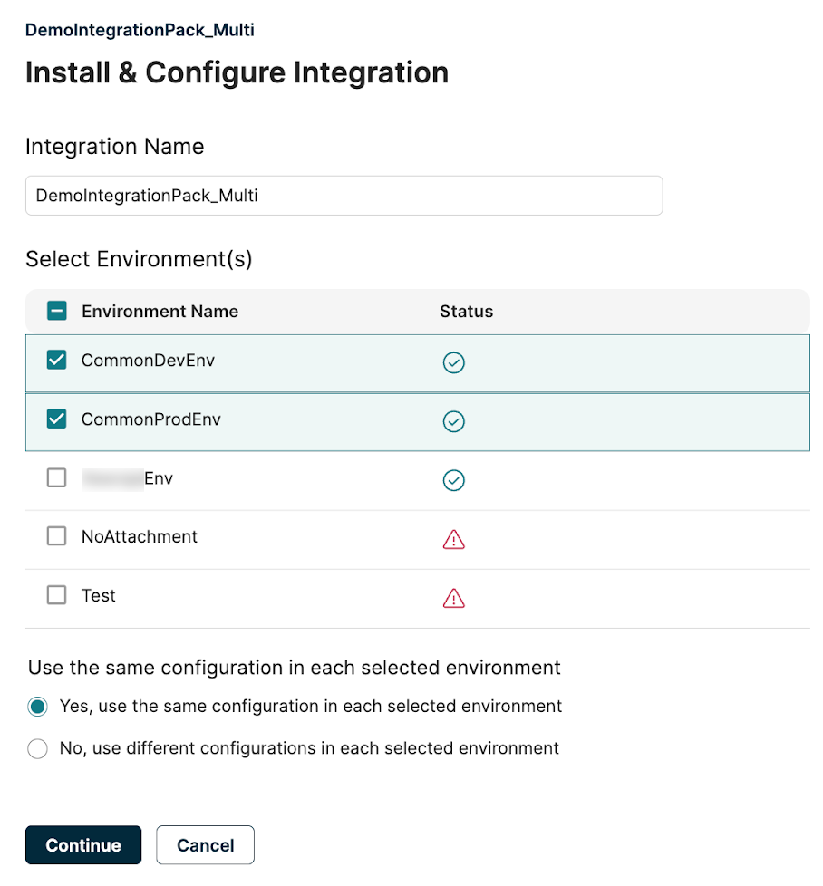

# Installing a single integration pack

<head>
  <meta name="guidename" content="Spaces"/>
  <meta name="context" content="GUID-8b76b2a9-d072-42e9-b3b0-e4b79894ddab"/>
</head>

A single attachment integration pack allows the installation of only one instance of the integration per account.

To install a single install integration:

1. In the Space user interface, select a Single install integration. You can search for an integration by typing its name in the search bar on the Browse page.

2. Click **Install**. The Install & Configure Integration page opens.

:::note

To successfully install the integration pack, the ipack must be added to an active environment with an Atom instance attached to it. If not, a pop-up message displays to contact the admin to set up an environment.

:::

3. Select one or multiple environments from the **Select Environment(s)** section, then click **Continue**.
    Environments are different spaces managed by the Space Admin within the Boomi Platform, shared here. Space users install integrations into these environments to schedule and run them. To learn more, refer to [environment management](/docs/Atomsphere/Integration/Integration%20management/c-atm-Environment_management_1ec94aeb-ffaf-4cec-a3b0-483c2af3967c.md). Checkboxes are disabled for unattached atoms for specific environments, preventing you from selecting them.

:::note

If you install the integration in multiple environments, repeat this step to configure it in each environment.

:::

4. Click **Done** to finish the installation.

:::note

 If the installation is unsuccessful for any selected environments, you receive an error message stating “Installation Failed”.

 :::
