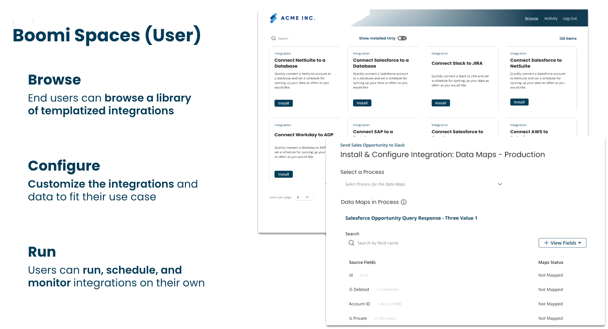
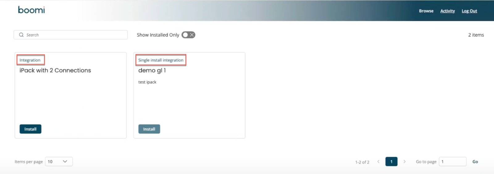

# Overview 

<head>
  <meta name="guidename" content="Spaces"/>
  <meta name="context" content="GUID-3c58e1c1-a18e-4303-9f8e-4215a5a8f182"/>
</head>

The User Space portal enables you to browse the library of templated integrations, configure and customize integrations and data mappings to fit their specific use cases, and run, schedule, install, and monitor those integrations.

Users having accounts with Space privileges can access the Space allocated to them.  You can sign in to the Space User portal using the Space URL shared by your admin.

:::note

Contact the Space Admin to get the Spaces URL associated with a Space.

:::

Log in to user Space

1. Sign in to the Spaces using the Space URL associated with it. (Eg URL: https://space.boomi.com?guid=e26c1a5a-d3ac-4286-8226-2ec1c)

2. Select an account using which you want to sign into the Space.

    The account page displays a list of accounts included in the Account group of the Space. If your Account group has only one child account, you are directly navigated to the Spaces Browse page.

:::note

By default, the Select Account page displays a maximum of ten child accounts. If the Space account group includes more than ten accounts, use the search bar to find the account.

:::

3. After you select the account, the Browse page displays all integration packs available for your account in the space. On the Browse page, multi-install integration packs are viewed as  **Integration,** and Single-Install integration packs as **Single-install Integration** Packs. 

