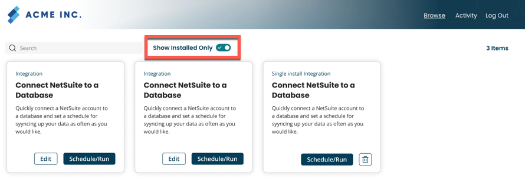

# Running a process

To run a process:
1. On the browse page of the Space User portal, click **Show Installed Only** to view the installed integration.
 

2. Choose the integration and click **Schedule/Run** to open the Schedule/Run page.

3. In the corresponding Action column of the process, click **Run Now** to run the process.
    A confirmation pop-up appears to confirm whether you intend to proceed with executing the process. Click **Continue Process Run** to carry out the process. The process runs as per your created schedule.
    
4. Click **Done** to finish or click **View Process Reporting** to view the status of that process on the Integration Process Reporting page. 
