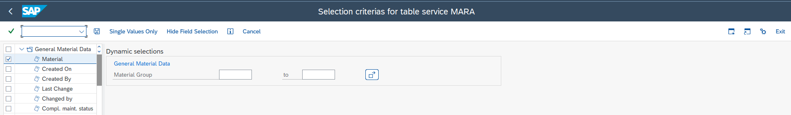
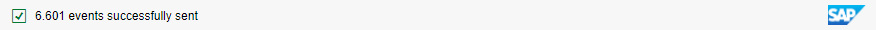

# Table Service Extracts

<head>
  <meta name="guidename" content="Boomi for SAP"/>
  <meta name="context" content="GUID-08ec7925-9948-47e6-9dd8-6f472626269d"/>
</head>

Table Service Extract enables you to request Table Service data. Boomi for SAP pushes the data to a REST web service in one or more threads. Table Service Extract performs better than Table Services as it can run multiple threads, and batching occurs automatically. You can request extracts in SAP through a manual or scheduled job, or in Boomi using a Function Module REST service `/IXBX/BATCH_TAB_SERV_EXTRACT`.

Table Service Extract executes various functions, including:

- Replicating a SAP table or view to another application. This helps in migrating from SAP ECC to SAP S4.

- Scheduling synchronization of **modified** SAP data to another application. Keeping stock and customer data updated in a B2B Web CRM.

- Scheduling synchronization of **filtered** SAP data to another application. Keeping employee data updated in subsidiaries.

## Prerequisites

Before requesting Table Service Extracts in SAP, ensure you have the following prerequisites:

- You have a **SAP RFC Connection** to a Boomi run-time (Atom, Molecule, Cloud) and a Boomi process to receive the data. For more information, refer to the [RFC Configuration User Guide](../Boomi_for_SAP/sap-Configuration_Guide.md).

- You have created the Table Service you are using. For more information, refer to the [Table Service User Guide](../Boomi_for_SAP/Sap-Table_service_extr.md).

## Requesting Table Service Data

1. Log in to SAP and run `/IXBX/ZBX008` to get the Table Service Extract Page.
2. Fill out the following fields:
    - **Table Service**: This helps you choose which table service definition to use for extracting data. Click the **search** icon to select the table service from the drop-down menu.

    - **Topic**: This keeps the output paths identical, if you extract the data through the payload option in events.

    - **RFC Destination**: Specify the destination of the Atom by clicking to the right of the RFC destination box and selecting the RFC destination from the drop-down menu.

    - **Max Records**: Specify the maximum number of records to send. If **Max Records** is 0, the amount of records sent is unlimited.

    - **Path**: Specify the path added to the RFC Destination. The path specified must match the path configured in the receiving Boomi web service.

      - **Path Not Required if**: Not required for a *Table Service Extract*. However, the RFC or Topic must handle the path if not provided when executing the Table Service Extract.

    - **Bundle size**: Specify the number of objects in each bundle. For instance, if a bundle size is 1.000, then 10.000 max records are sent in 10 bundles with 1.000 records each.

    - **Server Group**: Choose the server group in the drop-down menu.

    - **Max Threads**: Choose the amount of simultaneous working threads.

    - **Delay, each message**: Specify the number of seconds a thread can sleep after sending a bundle if the receiver has processing trouble.

    :::note Tip

    To improve your performance in versions 1.7 and higher when processing large volumes of data, i.e. **Max Records**, use the minimum bundle size with parallel processing (multi threads). 

    :::

You can limit the data being sent to Boomi by defining filter values. 

1. Click on the **Dynamic where criterias** button.

  A new page appears showing the fields in the previously selected table.

2. Double-click the folder in the upper left corner to view the fields included in the `SKAT` table.

3. Double-click the field you want to filter and fill in the values in the boxes. If you want to remove one of the filters, double-click the field you want to remove in the menu on the left.

4. Click **Save**. 

You will redirected to the *Boomi for SAP Table Service Extract* page.

After entering all the information and filtering the required fields, click **Execute**.
A message appears with the number of extracted messages for a successful transaction. In case of errors, an error message will appear.

In the image example above, the Max Records specified is 10.000 Max Records, but after applying a filter, only 6.601 records met the Dynamic Criteria, which are then succesfully sent, as shown in the image below.

