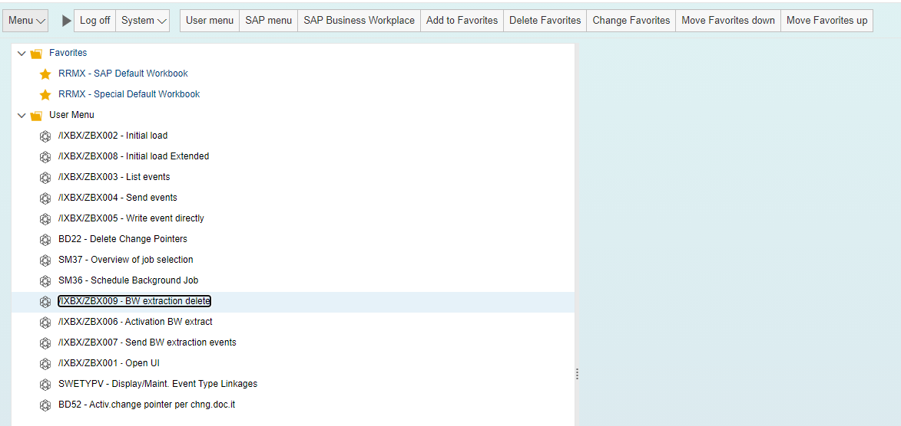

# BW Extraction Delete

<head>
  <meta name="guidename" content="Boomi for SAP"/>
  <meta name="context" content="GUID-226f0bc8-c5c7-4d71-9161-eabe78512c70"/>
</head>

The BW Data Extractor simplifies the extraction of data from SAP for BW reporting, facilitating the processing of BW Extractors through REST services. 

It integrates with SAP’s standard BW Extractor feature and exposes the Extractors for a seamless integration, enabling the use of this data in Boomi processes.

With this feature, Boomi for SAP Core can be configured to send metadata of BW Extractors to a REST service and can expose REST services that allow retrieving and deleting BW Extractors. 

This means that organizations can leverage the BW Extractor to aggregate financial data and send it to a reporting database or send changed order data to a data warehouse. 

With BW Extraction Delete, you can remove extractions that have been marked for deletion by Boomi, as well as unprocessed extracts. It is recommended to set up a regular job that runs at specific intervals.

- To manually delete processed and unprocessed extractions, access **/IXBX/ZBX009 (BW extraction delete)** and specify what needs to be deleted.

- The amount of days of when the extractions should be deleted must be defined. 
- The parameters are described below:
   - **Processed, deletion marked:** This parameter will delete extractions marked for deletion by Boomi based on the specified age deletion criteria. If you want to delete everything marked for deletion by Boomi, set this value to 0. In the example below, the value is set to 2, which means that all extractions marked for deletion two days ago will be deleted.
  - **Unprocessed extractions:** This parameter will delete unprocessed extractions. Unprocessed extractions refer to extractions that Boomi has not picked up. In the example below, this value is set to 7, indicating that all extractions created but not collected by Boomi within the last seven days will not be deleted. However, any extractions created more than seven days prior and not collected by Boomi will be deleted.

- Once you have specified the values and filled in the boxes, click on **Execute**.
- After the specified extractions have been deleted, a message will appear in the lower left corner indicating the date on which the processed and unprocessed extractions were deleted.

