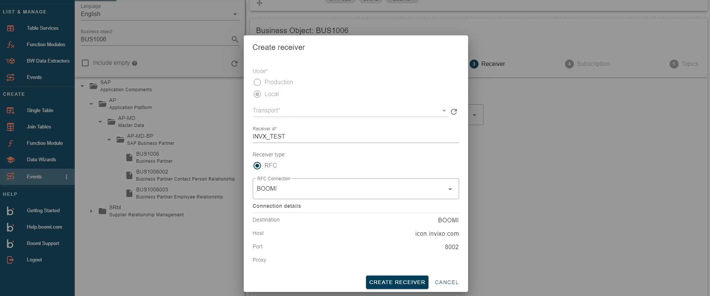

# Business Objects

<head>
  <meta name="guidename" content="Boomi for SAP"/>
  <meta name="context" content="GUID-fcbe871e-bf68-4203-87d3-14e73e34df75"/>
</head>

For Business Objects, you can search for specific business terms. This will return business object events with data that corresponds to your request. You can choose between implemented or not implemented business objects. 

:::note
The business objects are client dependent and must be accessible to all clients.
:::

**Language**

The Language function allows you to choose the language you prefer to display your data. 

:::note
Objects described only in other languages will change accordingly.
:::

In the example below, we searched for **Business Partner** and displayed all the relevant business objects for the search. We selected 'BUS1006' in this case, but we could have also searched for it directly.

## Events

After choosing the Business Object you want to subscribe to an event, you can drag it onto the canvas or double-click it. This will show you the different types of events you can subscribe to.

The symbols indicate if the event has already been in the SAP backend. The **lightning** symbol indicates it is ready for real-time processing, while the **stopwatch** symbol indicates it is ready for batch processing. You can still create your subscription even if the event hasn't been implemented in the SAP backend. This can be done after finalizing the subscription.

## Deployment mode

Deployment mode refers to whether the service created is transportable. If you select ***Production***, the service can be transported, meaning you must select a transport for the service before it can be created. If you select ***Local***, the service created cannot be transported, and therefore no transport can be selected.

:::note
Changing the deployment mode of subscriptions is not possible because subscriptions are stored in a transport for production, not for local use. Therefore, if you want to change the deployment mode, you must recreate your subscription.
:::

## Receiver

The receiver is responsible for defining the connection of your event. You can either choose an existing receiver or create a new one.

When creating a new receiver, you will need to provide the following information:
**Receiver ID:** Choose an ID of your preference.
**Receiver Type:** Select the connection type (RFC only).
**RFC Connection:** Choose from the available SAP connections list.

The subscription allows you to choose and define the desired output. Events have small metadata that describe their origin. You can also add an [Event Filter](../Boomi_for_SAP/sap-Events_and_Payload_Filtering.md) to enforce specific criteria for the event.

## Subscription 

**Bundle Size:** This determines the number of events processed at a time. If messages are sent to different URLs, they will be grouped based on the bundle size, which determines the total processing size.

:::note
If a topic with a dynamic path is used, it will generate different topics/paths for the events during processing. The events in the bundle are then split into the relevant topics before being sent individually.
:::

When applying a payload filter, only events of the same CD object and table can be processed together. This filter is applied after the events are split into bundles so that additional events may be sent. However, for bundling to occur, it's important to ensure that the events of the same CD object/table are in sequence.

**Event Only:** Only the ID will be sent as output.

**Event - metadata:** This sends the data output before and after the change.

**Adding Event Filters:** You can add event filters that uses metadata from the event itself to determine if the event should be handled. These filters can examine the table key(s) in change pointer events or the fields from a business object event. Learn more about how Boomi for SAP manages Buisness Object [Event and Payload Filtering](../Boomi_for_SAP/sap-Events_and_Payload_Filtering.md).

Subscriptions can be created without a topic.

## Topics

For the Topic, you can choose between existing topics or create a new one.

When creating a new Topic, you can choose an ID of your choice and provide a description. You can choose between a static text or assign a system for the **Event Only** and **Event - metadata** topic positions.

### Event - payload

It lets you enable table extraction with event key-based filtering. When subscribing to a Payload, select a **Table Service** and identify the key field(s) to map your payload. 

When choosing **Event - payload** for subscription, specify the **Table Service** from which you want to receive your payload. Additionally, you need to determine the value of your topic to define the data source. This feature can be used in an Event Mesh to route messages without inspecting the payload data. 

:::note
When using a table service for subscription payload the authorization checks should not be performed. 
:::

**[Payload Filter](../Boomi_for_SAP/sap-Event_Payload_Filter.md):** It lets you add a filter before the event and payload are sent out from SAP. This ensures that the selected payload data meets the requirements. 

Once you create your subscription, you can view all the event components you have created under **List and Manage**. From this page, you can edit or delete the Receiver, Subscription, and Topic.

### Reciever and Topic

**Receiver** and **Topic** components are created independently and can be reused for multiple subscriptions. This streamlines event management and reduces complexity.

To create a **Receiver** or **Topic** independently, click on the three dots in the **Events** tab under **CREATE** and select your desired option.

#### Receiver

The Recipient Framework was introduced, offering enhanced functionality for sending receivers. Please refer to [Recipient Framework](../Boomi_for_SAP/sap_Receiver_Framework.md) for more information.

:::note
The connections must have the same name across all systems. 
:::

The receiver is designed to be independent, allowing it to be used for multiple subscriptions and topics. For example, you can connect to Boomi for multiple Boomi event subscriptions.

#### Topic

The Topic can also be reused for multiple subscriptions, making it easier to maintain your subscriptions. 

**Position types**

- **VAL - Value** 

This refers to the data that the subscription provides, allowing you to reference data from the event payload. It is not necessary for the topic to use the same table service as the subscription. For instance, the Topic could be for a single table while the subscription uses a view that includes this table.

If the topic value reference is unavailable in the subscription payload, no value will be generated for the position output.

- **SYS - System Fields** 

These fields are available during program execution. All non-obsolete system fields can be used. 

The most commonly used system fields are : 

**SYSID** - is the name of the SAP system

**DATUM** - current date of the application server

**UZEIT** - current time of the application server

**MANDT** - Client ID of the current user.

**UNAME** - Name of current user.

**TXT** - text: Used for static text output.

