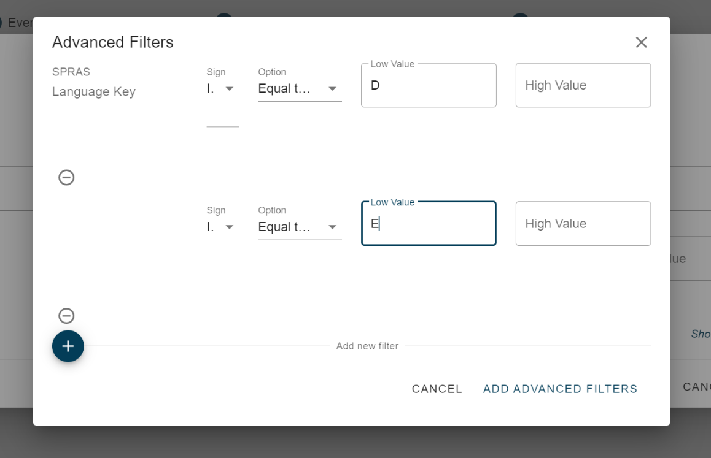

# Change Pointer Event filtering

<head>
  <meta name="guidename" content="Boomi for SAP"/>
  <meta name="context" content="GUID-af17e556-9a1d-44dd-8034-bd515fc99e87"/>
</head>

When creating an event subscription, the options for event filtering are based on the available data for the event. For Business objects, event filtering is applied during event creation. However, for Change pointers, this is done immediately when transitioning from SAP standard events to the Boomi for the SAP dispatch layer.

To add an event, select the object and table to which the filtering is related. 

For example, in the case of MATMAS (Material Master), only the object MATERIAL is available, so it is automatically selected. You then need to choose the relevant table for the event filter.

By selecting DMAKT the key for same is shown. For instance, let's say we want to filter out non-German (Language code 'D') texts. 

It is possible to use external values. However, it is important to note that these values are converted to internal SAP values.  As a result, the high and low values may differ from their external values. For example, if you use "DA" as the Low value and "DE" as the High value, the system will raise an error stating that "DA" is not lower than "DE" because internally "DA" is represented as "K" while "DE" is represented as "D".

To apply multiple filter rules for a field, click on **Show Advanced Filters**.

In this example, we add 'E' to allow both German and English Material texts.

All rules marked with either ***I*** (Incl) or ***E*** (excl) will be treated as **OR** conditions, while the included rules will be as **AND** conditions with the excluded ones.

Click on **ADD ADVANCED FILTERS** to save the changes or **CANCEL** to discard the advanced filters without saving.

If there are multiple rows in the **Advanced Filter** section, an marked icon is displayed in the image below to indicate the presence of additional rules.

If we also want to add a filter because the event is triggered by another table, such as MARC, select it from the Table drop-down list to view the available key fields for filtering.

When entering a value in the ***Low value*** field (From value), the default setting for the **Sign** is **I** (include), and the default **option** is **Equal to**.

If a value is added in the ***High value*** (To value) to create a range, the **Option** is changed to **Between**. Similarly, if the value in ***High value*** is removed, the **Option** is changed back to **Option**.

The added filters in the upper left corner indicate which tables have implemented filters.

If a change pointer subscription has an event filter, and there are no relevant filters for the actual change, then the event is considered irrelevant. For example, if there is a filter for the MATMAS object in the MATERIAL table MARA, any events created for other tables like MAKT will be filtered out as none of the filter rules are relevant for this table.