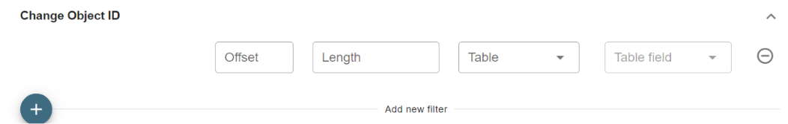
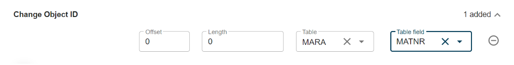
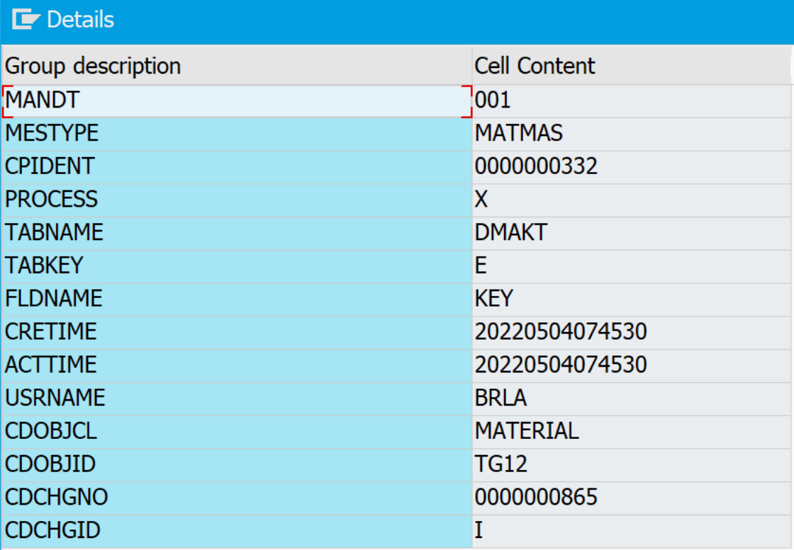
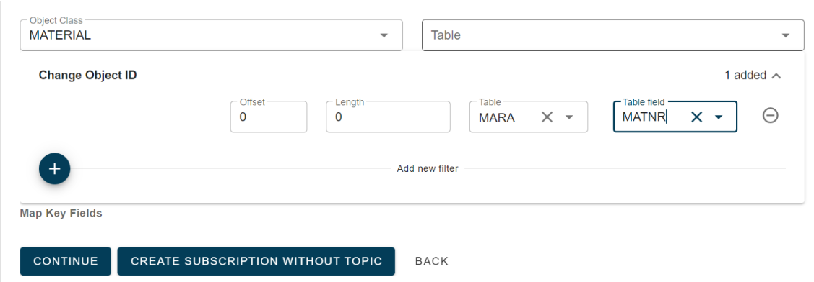
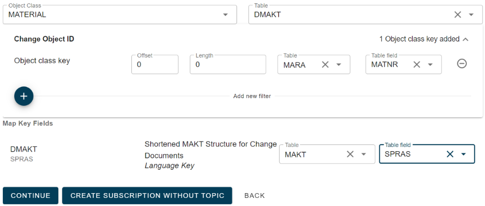

# Change pointer Payload

<head>
  <meta name="guidename" content="Boomi for SAP"/>
  <meta name="context" content="GUID-9ad12477-21b4-437b-9857-1770c1cb3060"/>
</head>

When selecting Event - payload, four new options are available.

  **1. Payload Filter:** This allows you to add filter rules for the table service tables included in the payload.

  **2. Table service Selection:** Choose which Table Service to use for extraction.

  **3. Class and Table for Change:** If you want to differentiate mapping, you can select the object class and table.

  **4. Change Object ID:** If the key fields are not sufficient, you can manually map the contents of the change object ID here.

The table key is specific to the table, such as MARC, while the Material object contains information about the material being changed at a higher level.

:::note 

Some tables are stored in the event as a reduced dataset. For example, MAKT is stored as DMAKT (Material texts), where DMAKT only stores the language key as it is linked to the MATERIAL object which stores the material number. To identify the material text, both parts are needed for key mapping to get the correct entry in the MAKT table.

:::

**Mapping via CD object ID**

Click the plus next to get the input field. When using Boomi for SAP, the key definition of this object may not be possible to determine. However, when referencing business objects or tables, the fields are provided as input.

The user needs to understand how the key information is stored in the CD object key. If the full key needs to be mapped, simply add **offset = 0** and **length = 0** to use the entire CD key. For example, for the MATERIAL object, the key is a material number (char 18). Since there is only one key field, you can either use length = 0 for the full field or specify the precise length (18).

In this case, we have mapped the full object key of the event as input to the table service.

Example of Event data (BDCP2)

In this example, the material of the event is **TG12**. Boomi for SAP will convert the mapping above to **MARA~MATNR = 'TG12'** for the selection ***where clause*** when linking data from the event to the data extraction for the payload. 

This is an example of a key mapping that can be used for all tables (since the table selection is left blank) for the MATERIAL object.

We have made a specific change to the mapping rule for material texts (DMAKT). 

Now, the user can utilize the DMAKT key information as part of the payload extraction. 

In the case of our BDCP2 example data mentioned above, the ***where clause*** input will be converted to: **MARA~MATNR = 'TG12' AND MAKT~SPRAS = 'E'**. This example demonstrates the need to use both the Change object key and the Table key to retrieve the correct table entry in the MAKT database table.

When mapping, only the tables from the selected table service can be used. 

It is necessary to map at least one field to restrict the data extraction. This prevents a full extract of the table service. 

Not all event key data needs to be mapped because, for instance, if there is a change to MARC (key material (MATNR) and Plant (WERKS)), the subscription may be linked to a custom material table with only the material as the key. Therefore, only this field needs to be mapped.