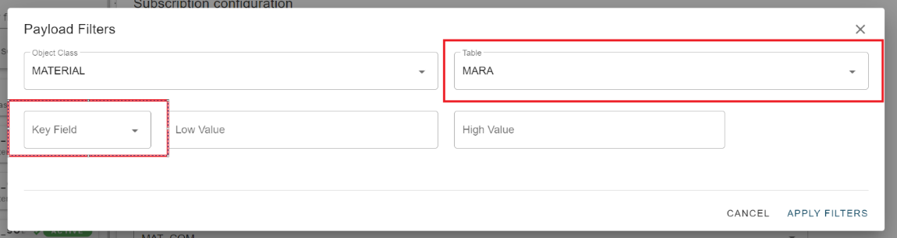
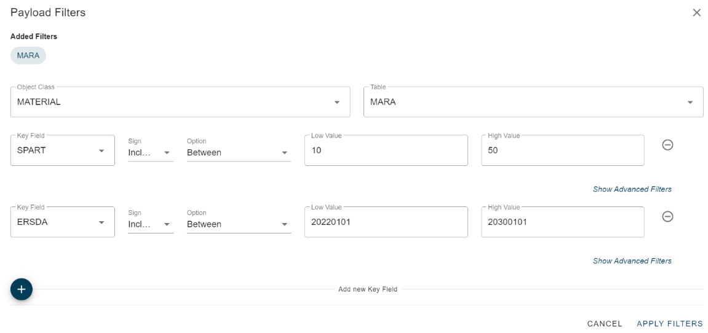

# Change Pointer Payload Filter

<head>
  <meta name="guidename" content="Boomi for SAP"/>
  <meta name="context" content="GUID-dae19942-9702-42e1-af59-2e814271f681"/>
</head>

The table field is used for both the event table and the filter table. Therefore, it needs to be split into two separate fields.

The key field is the field of the table where the filter is implemented.

The plus sign allows you to include additional fields to filter on. These fields are available in the table service, even if they are not required to be part of the table service extract.

In this example, we have a filter for materials belonging to divisions 10-50 and a creation date between 01.01.2022 and 01.01.2030. Please note to use the internal SAP date format.

The minus sign next to the field rule allows you to remove an unnecessary filter rule if needed.

