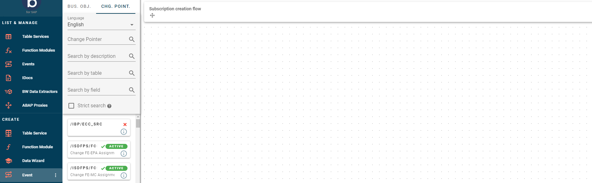
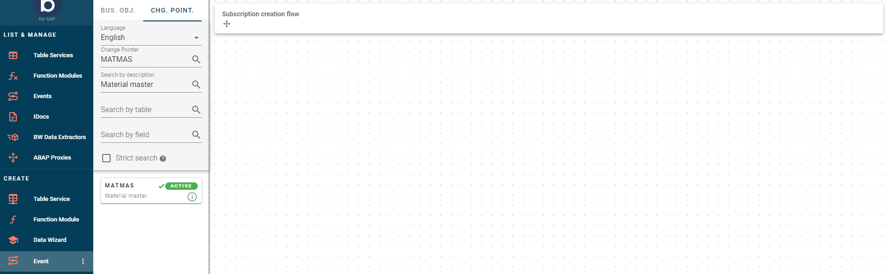
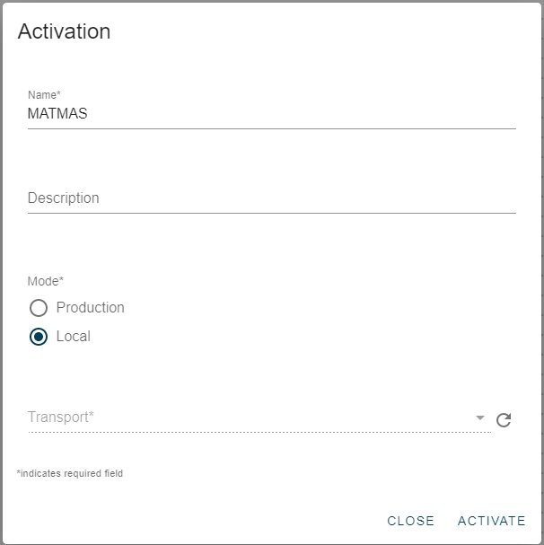
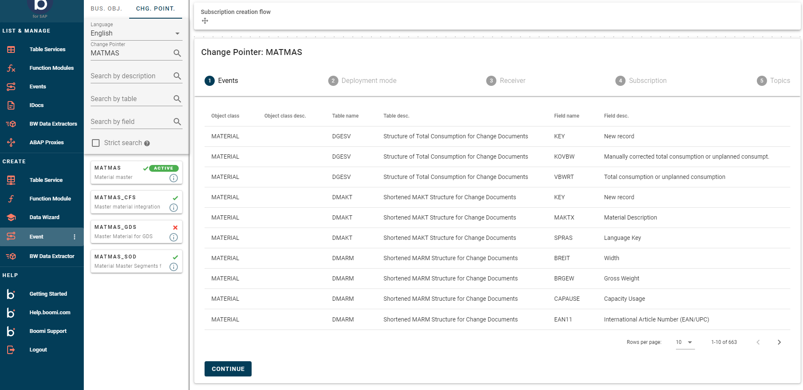
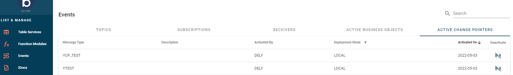

# Change Pointers

<head>
  <meta name="guidename" content="Boomi for SAP"/>
  <meta name="context" content="GUID-7de4c621-0333-4ad1-9576-51602dbde032"/>
</head>

Using Change Pointers offers a variety of opportunities compared to Business Objects. With Change Pointers, you can specify your event to a message type in SAP, allowing you to obtain information about changes in other types of business-specific data. 

In this example, we will use the message type 'MATMAS' (Material Master) to demonstrate how you can subscribe to every MATMAS.

:::note 
Change Pointers are client dependent and need to be accessible to all clients.
:::

To begin, select **CHG POINT** at the top of your screen. From there, you can search by name or description.

When searching for a Change Pointer to create an event, you have several options:

- **Change Pointer Name:** Use this field if you have the exact name of the object or table you are searching for.

- **Description:** Use this field if you are searching for Change Pointers with specific content.
   
- **Table:** Use this field to search for all Change Pointers containing a certain table.
   
- **Field:** Use this field to search for a description of a field in the change pointer.
   
- **Strict search:** You can specify your exact criteria here. However, please remember that it must be spelled correctly and is case-sensitive.

Once you have found the desired Change Pointer, you can view its status.

- **Red Cross:** If the Change Pointer has a Red Cross assigned to it, it means it is not active in SAP.
   
- **Green Checkmark:** Indicates that it has been activated in SAP.
   
- **ACTIVE:** This means it has been activated for Boomi for SAP and is ready for processing.

To activate it for Boomi for SAP, simply drag it to the canvas, provide a name, description (optional), and choose a deployment mode.

Boomi for SAP active indicates that the Boomi for SAP event processing application is allowed to process these change pointers. This measure is taken to ensure that the application processes only relevant change pointers for Boomi for SAP.

On your side panel, you will now see that *MATMAS* has been marked as **ACTIVE**. Then you're given a list of all the components included in the given change pointer. Once you have verified that the information aligns with your preferences, click on continue.

From this point onwards, you can proceed with the process outlined in the [Business Objects](./sap-Business_Objects.md) section. Learn more about how Boomi for SAP manages change pointer events and filtering[Change Pointer Events and Filtering](../Boomi_for_SAP/sap-Change_Pointer_Event_Filtering.md).

## List and Manage

In the *List and Manage* section, you can view a list of all the Business Objects and Change Pointers that you have marked as relevant for Boomi for SAP and can process. You can filter these based on various parameters using the standard options available.

If any of these Change Pointers are no longer required for Boomi for SAP processing, it is recommended that they be deactivated.

:::note 
Deactivating these pointers will affect only their activation in SAP, as only the Boomi for SAP relevance is being deactivated.
:::