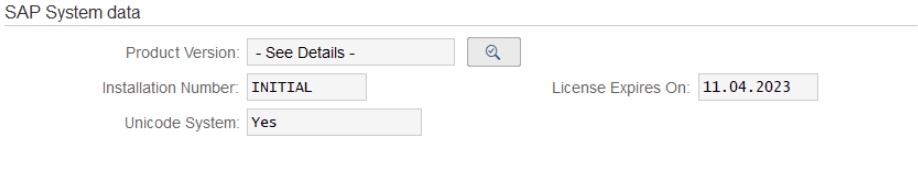
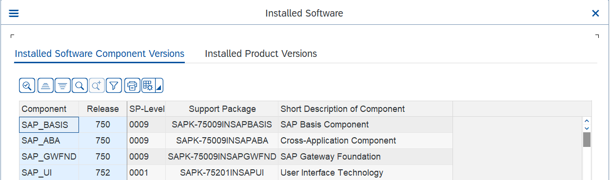

# Configuration Guide Overview

<head>
  <meta name="guidename" content="Boomi for SAP"/>
  <meta name="context" content="GUID-5ae8aea4-ea0a-4b5c-b511-d9dbee18f143"/>
</head>

This guide offers a step-by-step approach to successfully implementing the Boomi for SAP POC/Pilot. It outlines the necessary roles and prerequisites required for a seamless process. 

To ensure the system requirements are met for the installation of Boomi for SAP, provide the following fields: 

- SAP Product Version 

- Installed Software Component Versions (SAP_BASIS, SAP_ABA, SAP_GWFND, SAP_UI)

:::note
If Boomi for SAP has already been installed, skip the prerequisites and proceed to the **Connectivity** section. 
:::

