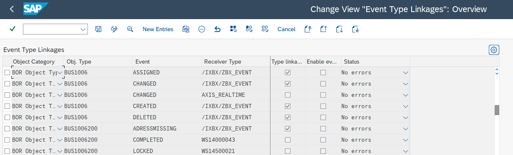

# Configuring Events for Boomi for SAP

<head>
  <meta name="guidename" content="Boomi for SAP"/>
  <meta name="context" content="GUID-178f70c4-0e84-469c-a9f1-980803c268b1"/>
</head>

To enable the processing of Change pointers from the Boomi for SAP UI, the following steps need to be taken in SAP:

To activate Change pointers use the BD50 transaction.


- When using Business Objects, the following configurations should be made:

**Business Object events**

Use the transaction `SWETYPV` to identify the appropriate business object event to be sent through Boomi SAP. Set the receiver call to 'method' and choose one of the three classes: `/IXBX/CL_EVENT_HANDLER`, `/IXBX/CL_EVENT_HANDLER_R`, `/IXBX/CL_EVENT_HANDLER_R_TOPIC`.

- Usage of the three handlers for Business Object events:

- `/IXBX/CL_EVENT_HANDLER` For batch processing.

- `/IXBX/CL_EVENT_HANDLER_R` For real-time processing without path prefix.

- `/IXBX/CL_EVENT_HANDLER_R_TOPIC` For real-time processing with the /topic path prefix, such as for use with Solace.




User exits can be implemented using the provided source code example. Make sure to use the appropriate message type for the Change pointer you have created/selected. 

```
 CALL FUNCTION 'CHANGE_POINTERS_CREATE_DIRECT'
    EXPORTING
      message_type          = ZBX_EVENT
    TABLES
      t_cp_data             = lt_data
    EXCEPTIONS
      number_range_problems = 1
      OTHERS                = 2.
```

This populates the change pointer enabling Boomi to process it for SAP subscriptions.
