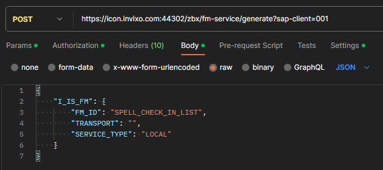
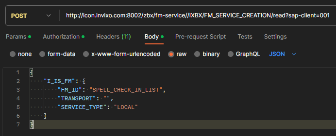
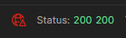
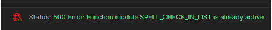

# Create Services via Boomi for SAP API

<head>
  <meta name="guidename" content="Boomi for SAP"/>
  <meta name="context" content="GUID-cfc80f57-11ce-4e60-a966-cada2d04d526"/>
</head>

## Introduction

We developed this feature to enhance the capabilities of Boomi for SAP and provide an easier way to create services through API calls. Its primary purpose is bundling and automatic creation of services from Boomi integration.

Supported services at the moment are:

- Function Module enablement
- Subscription creation
- Table service creation
- Topic creation
- Receiver creation
- Function Module activation
- BW activation

## Function Module Description

The core of this feature is a SAP function module designed to create services programmatically. Here are the key details:

**Function Module Name for FM enablement** `/IXBX/FM_SERVICE_CREATION`

*Input Parameters*:

- `is_fm`: Expects a structure with all the information for an FM enablement, which includes FM ID, transport, and service type.

**Function Module Name for subscription creation** `/IXBX/SUBSCR_CREATION`

*Input Parameters*:

- `is_subscr`: Expects a structure with all the information needed to create a subscription, including a header, filters, events, transport, etc.

**Function Module Name for BW activation** `/IXBX/BW_ACTIVATION`

*Input Parameters*:

- `is_bw`: Expects a structure with all the information for a BW activation, including the data source if it is custom_extract and transport.

**Function Module Name for Table Service creation** `/IXBX/TABLE_SERVICE_CREATION`

*Input Parameters*:

- `is_table_service`: This function expects a structure with all the information needed to create a table service, including its ID, transport, service type, tables, authorization, etc.

**Function Module Name for Topic creation** `/IXBX/TOPIC_CREATION`

*Input Parameters*:

- `is_topic`: Expects a structure with all the information needed to create a Topic, including its header, position, maintain type, and transport.

**Function Module Name for Receiver creation** `/IXBX/RECEIVER_CREATION`

*Input Parameters*:

- `is_receiver`: This function expects a structure with all the information needed to create a Receiver, including its ID, type, deployment, maintenance type, transport, and parameter data.

## API Endpoint and Authentication

To interact with the feature, you will need to make API requests. There are two ways of doing it through the following 2 API endpoints:

1. ``https://{hostname}:{port}/ZBX/fm-service/{FM name}/read?sap-client={client number}`` (Use this option for any other exposed FM):

    - For FM Enablement: ``https://{hostname}:{port}/zbx/fm-service//IXBX/FM_SERVICE_CREATION/read?sap-client={client number}``

    - For Subscription Creation: ``https://{hostname}:{port}/zbx/fm-service//IXBX/SUBSCR_CREATION/read?sap-client={client number}``

    - For BW Activation: ``https://{hostname}:{port}/zbx/fm-service//IXBX/BW_ACTIVATION/read?sap-client={client number}``

    - For Table Service Creation: ``https://{hostname}:{port}/zbx/fm-service//IXBX/TABLE_SERVICE_CREATION/read?sap-client={client number}``

    - For Topic Creation: ``https://{hostname}:{port}/zbx/fm-service//**IXBX/TOPIC_CREATION**/read?sap-client={client number}``

    - For Receiver Creation: ``https://{hostname}:{port}/zbx/fm-service//IXBX/RECEIVER_CREATION/read?sap-client={client number}``

 2. ```https://{hostname}:{port}/zbx/{service name}-service/generate?sap-client={client number}```

    - API Endpoint for FM Enablement: ``https://{hostname}:{port}/zbx/fm-service/generate?sap-client={client number}``

    - API Endpoint for Subscription Creation: ``https://{hostname}:{port}/zbx/subscr-service/generate?sap-client={client number}``

    - API Endpoint for BW Activation: ``https://{hostname}:{port}/zbx/bw-service/generate?sap-client={client number}``

    - API Endpoint for Table Service Creation: ``https://{hostname}:{port}/zbx/table-service/generate?sap-client={client number}``

    - API Endpoint for Topic Creation: ``https://{hostname}:{port}/zbx/topic-service/generate?sap-client={client number}``

    - API Endpoint for Receiver Creation: ``https://{hostname }:{port}/zbx/receiver-service/generate?sap-client={client number}``

Understanding the importance of Basic Authorization, and having your credentials for the specific SAP system and client, is crucial for ensuring system security and access.

## Request Format

Send a POST request to the API endpoint to create a service using the function module. The request should include the following:

- HTTP Method: POST

- Request Body: JSON payload with the required input parameters.

## Request Examples

API Endpoint and Authentication, option 1


API Endpoint and Authentication, option 2


## Response Format

The API response will have a standard structure, including HTTP status codes. Successful responses will return a `200 OK` status code.



## Error Handling

In case of errors or issues, the API will return appropriate status codes and error messages.




