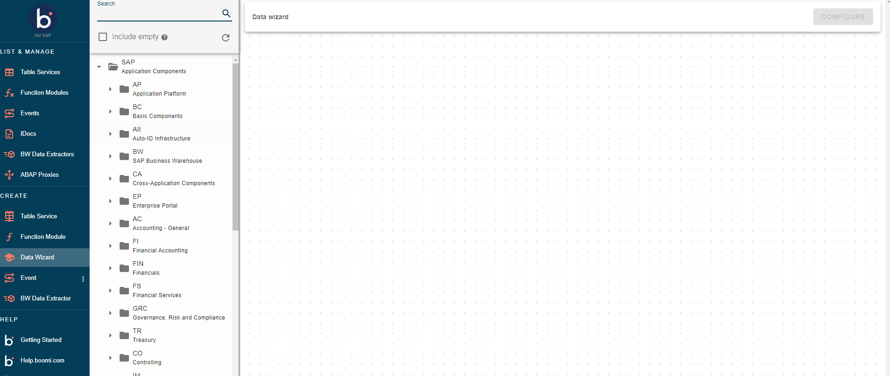
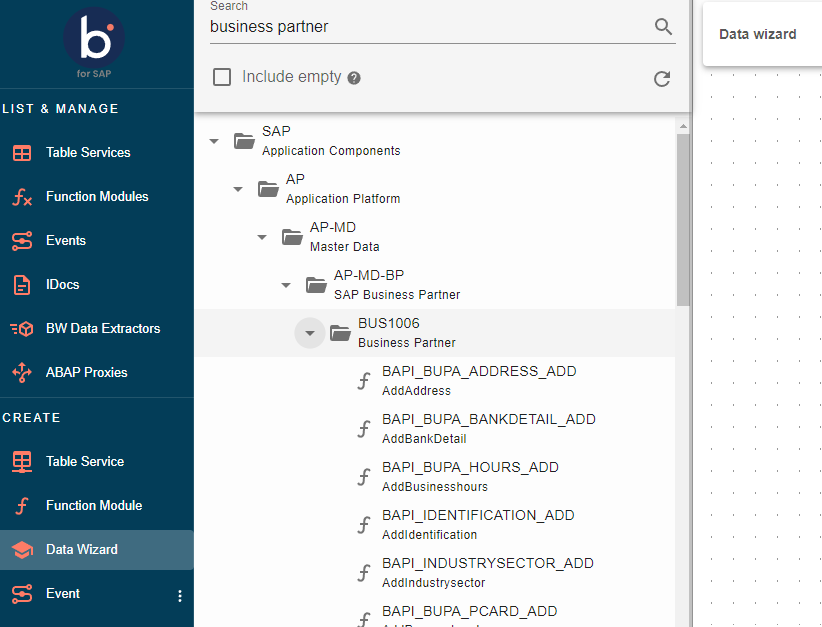
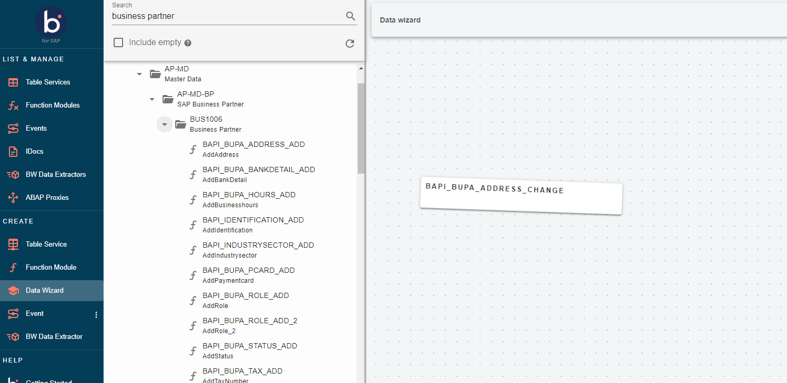

# Data Wizards

<head>
  <meta name="guidename" content="Boomi for SAP"/>
  <meta name="context" content="GUID-466a00af-0e50-4d50-853f-0fff17a6327c"/>
</head>

Data Wizards is part of the UI installation and are automatically updated and maintained by SAP with new releases. These wizards serve as a visual representation of the native SAP functionality.

Data Wizards are based on SAP's integrated and managed BAPIs (Business API). Each BAPI consists of function modules focused on specific business domains or objects, enabling tasks such as retrieving the address of a particular business partner. Data Wizards provides SAP users with complete functionality through a user-friendly, interactive list on our platform.

## Working with Data Wizards

The following sections will provide a description and visualization of the Data Wizards. 

### Accessing Data Wizard

To access the Data Wizard, go to the main page and click on *Data Wizards* under *CREATE*. This will direct you to the Data Wizards page, where you can explore a variety of SAP BAPIs.

The Data Wizards page displays all the SAP BAPI’s that can be used to locate Function Modules. These Function Modules can then be made available as services.

### Searching Data Wizards

To find specific information, you can use the search feature located in the upper left corner of the page.

If you input *Business Partner* as your search query, the results will be filtered to show all Function Modules within a BAPI with *Business Partner* in their name or description.

Additionally, you can change the search language using the drop-down menu. If you check the **Include empty** checkbox, you can identify BAPIs that do not contain any Function Modules. 

By default, these BAPIs are not included in the search results.

### Using the Data Wizard tree

The Data Wizard is organized as a hierarchical folder structure, where each folder represents a BAPI. These BAPIs can either contain no subfolders or multiple subfolders. Additionally, a folder can contain various Function Modules, which are indicated by an *f* icon. 

To access a Function Module, you can either drag it or double-click on it. The Function Module added to the canvas operates in the same way as other Function Modules. 

