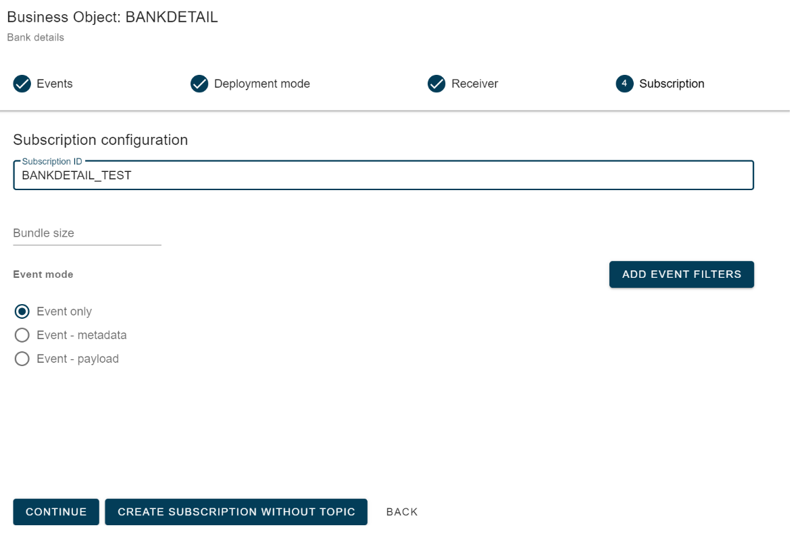
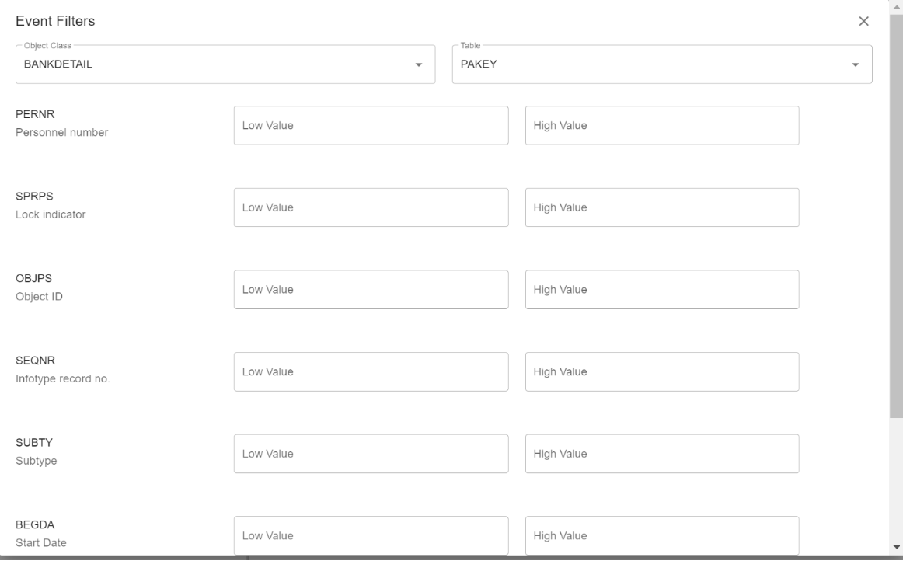
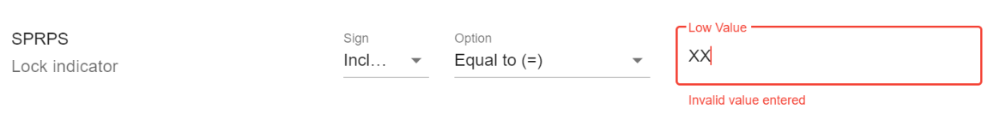
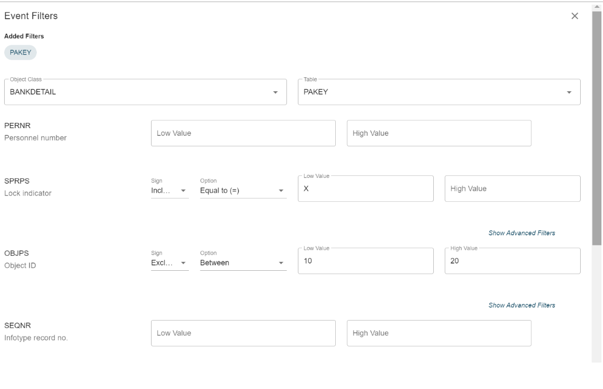
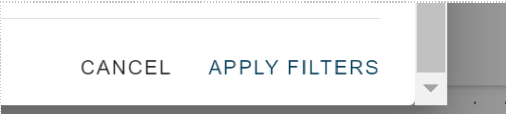
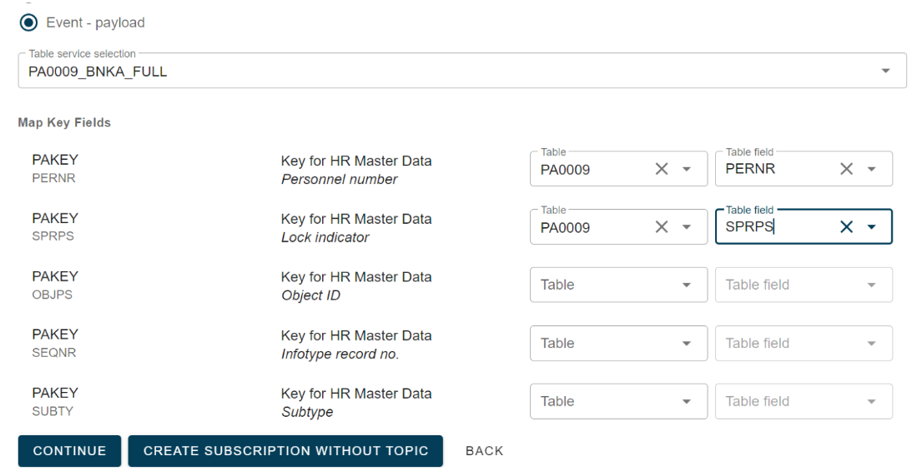

# Event Filtering for Business Objects

<head>
  <meta name="guidename" content="Boomi for SAP"/>
  <meta name="context" content="GUID-64189c8a-923d-482c-8dc7-64b7ce87113a"/>
</head>

The following sections will provide a description and visualization of the Event filtering.

To illustrate, we will use the **BANKDETAIL** object, which contains numerous key fields, allowing a complex filter setup.

On the main subscription screen, an option called **ADD EVENT FILTER** is available if the payload has not been selected.

When you click on **ADD EVENT FILTERS**, the event filter screen will appear, showing the BO (BUSINESS OBJECT) as the Object Class. Table will show default table values if there are only key fields with references to a single table.

The image below shows an example of the key fields for this combination of object class and table.

The length of the input is compared to the definition of the referenced field and indicates if input is too long.

Here, you can add simple filtering rules for two fields. Leave fields blank if they should not have a filter.

Click on **Apply Filters** on the bottom right to save the changes. 

By selecting the payload option, you can view the key mapping and link the event data to input for payload extraction. At least one mapping is required to limit the extract. However, not all mappings may be necessary depending on the key definition of the business object and the table service table keys (The image below shows a partial mapping). The extract will retrieve all records from PA0009 that have the specified field values according to the event values, even if it results in multiple records. This option offers high flexibility but requires careful consideration of the selected mapping's consequences.

If an event filter exists for a business object event subscription, no filter is relevant for the actual change, and the event will be discarded.

