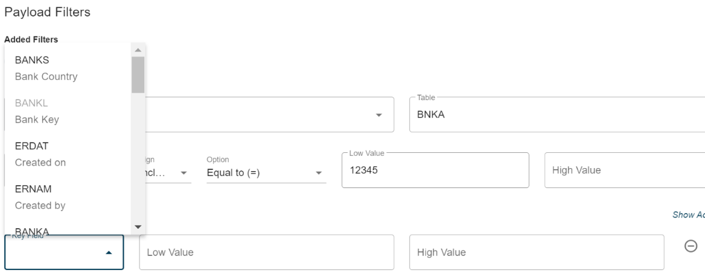
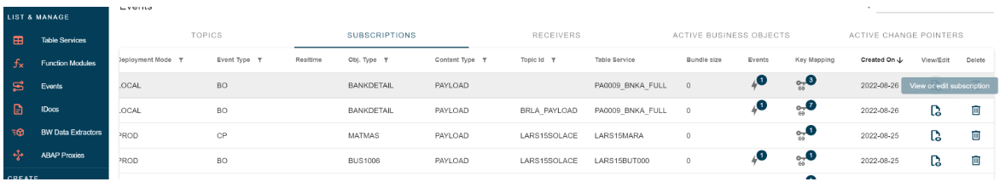

# Payload Filter

<head>
  <meta name="guidename" content="Boomi for SAP"/>
  <meta name="context" content="GUID-3d310ac4-ca08-461b-82b5-04c31324f573"/>
</head>

When the event mode is set to **payload**, the payload filter option is displayed.

When presented with the option to select tables in the table service used for payload data, the object class is the business object and remains a static value.

After selecting a table, you will have an option to choose a field for that table.

Once a column name is selected, the filtering options will become visible.
Additionally, you can create advanced filtering or add additional field filtering.

Advanced filtering functions similarly to change pointers.

When adding a field, the list is displayed again, but fields that already have filtering are not available, as these filtering rules must be defined together. Here, the BANKL is disabled, since this filter has already been added.

Note that the advanced filter icon on the right of the BANKL filter is due to multiple rules. For all fields, there is a minus icon to remove a field if the filter rule is no longer needed.

It is important to note that if a filter is not fully specified, the **Add/Apply filter** button is deactivated, as the rule for a field must be fully defined or removed if not required.

The overview of implemented events provides some event details but does not include the filtering aspect.

To view the filtering details, go onto the **View/edit** mode, go to the **Subscription configuration** sub-page, and click the **Event Filters** or **Payload Filter** button.

