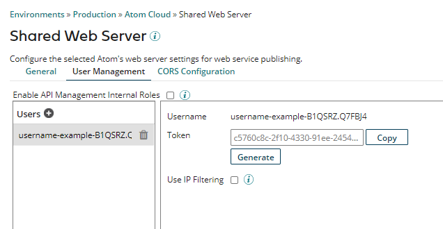
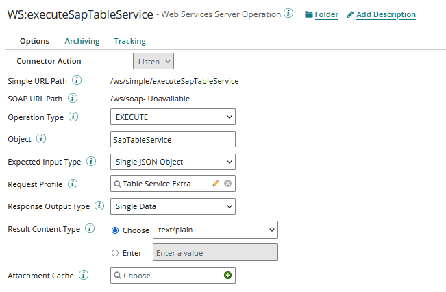
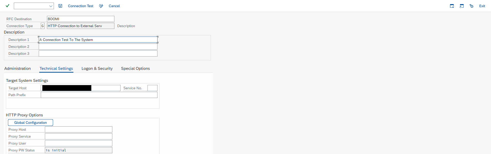
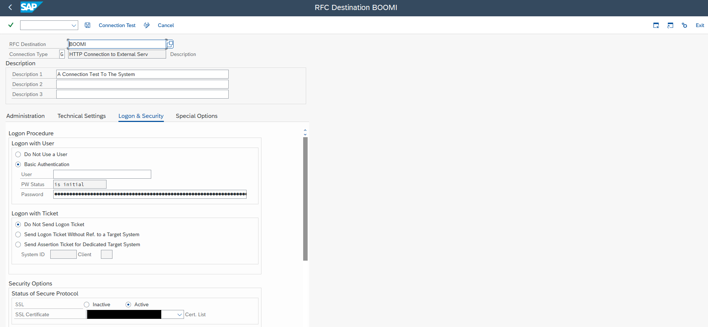

# RFC Configuration

<head>
  <meta name="guidename" content="Boomi for SAP"/>
  <meta name="context" content="GUID-442b506a-2ae6-4012-8ebf-a9a4f650cb72"/>
</head>

A SAP RFC Connection is required to send data to REST services using features like; events, BW extractors, and table service extracts. 

This guide outlines the process of establishing an RFC connection in SAP to link with a Boomi Atom using Basic authentication. Keep in mind that your configuration may vary if you opt for a different authentication method, employ a reverse proxy, or utilize a load balancer.

## Setting up RFC Connection

To set up an RFC connection in SAP, follow these steps:
- Find Atom information in the Boomi Enterprise Platform.
- Set up a Web service listener operation in Boomi.
- Create an external connection in SM59 in SAP.

## Boomi Configuration
To receive SAP data, configure the **Boomi Shared Web Server**, then develop and deploy **Boomi Web Service Processes**. 

- **Boomi Shared Web Server** 

1. Go to the *Shared Web Server* settings on the runtime you want to connect to. 
2. On the *General tab*, note the hostname and port. These will be required for the SAP configuration. 
3. On the *User Management* tab, create a new user or verify that an existing user can be used. 
4. Take note of the **Username** and **Token**. You will needed them for the SAP configuration. 

:::note
In SAP, the **Token** corresponds to the **Password**

:::

- **Boomi Web Service Processes**

To use your desired features, you need to set up the Web Services processes by configuring the Web Services Listener to receive JSON data via the POST method. Once you have done this, you can deploy the designated process or processes on a Boomi Atom. 

## SAP RFC Configuration
To set up an RFC connection to connect to the corresponding Boomi Atom, do the following:

1. Open transaction SM59 and enter the connection details. 

  In the *Technical Settings* tab, input the *Target Host* and *Service No*. The *Target Host* is the base URL for the Atom, and the port (defaulting to 80 for HTTP and 443 for HTTPS) is the *Service No*. The standard ports for the Boomi Web Service are 9090 and 9093 for HTTP and HTTPS, respectively. 

2. In the Technical Settings tab, provide the User and Password (Token) credentials for connecting to the Boomi Atom.

3. On the Logon and Security page, set the User and Password. If SSL is being used, configure the SSL certificate. 

4. Conduct a Connection test to verify that the connection works. For a successful test, the Boomi Atom Web Server must be running. At least one web service listener must be deployed to the Atom to ensure a successful connection test.

  Note the RFC Destination Name. This which will be required later. 

Once these steps are completed, the RFC connection will be set up and ready for use.

