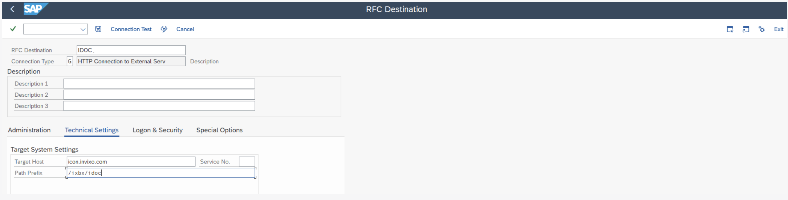
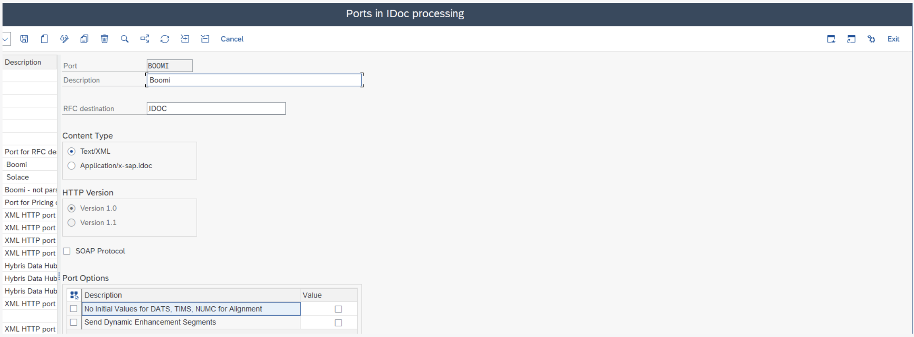
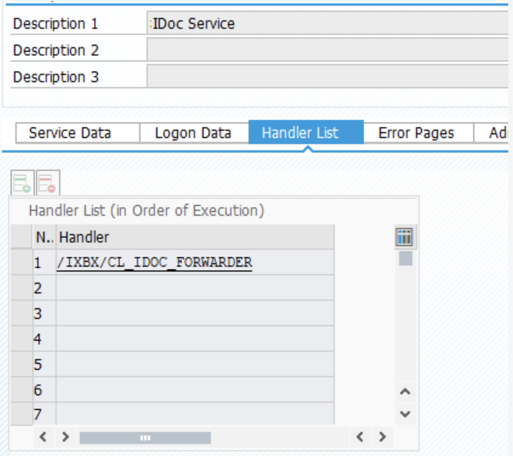
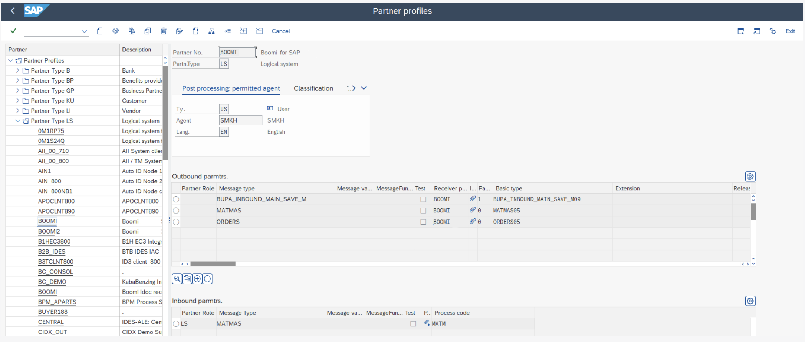

# SAP and Boomi for SAP Configuration

<head>
  <meta name="guidename" content="Boomi for SAP"/>
  <meta name="context" content="GUID-fa1360153-87e1-4eee-8c0f-8e98306ae01c"/>
</head>

We must complete the following steps and transactions to use the IDoc feature in Boomi for SAP. Create a Boomi for SAP IDoc user (SU01) and add the role `/IXBX/IDoc`.

*It is necessary to add role `/IXBX/IDOC` to the user, as an authorization object, embedded in the role to access the Boomi for SAP functionality*.

- Set up a RFC destination for IDoc handling (SM59)
- Set up Ports for IDoc Processing (WE21)
- Create Logical System(s) in BD54 - suggestion Boomi
- Set up a Partner Profile(s) for Boomi for SAP (WE20)
- Set up an IDoc handler (SICF)
- Set up an RFC destination (SM59) for the receiving system
- Set up the relation between IDoc Ports and RFC destination

## Create a Boomi for SAP IDoc users

- User Type = SYSTEM
- Add Boomi for SAP role `/IXBX/IDOC` or add the created Authorization Object
- Suggested name: BOOMI_IDOC

## Set up an RFC destination for IDOC handling

Please complete the following steps:

- RFC Destination for IDoc handling: Suggested name - BOOMI_IDOC
- Type = G
- Target Host

## Set up Ports for IDOC Processing

- Select port type: XML HTTP
  - Port - Suggested name: Boomi (JSON, pashing through Boomi for SAP as in the example)  
  - Description - Suggested name: Boomi (XML, sending to Boomi, choose RFC Destination for Boomi)
- RFC Destination: Choose the RFC Destination just created in SM59 (BOOMI_DOC)

## Batch processing

Note that when you choose to use batching, sending more IDOCs (inbound) to SAP, via XML request, will require you to configure the business partner to "collect", when there's a separate processing SAP batch job running. Using this method ensures IDOCs are processed sequentially rather than in parallel. We will manage all the IDOCs correctly, and the response will include the correct IDOC numbers.

## Set up a Partner Profiles for Boomi for SAP

1. Create several Partner Profiles depending on how many systems you want to send data to:

    - Partner Number: Suggested name - Boomi
    - Partner Type: "LS"

2. Set up Outbound parameters(example):

    - Message type: MATMAS
    - Receiver port: Boomi
    - Basic type: MATMAS05

3. Set up Inbound parameters(example):

    - Partner Role: LS
    - Message Type: MATMAS
    - Process code: MATM

## Set up an IDoc handler in SICF

- Set up the specific IDOC handler in SICF under `/IXBX`, as shown in the image below.

- Add a handler to the IDOC service:

:::note
**Version 1.4** This version does not support bundling outbound IDOC for JSON. To send in a batch, set the Pack size in the Partner Profile (WE20) in "Outbound Options".
:::

## Further information

- The logic system for Boomi for SAP is Established in `/n/ixbx/zbx016`, same as shown in the UI under Partner.
- Alternative setup: If Port and RFC Destination are not created with the same name, use `/n/ixbx/zbx017` to change it.

