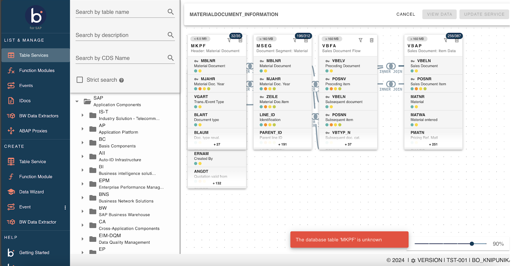
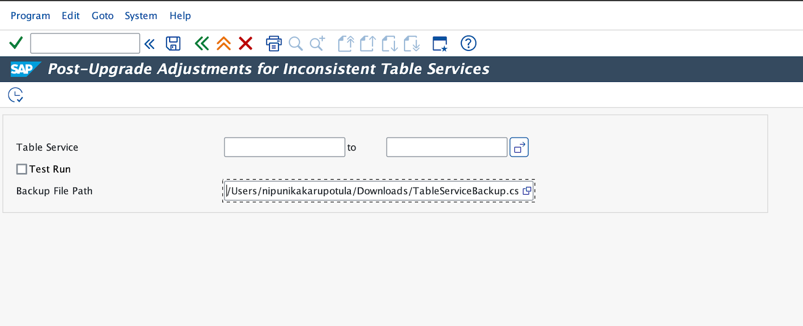
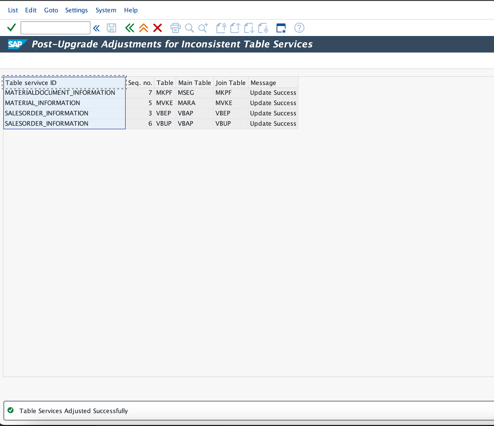

# Utility Program User Guide

<head>
  <meta name="guidename" content="Boomi for SAP"/>
  <meta name="context" content="GUID-1ae910a4-1c04-4b1f-ae7c-6d0dcb9af8bd"/>
</head>

### Issue

After the upgrade to version 1.7, you may have experienced issues accessing certain table services that were created in older versions. To facilitate a smoother transition and ensure continuity in service accessibility, a utility program has been delivered to adjust the compatibility of table services.

### Fix

Following a successful upgrade to version 1.7.2, if you encounter the errors listed below while accessing the table services created prior to the upgrade, please follow the steps outlined below.

As part of the resolution, we have developed a utility program named `/IXBX/ADJUST_TAB_SERV_UPGRADE`. You must execute this program to resolve the issue.

## Resolution Steps:

1. Access the Program:  

    - Navigate to transaction code SE38 in SAP.

2. Execute the Program:  

    - Enter the program name `/IXBX/ADJUST_TAB_SERV_UPGRADE` and execute it.

3. Run in Test Mode:  

    - On the selection screen, check the **Test Run** checkbox and proceed to execute. This will list all inconsistent table services (if any).

    - If no inconsistencies are found, a message will indicate that all tables are consistent.

4. Backup Existing Services:  

    - If there are inconsistent table services, uncheck the **Test Run** option and specify a file path to back up the existing services before making them consistent.

5. Specify Table Services:  

    - You have the option to input a specific table service name to make it consistent.

    - If no specific table service name is provided, executing the program without parameters will make all inconsistent table services consistent in one go.

6. Final Execution:  

    - Once you execute the program, it will bring the chosen table services into a consistent state.

:::note

Ensure that the utility program is run in accordance with your organization's guidelines and that appropriate backups are taken to prevent data loss during the adjustment process.

:::
