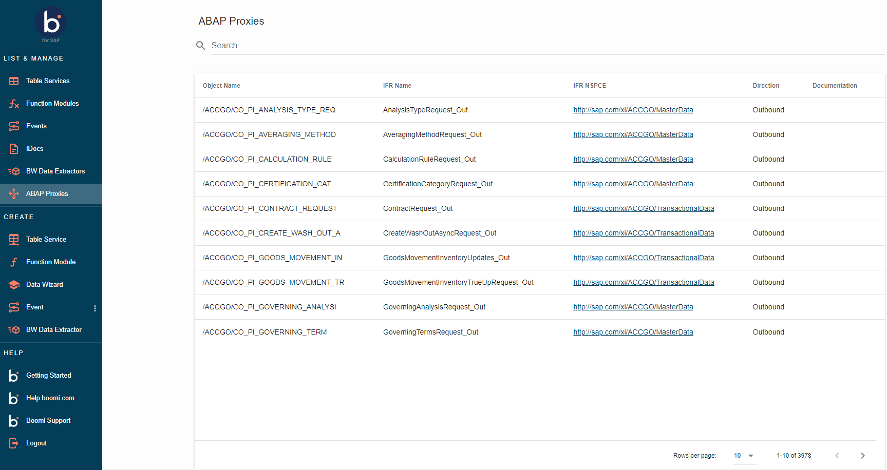
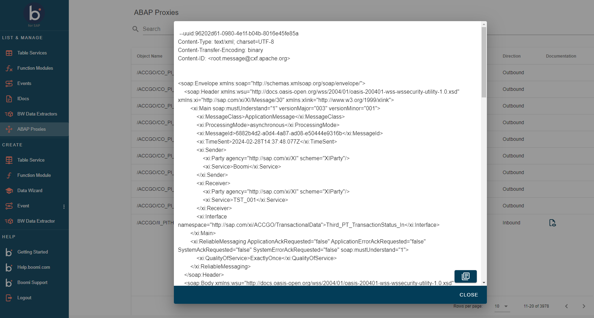

# Boomi for SAP UI

<head>
  <meta name="guidename" content="Boomi for SAP"/>
  <meta name="context" content="GUID-8acbce7d-419e-4e73-b98e-48c3cfce6541"/>
</head>

In Boomi for SAP UI, proxies are pre-established, offering essential information for both inbound and outbound message transmission. Additionally, you can filter the following parameters:

- **Object Name** = Name of the implementing class or interface

- **IFR Name** = Name of the service interface

- **IFR NSPCE** = Service interface namespace

- **Direction** = Either inbound or outbound; indicating which way the communication is

- **Documentation** = Contains the generated template (multipart) for a test payload for each Inbound proxy to test integration brokers

## Proxy test payload

When you click the **View documentation** button, a dialog box shows the test payload of the specific proxy. To copy this template, click the copy button in the bottom right corner.

:::tip
Since this is a test payload template, the *Receiver* and *Sender* information have to be changed accordingly.
:::