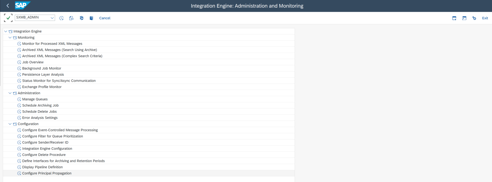
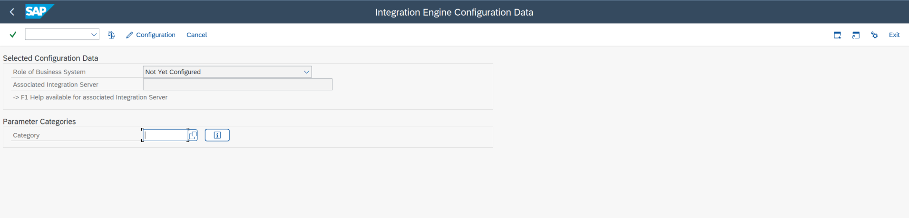

# Types of communication

<head>
  <meta name="guidename" content="Boomi for SAP"/>
  <meta name="context" content="GUID-957a34cd-1b68-45f1-a428-b139b761b30e"/>
</head>

ABAP Proxy, by Boomi for SAP, uses Inbound and Outbound communication.

## Inbound communication

For inbound communication, an Internet Communication Framework (ICF) service is shown at path `/sap/xi/engine`.

  This example shows a proxy ICF service's HTTP endpoint `http://&lt;host>:&lt;port>/sap/xi/engine?type=entry`

This serves as the sole entry point for inbound proxies. The message header dictates the routing to the appropriate proxy class, where the payload is parsed and processed. This process involves transformation, either via XSLT or from XML to SAP DDIC format.

## Outbound communication

The default configuration for receiving requests from the Proxy framework is set to SAP PO. Altering this configuration involves adjustments to either **SM59** or **SXMB_ADMIN**. Additionally, setting up a new HTTP endpoint for the new Middleware is necessary for this change.

1. In **SXMB_ADMIN** choose **Configuration** under **Integration Engine**.

2. In the **Integration Engine Configuration Data** pop-up, choose which **Role of Business System** you would like to use and provide the HTTP endpoint. 

All messages sent or received are monitored using the **SXI_MONITOR** transaction.

:::note
- In asynchronous communication, the proxy framework expects an "Acknowledgement" in return. This functionality is automatically provided when SAP PO is used and managed within the SOAP adapter. However, when the middleware is altered, this responsibility transitions to this platform.

- In synchronous communication, the proxy framework remains waits for a response from the receiving system. This must comply with the XI 3.0 standard that is used in proxy communication protocols.
::: 