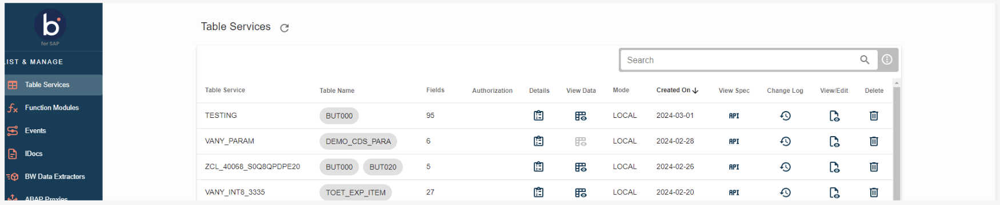
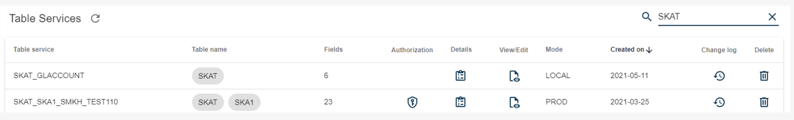
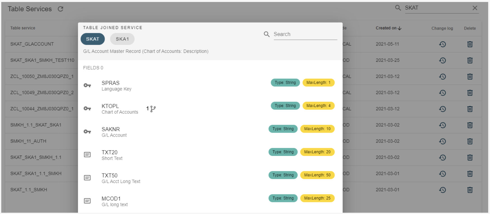
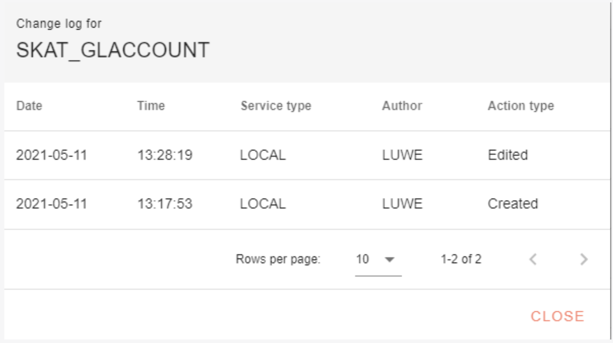

# Active Services

<head>
  <meta name="guidename" content="Boomi for SAP"/>
  <meta name="context" content="GUID-4fad146e-e749-4e7a-9495-713ad99186f0"/>
</head>

You can view servies that are currently active in your tables by clicking on **Table Services**. This will direct you to the **Table Services list**, where configured services are shown.

You can also use the search function, in the upper right corner of the page, to search for table services. If you search for the name **SKAT**, for example, all table services containing **SKAT** will show.

1. **Table Service**: This the service configured, containing one or more tables.

2. **Table name**: This the name of the table(s) included in the service.

3. **Fields**: Indicates the number of fields included in the table service. The number is the sum of all the fields included in the service.

4. **Authorization**: Shows the authorization object, if specified during the service configuration.

5. **Details**: If you want to see the table(s) details and fields in the service, you can click on the table icon. A pop-up window will appear, showing the details of each table(s) and the fields related to the table(s).

In the above example, the table service includes the table **SKAT**. The search field in the upper right corner lets you search through the fields inside the table service. To return to the **Table Services** page, click the **Close** button.

6. **View/Edit**: Here you can edit and update your table service, select and de-select fields, and reconfigure how the tables should be joined.

7. **Mode**: This shows whether the created service is transportable or local. ***Production*** mode indicates that the service can transport itself. If the mode is ***Local***, the service cannot transport itself.

8. **Created on**: The date the table services were created. Hover your cursor over the date to see the user that created the table and at what time the creation took place.

9. **Changelog**: Clicking the changelog icon opens a pop-up window with information about the creation and edits made to the Table Service.

10. **Remove**: The table service will be deleted from the list if you click the garbage can icon.

After finding or creating the service in Boomi for SAP, you can use the Boomi Enterprise Platform and the ***Boomi for SAP*** connector to import, map, and share it with other systems.

To do this, log onto [Boomi Enterprise Platform](https://platform.boomi.com/) and follow the instructions.

