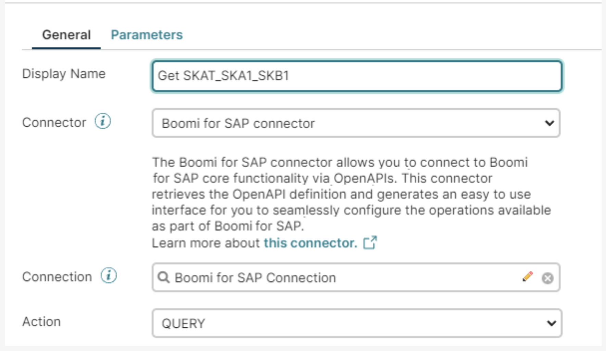

# Boomi Enterprise Platform for Table Services

<head>
  <meta name="guidename" content="Boomi for SAP"/>
  <meta name="context" content="GUID-bdbd630e-06e5-4bdc-be25-b7a43d1c4f24"/>
</head>

You can use the **Boomi for SAP connector** to import Table Services into Boomi.

The **Boomi for SAP connector** can either be used in a Start step to begin a process or as a Connection step later in a process by searching for the connector and dragging it onto the canvas. The following sections show how to create a new method using the **Boomi for SAP** in a Start step. However, the options are the same in both cases.

When you enter the Boomi platform, click the **Process** button in the canvas or create a **new component** in a folder, then fill out the different fields on the Start step page.

Create a **Display Name**, then click on the drop-down arrow to select the connector **Boomi for SAP**. The action will then change because of the chosen connection.

By default, choosing **Boomi for SAP** sets the action to ***QUERY***.

