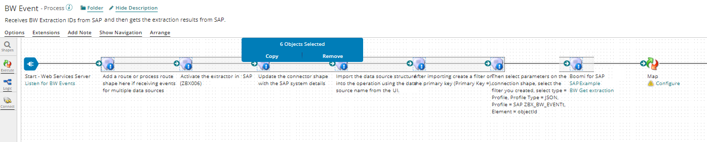
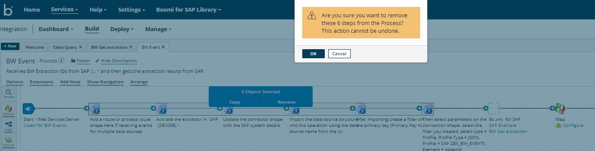
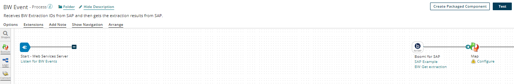
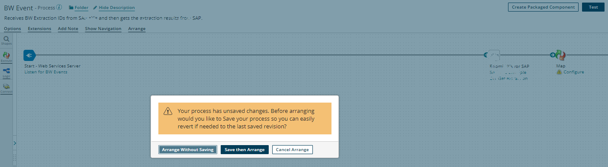
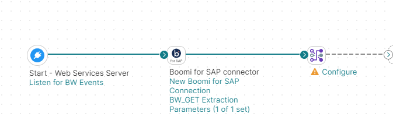
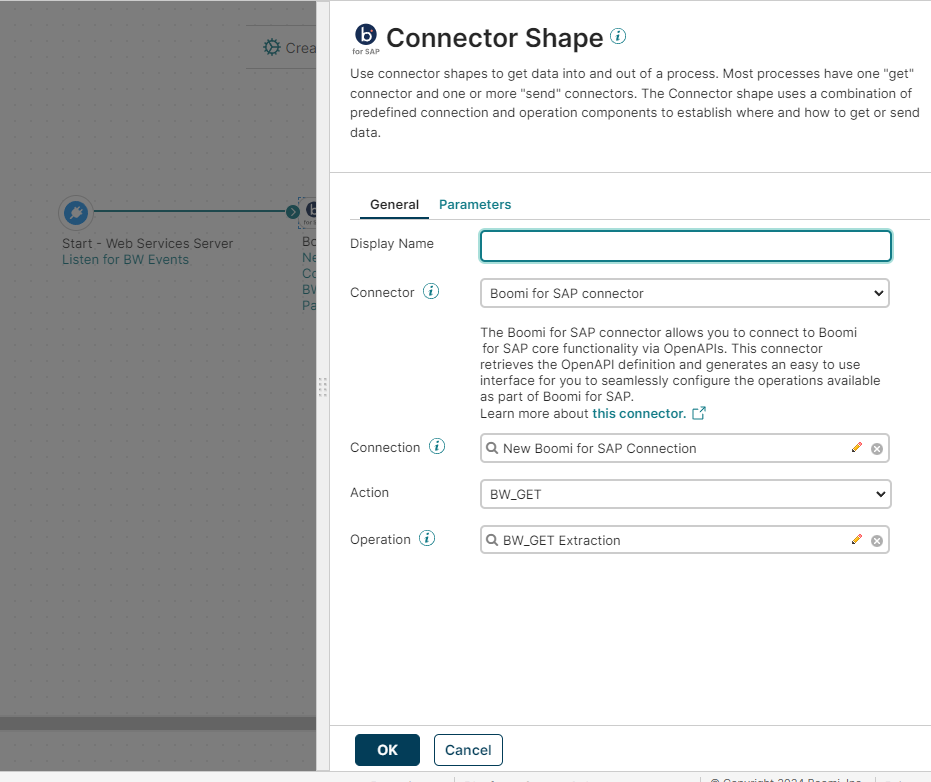
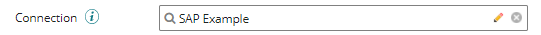
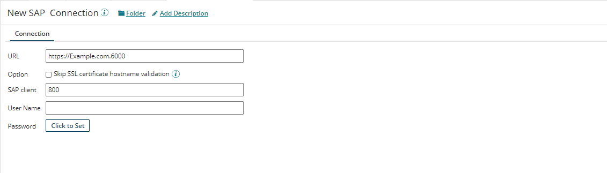

# Configure BW Extractor Process

<head>
  <meta name="guidename" content="Boomi for SAP"/>
  <meta name="context" content="GUID-d591b5aa-8de2-4008-aecf-4d658d446136"/>
</head>

To configure the BW Extractor process, follow the steps:

- If you are starting from the example process, remove all the notification steps by selecting them and clicking on the **Remove** button.

- Click **OK** to proceed.

- Next, click the unconnected endpoint next to the start step and drag it to the Boomi for SAP connection. The endpoint will turn into a green arrow, indicating that it is now connected.

- Click the **Arrange** button and choose the option to arrange the process without saving. 

- Now, you have a smaller process.

- Double-click on the **Boomi for SAP connection**.

- If a Boomi for SAP connection has already been made, click the 'x' in the connection field to remove the Boomi for SAP Example. Then, select the previously created connection. It is recommended to reuse the configured connection as much as possible, per runtime, to optimize Boomi licenses, which are based on consumed connections by the runtime (Atom/Molecule).
- If there isn't an existing Boomi for SAP connection, click the **pencil icon** next to the Boomi for SAP Example.

- Fill in the required fields on the connection page. If you don’t know the answers, contact the SAP team in your organization for assistance.
- Once all the fields are filled out, click the **Save and Close** button to return.

