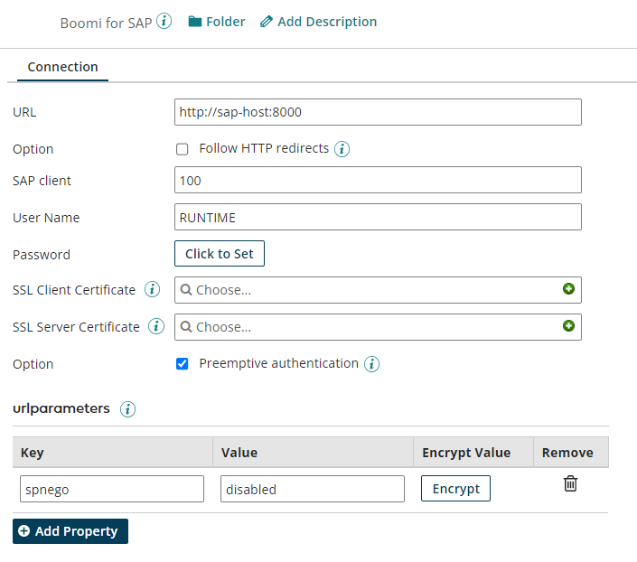
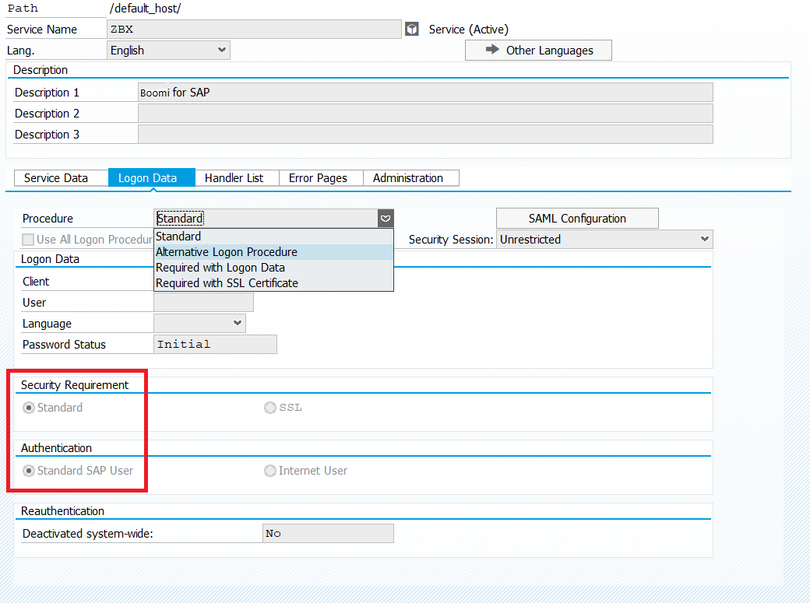
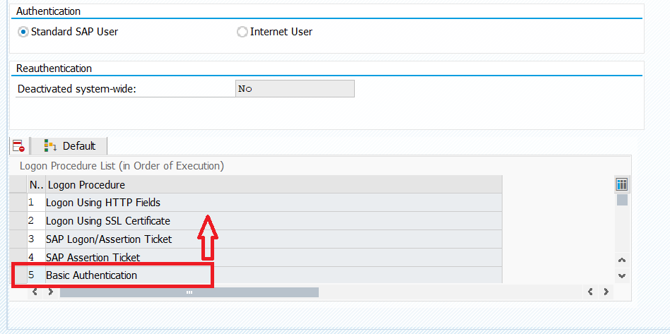

# Connectivity to SAP from Boomi

<head>
  <meta name="guidename" content="Boomi for SAP"/>
  <meta name="context" content="GUID-66496ac5-a269-4fe9-a191-dfd60acd02e2"/>
</head>

## Challenge

- 401 Unauthorized errors. Typically occur when there is a misconfiguration in the authentication settings. 
- Unexpected character error. Observed when Boomi receives HTML instead of JSON and often occurs due to misconfiguration in the SSO set-up, where interactive login is expected.

## Solution

To resolve both of the above error messages, the following solutions should be attempted one at a time:

1. **Force SAP to accept Basic authentication:** If SAP is configured to use Logon Procedures other than Basic Authentication, they might take precedence in SAP. In such cases, force SAP to accept Basic authentication by implementing the following options:

    1. Enable Preemptive authentication in SAP.
    2. Add the following *key* parameter in the Boomi connector: `spnego = disabled`.
    3. Add the following *value* parameter in the Boomi connector: `saml2 = disabled`.

2. **Prioritize the Authentication Mode in SAP:** 

Follow the steps below to prioritize the authentication mode:

    1. Set the authentication type to Basic.

     

    2. Modify the SICF service ‘ZBX’ in the BR2 system and prioritize Basic authentication by moving the **Basic Authentication** option to the top of the list or deleting other options.

 

If none of the above solutions work, you can perform **Advanced Connection Debugging** as outlined below. 

