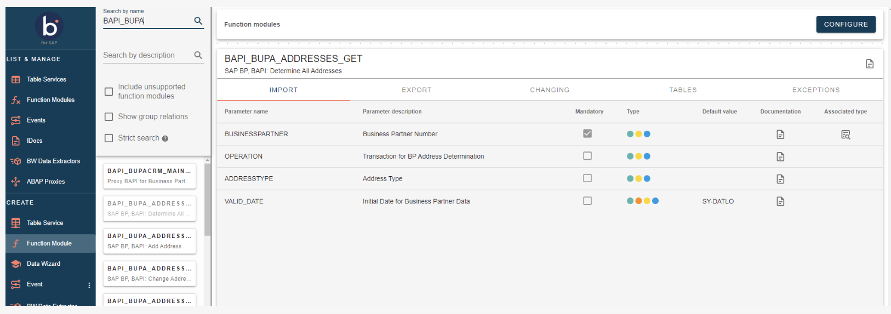
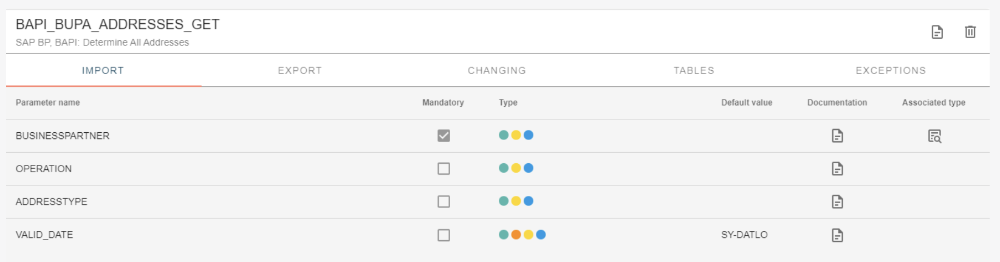
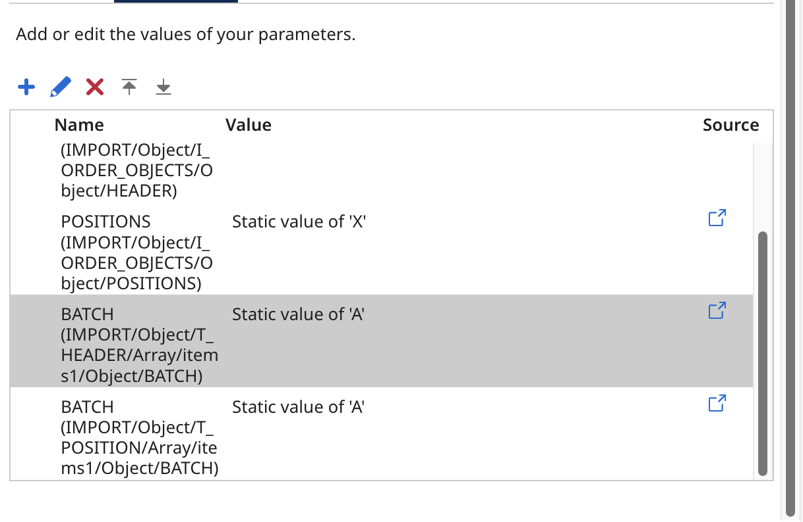
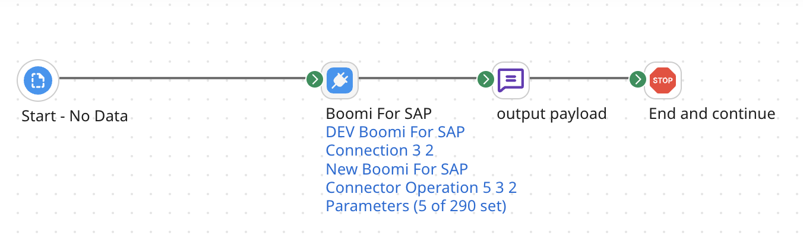
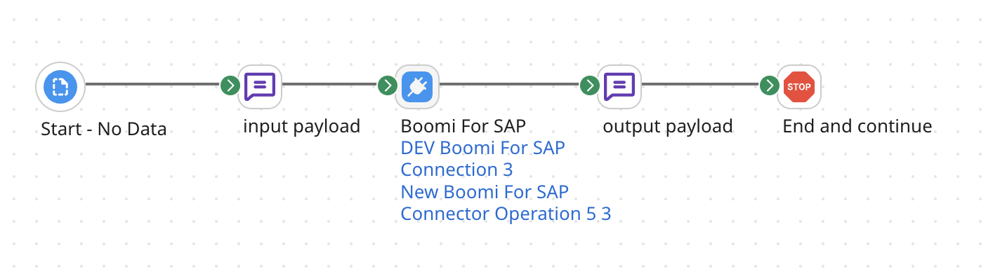
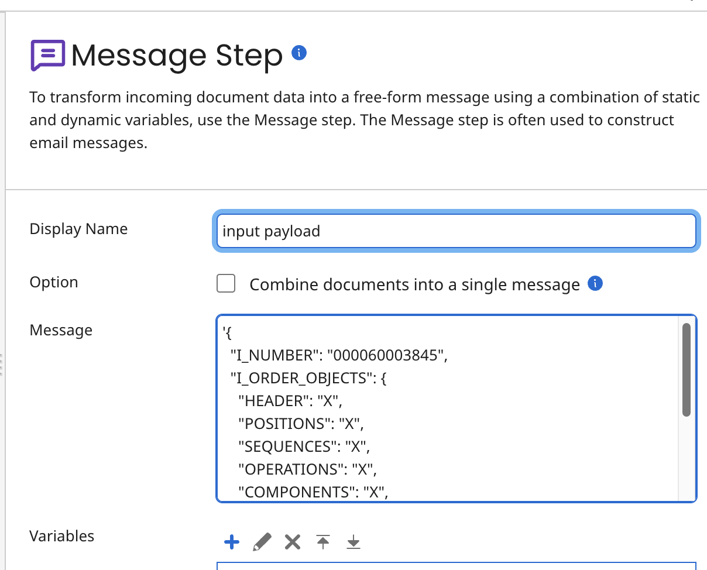

# Create a Function Module

<head>
  <meta name="guidename" content="Boomi for SAP"/>
  <meta name="context" content="GUID-c2e59800-668e-4de9-b732-fc66b98045a6"/>
</head>

When you have found the Function Module you want to expose as a service, drag and drop it onto the canvas or double-click it. If you choose the wrong Function Module, you can click on the correct one and drag and drop it again. The former Module will disappear and be replaced with the new Module.



**Configure Service** 
This section explains the Function Module elements used to create a service. The JSON schema definition adds a pre-pending letter indicating which kind of parameter is related. The highlighted text shows these:

**Import - "I_"**: Input parameters

**Export - "E_"**: Output parameters

**Changing - "C_"**: Changing parameters

**Tables - "T_"** 
Tables are both *in* and *out*, and change depending on the individual Module. Technically, tables can be viewed as changing, with "*out*" and "*evolving*" representing different data types. Tables will always be tables.

:::note

The request does not include mandatory tables; Boomi for SAP Core will automatically insert a null array when communicating with SAP. Add a null array to the corresponding key in the input Function Module JSON document to include optional tables in the output. For example, `"T_table_name": null` or `"T_table_name": []`.

:::


**Exceptions** 
Exceptions indicate which errors the modules have specified as possible errors. Take the possible exceptions into account when developing Boomi processes. The exceptions can be class-based. The figure below shows an example of a Function Module that does not contain exception classes but includes two expected errors when calling the function.


The *Import, Export, Changing, or Tables* Function Module elements contain the following parameters:

  - **Parameter name**: Name of the parameter included in the import of the Function Module

  - **Mandatory**: The checkbox marks the parameter as required.

  - **Type**: The type indicates the technical details of the parameter. If a description exists, This page will also display it. To view the details, hover over the colored circles.

  - **Default value**: Information provided by SAP. The system will default to sending the value if a default value is defined.

  - **Documentation**: This feature displays the available documentation. Documentation is not available in all cases.

  - **Associated type**: This section will illustrate the related type if a parameter defines an object type.



## Available parameters

The availability of Changing and Table parameters of FM services in the response is based on if you select the **Mandatory** checkbox.
- If selected: the parameter is added to the response by default even if not mentioned in Input payload.
- If left blank: the parameter is added to the response only if mentioned in Input payload. 

If you choose to make the parameters Optional, the Changing and Tables parameters will need to be added to the input of FM services, along with existing importing parameters. There are two methods to achieve this:

- Passing parameters through connector parameters (current approach)
- Passing parameters through JSON payload string (available with version 1.7 and higher).

:::note

Passing parameters through JSON payload string is recommended for future implementations of Boomi for SAP.

:::

### Demonstration through Connector parameter with example : `BAPI_PRODORD_GET_DETAIL`

- Add the required tables parameter in the connector parameters and set any default value for any parameter field. It ensures Tables parameter is passed to Payload. 

  This adds a record in Tables Parameter.

  `T_HEADER-BATCH` is passed as A.
  `T_POSITION-BATCH` is passed as A.

  `BATCH (IMPORT/Object/T_HEADER/Array/items1/Object/BATCH)`

  
  

During the execution if the Table/Changing parameter gets overwritten in the function module, the Extracted Table data will be available in export payload.

If the Table/Changing parameter is appended, the extracted Table data along with import record (Record passed at Connector parameter) will be available in export payload.

### Demonstration through input payload as JSON string with example : `BAPI_PRODORD_GET_DETAIL`

- We have to include Required optional Table parameters and Changing parameters along with importing parameters in the Input payload as JSON string and pass through the message component instead of Connector Parameters.



Prepare the importing parameters with required optional Changing and Tables in JSON format based on the Request Profile of operation.



Example Payload: Adding `T_HEADER`, `T_POSITION`, and `T_SEQUENCE` will include Table parameters in the response payload. This works similarly for all other Function modules.

````
'{
  "I_NUMBER": "000060003845",
  "I_ORDER_OBJECTS": {
    "HEADER": "X",
    "POSITIONS": "X",
    "SEQUENCES": "X",
    "OPERATIONS": "X",
    "COMPONENTS": "X",
    "PROD_REL_TOOLS": "X",
    "TRIGGER_POINTS": "X",
    "SUBOPERATIONS": "X"
  },
  "T_HEADER": [],
  "T_POSITION": [],
  "T_SEQUENCE": []
}’
````
