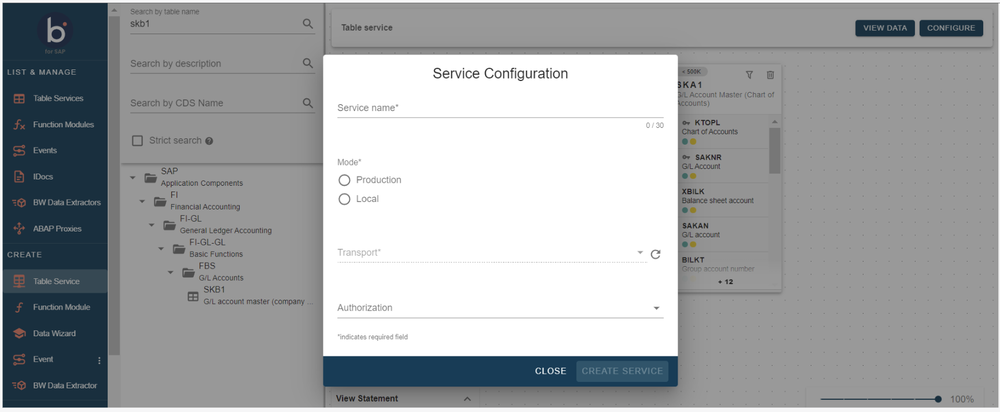

# Create Table Join Service

<head>
  <meta name="guidename" content="Boomi for SAP"/>
  <meta name="context" content="GUID-974cf5e1-14aa-4906-b8eb-5a6ca347500b"/>
</head>

After the desired fields are joined, click the **Configure Service** button in the upper right-hand corner. In the pop-up window, fill out the information needed to create the service, as described below.

1. **Service name**: To create a service, enter a service name.

2. **Mode**: This indicates if the service created is transportable. By selecting ***Production***, the service can be transported. When using this option you must select a transport for the service before it can be created. On the other hand, by selecting ***Local***, the service created can not be transported, and therefore, no transport can be selected.

3. **Transport**: This is the transport that will be assigned to the service. Creating the table service and promoting it from local to Production is possible.

4. **Authorization**: You will configure the authorization object for the service with the corresponding authorization fields and values. Press the drop-down menu to choose the authorization object, and then fill out the authorization field's values.

If no authorization objects are assigned, it doesn't check for authorization when calling the service. Thus, it is also possible to configure the service without selecting any authorization objects.

6. **Test as user**: You can test the authorization to check for a specific user by entering a user name. If the user exists and has the correct authorization, a green checkmark will appear.

If no user exists and there are no correct authorizations, an error message will appear.

7. **Configure Services**: After filling in the above information, you generate the service by pressing the **Create Service** button. If the service creation was successful, you will see the following confirmation message: *The process successfully created all services*. If you want to return to the canvas, click the **Close** button.

Once you create the service, the system will redirect you to the ***Table Services*** page, where you can find the service(s) you just created.
