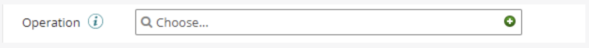
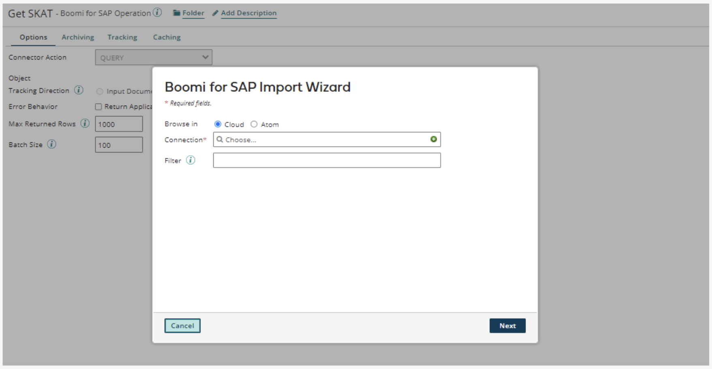

# Creating Connection and Operation

<head>
  <meta name="guidename" content="Boomi for SAP"/>
  <meta name="context" content="GUID-4fb15561-d37c-4148-b64b-1873ae8a14a0"/>
</head>

## Creating a Connection

You must now create a new connector or search for and select an existing connector.

:::note
Boomi licenses are based on connections consumed by the runtime (ATOM/MOLECULE) used per atom, so the configured connection should be reused as much as possible per runtime.
:::

If someone has already created a connection, click on the field and select the connection in your folder. If the connection is not visible and you know the name of the connection, you can search for it in the text field.

Click the small **green plus icon** to create a new connection.

In the pop-up window, fill in the different fields shown on the connection page. If you are not sure what to enter in those fields, contact the SAP team within your organization. Once all fields are filled out, click the **Save and Close** button to get back.

## Creating an Operation

You now have to select, create, or search for the connector operator.

If someone has already created the operation, such as the connector operation on the specific account, you can click on the field and select the operator in your folder. If the connector operation is not visible, you can search for it. 

To create a new connector operation, click the small **green plus icon** within the operation field. You will then be redirected to the page where you can create the connector operation.

To quickly find the operation in the future, you should add the name of the service you created earlier in the operation name field. In this example, we named the operation **Get SKAT** because it imports the table **SKAT**. Previously, we created the service in Boomi for SAP. Then, click on the **Import** button to query the objects. A pop-up window will appear.

Choose an **Atom** from the drop-down menu to run the operation.

Afterwards, you must choose a connection. You can create a new one, search for one, or select a recently used connection.

When you have selected the Atom and the connection, click on the **Next** button to query the objects. The Atom will then connect you to object types. Click on the drop-down and select the desired ***Object Type***.

Alternatively, if you click the **Back** button, you can use filters with wildcard characters to reduce the number of returned objects.

The filter allows you to limit the objects (Services) by searching for a specific value in the service name. You can use an "*" to search for any value. If you want to find tables ending in **SKAT**, you should search on `*SKAT`. Or, if you want to find all services that contain **SKAT** somewhere in the title, search on `*SKAT*`.

When entering the desired filter, for example, `*SKAT*`, click the **Next** button. The object type shown will then contain the word **SKAT**.

When you have selected the desired object type, click the **Next** button. A new page will appear, showing the object type and the associated response profile. Click on the **Finish** button to get back.

You will now see that your operator imports the service selected with an associated response profile. Click the **Save and Close** button to return to the start step page. To finish the configuration, click on the **OK** button.

When you have created the operation, you can pick and choose fields and add a filter and/or sort criteria, which will be applied when the service loads SAP data into Boomi. 

:::Note:
The filtering happens on the SAP side, so you are not exhausting the ATOM with the filtering task.
:::

You will find **fields**, **filters**, and **sorts** at the bottom of the page where you just imported the `SKAT` object. The following sections describe the fields, filters, and sort criteria.

