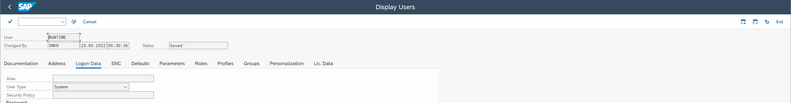
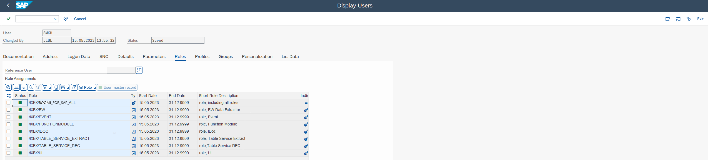
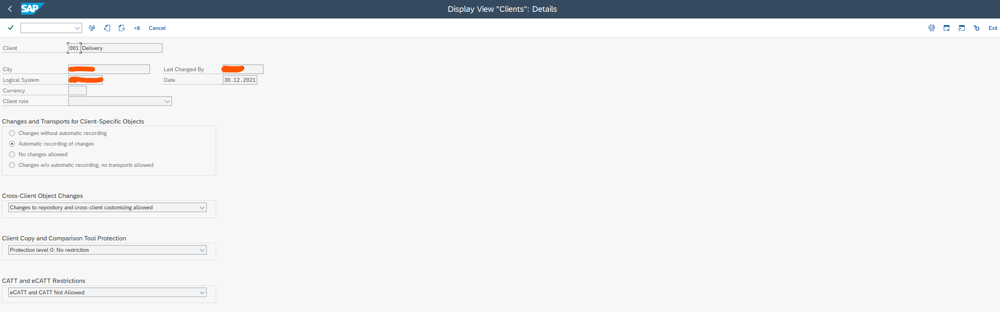

# Creating Users and UI Verification

<head>
  <meta name="guidename" content="Boomi for SAP"/>
  <meta name="context" content="GUID-65986967-23be-4ab9-9dd5-e38ebd30fdf0"/>
</head>

## Creating Users

To set up user accounts, follow the below instructions:

- **WF-batch User**

1. Create the WF-batch user, unless one already exists.
2. Verify the Workflow user configuration in SWU3.

 

- **System Runtime**

1. Create a Boomi Runtime user within the data client to facilitate access from Boomi atoms. 
2. Assign the necessary roles to the Boomi Runtime user.



- **Dialog User(s)**

1. Create Dialog User(s) with SAP_ALL (only recommended in Development).
2. Add the following roles to the Boomi for SAP user(s):
Boomi for SAP roles = add /IXBX/BOOMI_FOR_SAP_ALL



## UI Verification

To verify the UI, proceed as follows: 
- Run the transaction ```/n/ixbx/zbx001``` or ```/n/ixbx/start_UI``` in the development client. This will open a browser that allows the user to configure Boomi for SAP services. 
- Log in using your regular SAP user credentials. 
- Ensure the development client settings are configured properly to run Boomi for SAP UI.



