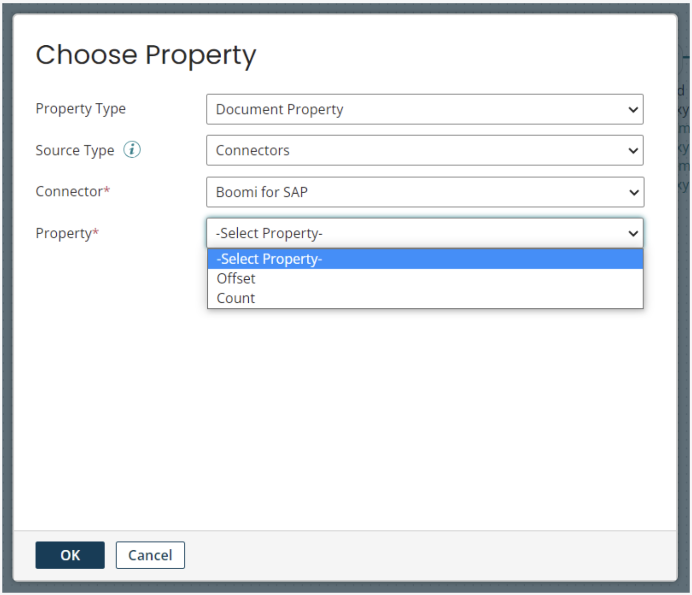

# Document Properties

<head>
  <meta name="guidename" content="Boomi for SAP"/>
  <meta name="context" content="GUID-a41f424a-f68c-4fe2-a48e-7b41aed0e85c"/>
</head>

The **QUERY** operation for Table Services has two related Document Properties. The properties are ***legacy properties***, and new features, like [Table Service Extract](./Sap-Table_service_extr.md), have replaced their usefulness.

**Boomi for SAP — Count** overrides the operation’s **Max Returned Rows** setting. It can be used to dynamically limit the number of returned rows. This can be particularly useful in scenarios where you need to control the volume of data returned.

**Boomi for SAP - Offset** allows a developer to get results after a set number of rows.

Note that while these two properties will allow you to page through Table Service results, it is not recommended for Boomi and SAP performance reasons. There's also a risk of skipping data if data is updated or created during an extract. For large queries that require paging, use the [Table Service Extract](./Sap-Table_service_extr.md) functionality, which provides better performance and no risk of skipping data.

