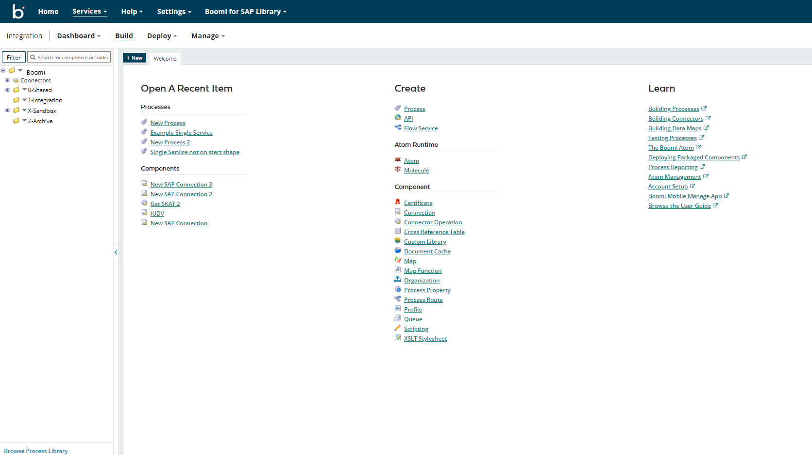
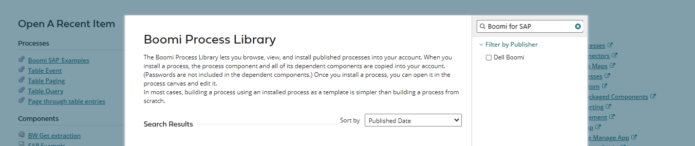
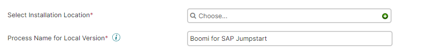
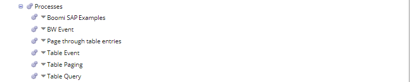
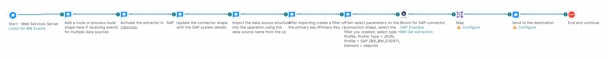

# Extract Data in Boomi Enterprise Platform

<head>
  <meta name="guidename" content="Boomi for SAP"/>
  <meta name="context" content="GUID-2da09f51-bedd-409e-9805-651c118594b0"/>
</head>

To import the SAP data source format into Boomi, configure Boomi to receive notifications when extractions occur, extract the data, and send it to another system.

If this is your account's first BW data extraction, you can download the example processes from Boomi's process library. However, if you already have a BW extraction in your account, proceed to configure Additional BW Processes.

To download from the Process Library:

- Create a new folder to store the example process.
- Click on the **Browse Process Library** button located on the screen's lower left-hand side.

- Search for **Boomi for SAP** in the process library.

- Select the Boomi for SAP Examples process and click on the **Install** button.
- Choose your selected installation location and click the **Install** button.

- After completing the above steps, you will now see five processes in the new folder in your account.

- Double-click on the 'BW Event' process and use it as a foundation for your new BW extraction listener, as described in the **Configure BW Extractor Process** section below.

