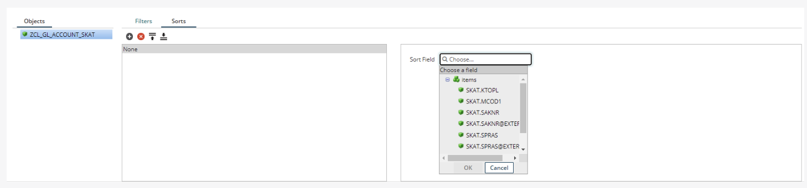
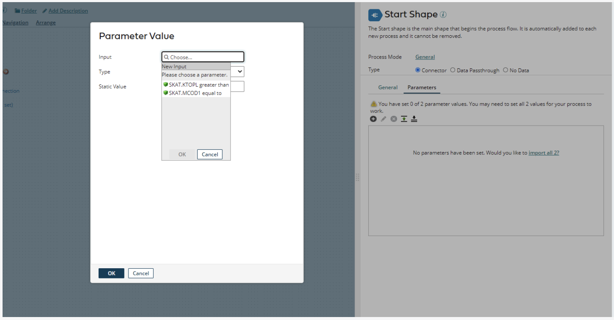
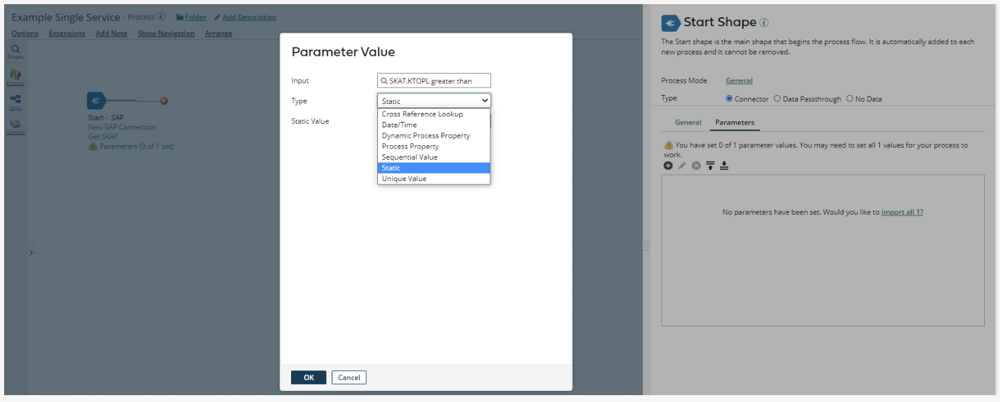

# Fields, Filter and Sorts

<head>
  <meta name="guidename" content="Boomi for SAP"/>
  <meta name="context" content="GUID-d9155b1e-1ba1-466a-aff8-c75402cc3fc3"/>
</head>

## Fields

Clicking the **plus** icon next to the previously chosen Table Service unfolds it and shows the fields inside, as shown in the example below.

In the ***Fields*** tab, you can use the checkboxes to select and de-select each field and thereby specify the fields that should be returned from the SAP backend.

## Filter

The ***QueryFilter*** supports up to 10 levels of nesting, where the groupings are AND and OR together. 

:::Note:
Nested OR statements must have the same field name in all fields within each Logical OR group. The following describes how to filter by adding an AND expression group.
:::

Click on the **arrow** under the filter to **Add Logical Sub-Group**.

A new field will appear. Click the **arrow** and choose ***Add Expression***. By default, the operator to the right will be **AND**.

To add an expression, use the drop-down menu to select a field. Click on the desired field and then click the **OK** button.

A new operator field will appear. Click the drop-down to choose the operator. In this example, **SKAT.KTOPL** is selected with the operator ***Greater Than***.

Ensure that you write a ***Filter Name*** that reflects the chosen field and operator. It will make it easier to find the Expression later in the process.

If you want to add a second expression, click the **arrow** beside the Expression you already made. Then follow the steps described above.

After creating one or more expressions, click **Save and Close**.

You are now redirected to the canvas. Click **(Parameters 0 of 2 sets)** to create a new parameter.

A new page will open to the right, click the small **green plus icon** to set the parameters.

In the pop-up window, choose the **Input** you created as an expression.

You can then compare your filter criteria with various values, such as the current date, a static value, or a process property. For a full list, visit [Parameter values](../Integration/Process%20building/c-atm-Parameter_Values_23a1eb13-d83b-423e-adf1-d78db4a1fbbd.md).

In this example, someone chose two different types: **Dynamic Process Property** and **Static**. You may need to manage your filter criteria differently, based on which type you select, before clicking the **OK** button to return.

When you return to the start step page, click the **OK** button to return to the canvas.

## Sorts

You can now sort different fields as you prefer. To do so, click on **Sorts** beside **Filters** at the bottom of the operation page. Two big boxes will appear.

Click the **plus icon** to select the field you want to sort. After you have chosen the desired field, click the **OK** button. you can then select an order for **Ascending** or **Descending**.

You can add as many fields as you want to sort. Each time you add fields to sort, click the **Save and Close** button.

:::Note: 
You can configure the step from the canvas. If you want to change the connection or the operation, you can do that directly from the canvas. For example, if you click **Get SKAT**, you will be redirected to the operation's configuration.
:::

### Number of Rows

If your process resides on a Boomi cloud Atom, keep the number of returned documents per connector operation below 1000 and keep the returned data below 1 MB. You can increase this number using an on-premise Atom with more processing power.

The **Max Returned Rows** setting in the Connector Operation is helpful if you always need a fixed number of rows, For example, the first result, or want to limit the number of rows returned during development and testing.

