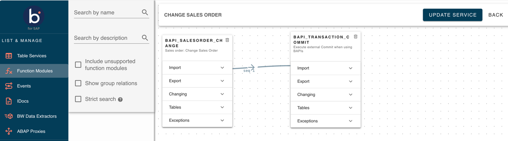

# Function Module Service Batching

<head>
  <meta name="guidename" content="Boomi for SAP"/>
  <meta name="context" content="GUID-=8d9269e2-15e4-4bf6-88af-ec779b9d92ca"/>
</head>

The FM service batching functionality allows you to sequence Function Modules (FMs). This approach improves the flexibility and execution efficiency of multiple FMs in a single Boomi service call.

With the FM batching feature, you can queue the execution of function modules for each required sequence while configuring FM service. 

## Process overview

## Supported editions

- Services created in Boomi for SAP version 1.7.2 and earlier are not eligible for the consistent execution of consumed Boomi processes. You must upgrade to at least version 1.8 to utilize FM service batching.

## Error handling

- The process executes successfully if no FM exceptions are encountered during execution.  

- If an exception is encountered in any FM, an exception will be raised for that FM and the process execution will be terminated. 

- If the execution of a FM fails in process execution, the process will continue for the remaining FMs and an exception will be raised for the failed FM execution. See the following error for an example:
 

## End to end FM batching execution
1. Log into Boomi for SAP UI and navigate to **Create FM**. You can drag and drop multiple FMs onto the canvas and link them through the yellow highlighted areas as required.

2. Once all the FMs are linked, you can create a FM service with the **Configure** button.

3. Fill in the required fields on the **Configure** screen. Click **Create Service**. 

4. You should see the new service in the **List and Manage** tab. 

5. In the Boomi Platform, create a process with the Boomi for SAP connector to consume the FM service. 

6. Create a connection with SAP using your user credentials. 

7. You can see the request and response profiles once the FM service is consumed. These profiles are updated as service data is consumed. 

8. You can add input parameters for consumed service FMs if needed. 

9. Once the process is deployed successfully, select the deployed process and atom to execute the created process.

10. You can view the process output with the Document Viewer in the export parameters for each consumed FM service.

## Real time batching execution

### Request profile of the service

### Response profile of the service

### Process output

