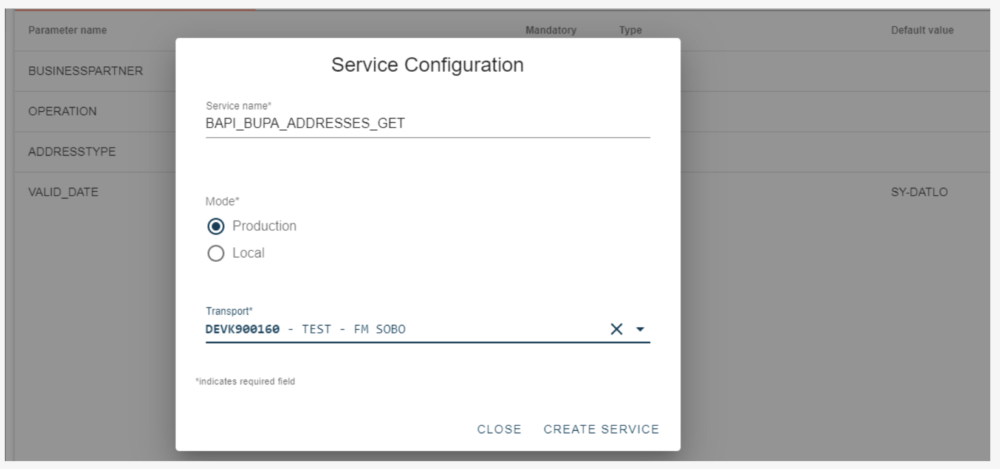
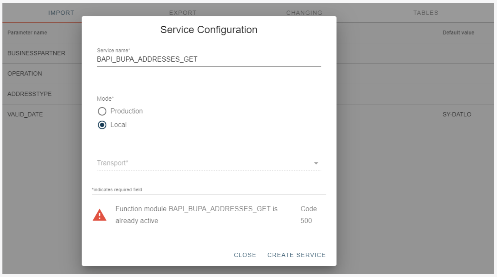
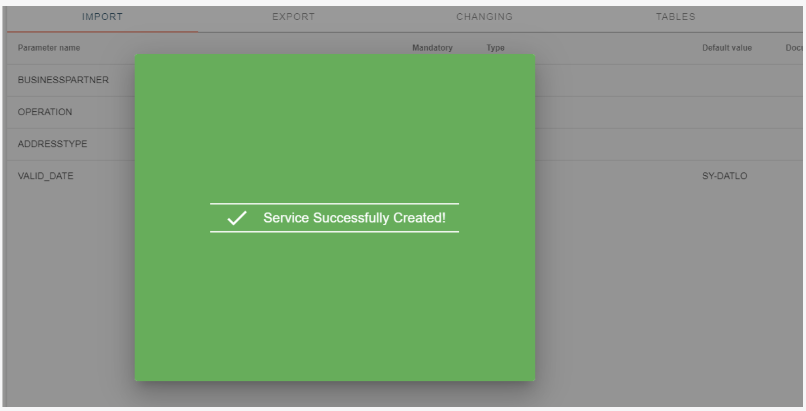
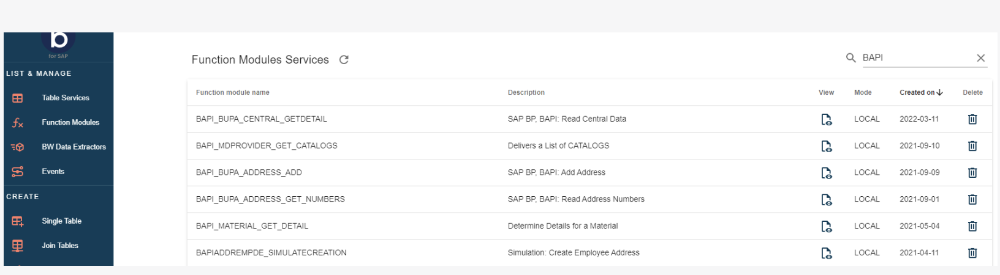
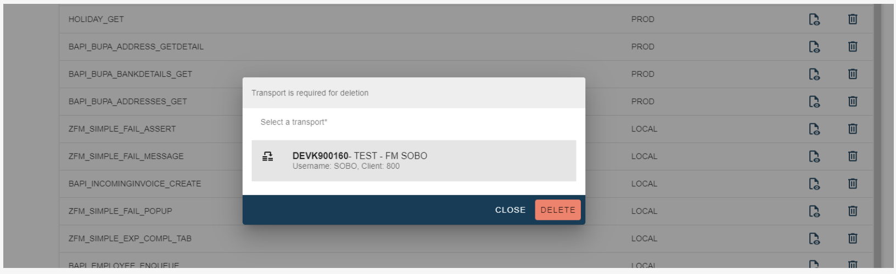

# Service Configuration

<head>
  <meta name="guidename" content="Boomi for SAP"/>
  <meta name="context" content="GUID-8017796c-fccd-45cb-b99f-d163461760e2"/>
</head>

This section describes how to configure a Function Module service.

Click on **CONFIGURE FUNCTION MODULE** in the upper right corner. A pop-up window will appear with the following fields:

- **Service name**: This will be the name of both, the service you create and the Function Module.

- **Mode**: This indicates whether the service created is transportable. If you select PROD mode, you must choose a transport method beforehand to activate the service, as the service itself doesn't transport automatically. If you opt for the "Local" selection, the service won't require transportation, so you shouldn't designate a transport method.

- **Transport**: This will be assigned to the service. 

The service creation will trigger an error message if it already exists.

When you fill out the required fields, click  **Create Service**.

Upon successful service creation, a pop-up window will appear.

### See Active Services

Click on **Function Modules** under **LIST & MANAGE** to be directed to the page with all the active Function Module services.

### Search for Generated Services

You can search for table services using the search function in the upper right corner of the page. If you search for the name 'BAPI,' for example, all active Function Modules services containing 'BAPI' will appear.

### Delete Service

Go to the page with active Functions Module services and search for the service you would like to delete. Then click the **Delete** icon on the row of the service you want to delete.

A pop-up window will appear to confirm deletion. If you create the service in PROD mode, please choose a transport option. Click 'Delete' to remove the service.

### Mandatory Fields

You don't need to send the *Import*, *Changing*, and *Tables* parameters from the client if they are mandatory or have a default value.