# Function Modules in the Boomi Enterprise Platform

<head>
  <meta name="guidename" content="Boomi for SAP"/>
  <meta name="context" content="GUID-27f98a35-aa57-4275-b81a-88d22f1e4dd2"/>
</head>

The ***Boomi for SAP*** Connector is no different from other Boomi Connectors. It makes development easy by importing operations and profiles.

## Building a Boomi Process

Create a new Process and configure the Start step type to ***No Data***.

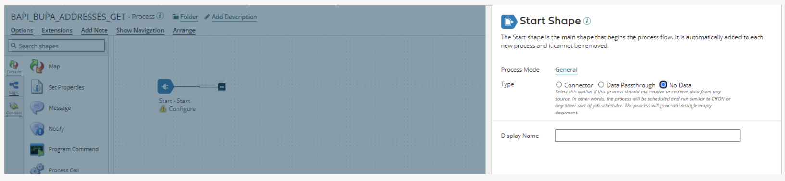

Add a ***Message step*** immediately after the Start step and connect them. In this example process, the Message step contains test data corresponding to the Request Profile created in the next step. When building your processes, map your data to the Request Profiles of the Operations.

## Connection

To configure a **Boomi for SAP Connector**, add a Connector step to the canvas, then double click the connector step and add a *Display Name*. You can select an existing Connector or create a new Connector (see image below) by clicking on the green plus sign icon.

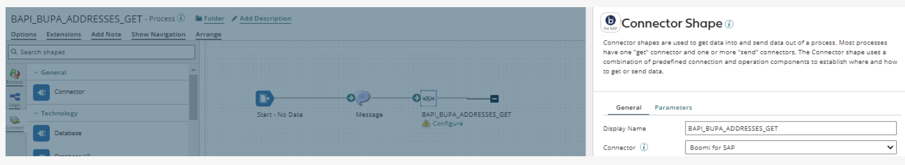

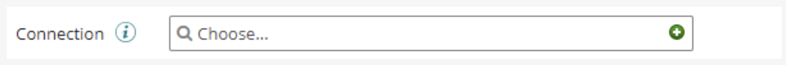

Fill in the fields shown on the connection page with the values provided by your SAP team. Then set the Action to ***FUNCTION*** and click the **Save and Close** button to return to the previous screen.

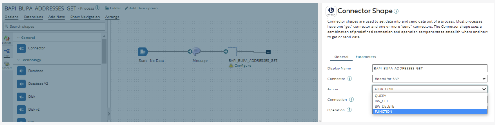

## Operation

To create a new Connector Operation, click the small **green plus icon** in the Operation field. This opens a pop-up window for you to create your Connector Operation.

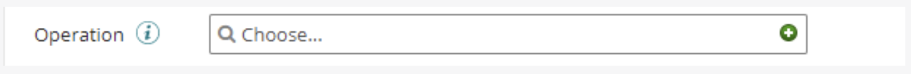

To quickly find the Operation in the future, add the name of the service you created in Boomi for SAP to the operation name in the upper left corner. In this example, we named the operation *BAPI_BUPA_ADDRESSES_GET*.

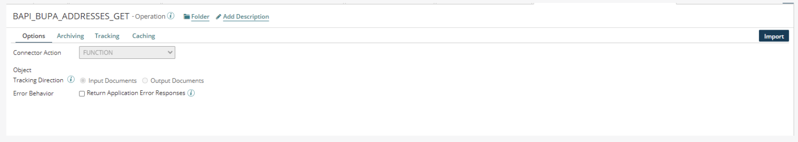

Click the **Import** button to import the Operation and Profiles.

In the *Import Wizard* pop-up window, choose an **Atom** to run and perform the import. The Atom should have network access to the Boomi for SAP instance. In the Connector and Filter fields, choose the appropriate *Connector* and an optional *Filter*, which allows for wildcard filtering.

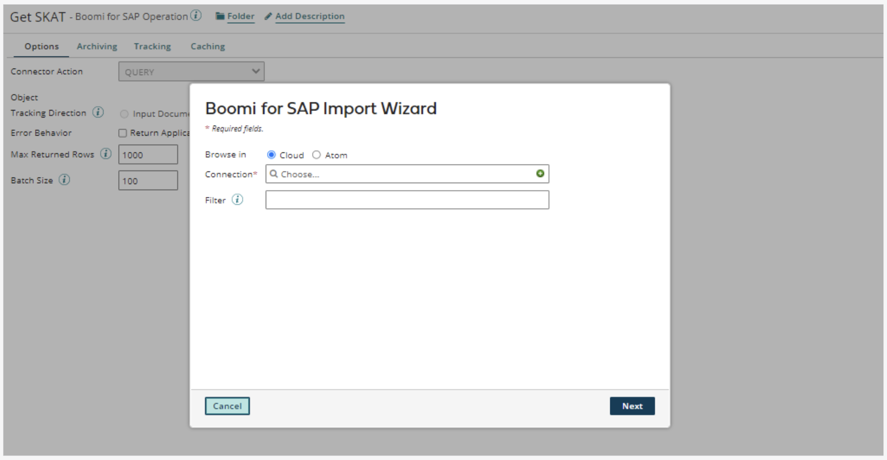

After selecting the Atom and the Connection, click the **Next** button to query the objects. Then, choose the *Object Type* from the drop-down menu.

Click **Next** and a pop-up window will appear, showing the following:

- **Object Name**: The name of the Function Module.

- **Request Profile**: The format of the data expected by the Operation.

- **Response Profile**: Click **Finish** to return to the Operation view with the newly imported Operation and Profiles. This View will display the format of the data returned from the Operation.

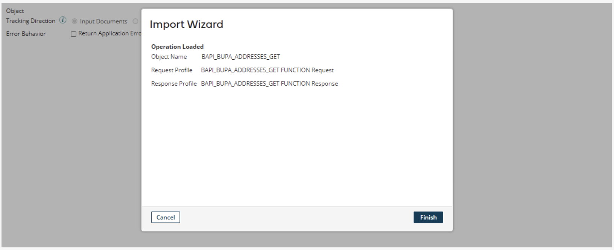

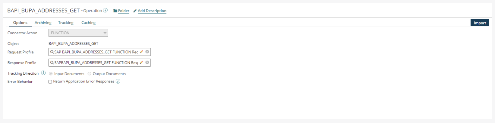

Click **Save and Close** to get back to the configuration of the Connector step. Click **Save** to save your operation.

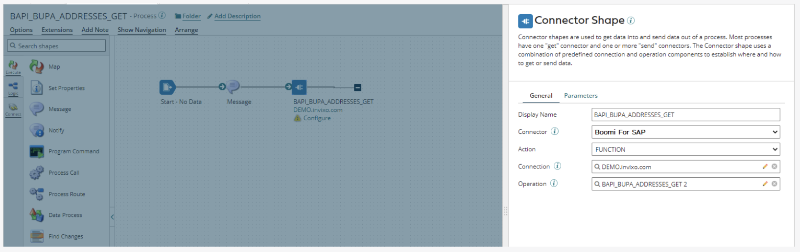

Finalize the configuration by adding a ***Stop step*** and connecting it to the Connector step.

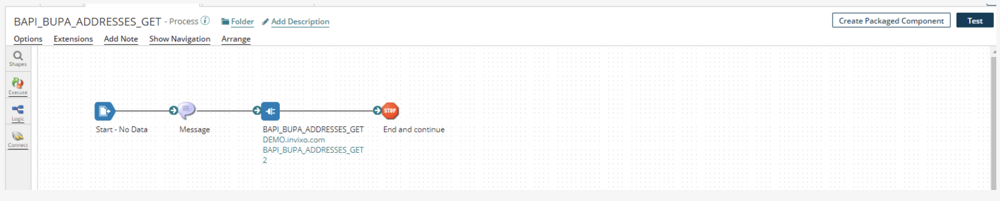

Now you can add a test data to the ***Message step*** that conforms to the Request Profile format. To test the process, click on **Test** in the upper right corner and choose Atom to run the test. Click **Run Test**.

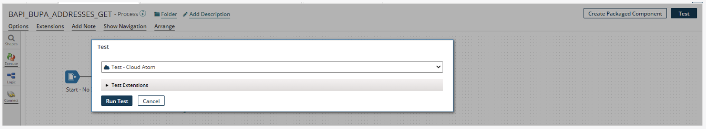

Once the test execution completes, a brief message will pop-up in the lower right corner stating that the "Test execution of BAPI_BUPA_ADDRESSES_GET completed successfully".

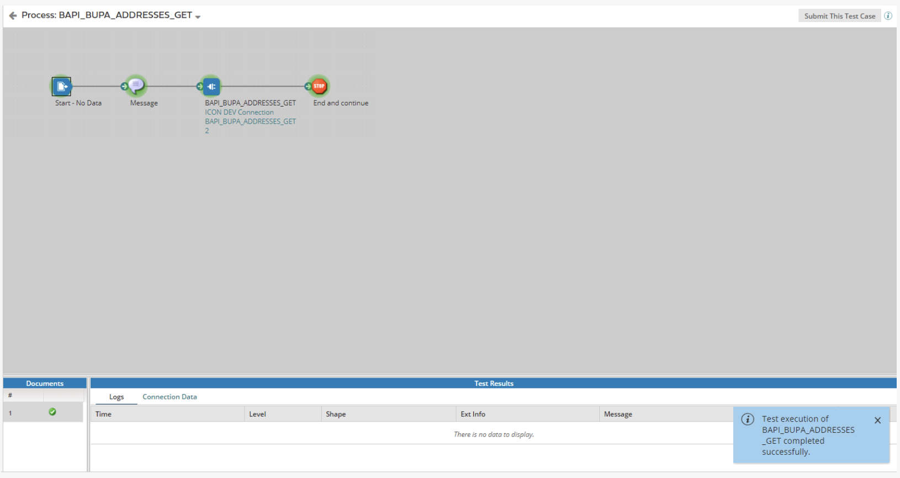

To see the result, click on the **Connector step** on the canvas and then on **Connection Data**.

Then click the **file icon** right under *View* to see the output.

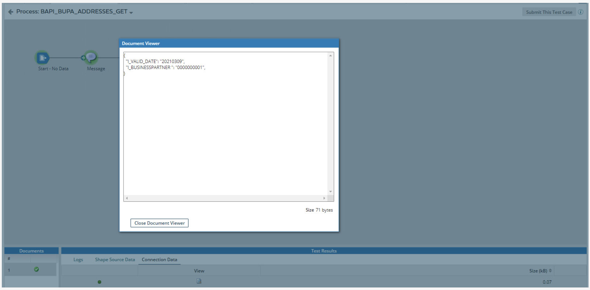

## FILTER_RESPONSE PARAMETER

In a Function Module's request profile, there is a parameter called `I_/IXBX/FILTER_RESPONSE` (The same is called `I_1IXBX1FILTER_RESPONSE` in Boomi profiles), which allows for filtering the returned data. For instance, if a function module returns data in a table that is not needed, you should filter away this table before returning the data to the Atom from the backend. You can filter the returned values from *Export* or filter the tables from *Tables*. You can use either the backend names of the parameters or the service exposed names (with `E_` or `T_` in front)

## FORCE_COMMIT_OR_ROLLBACK PARAMETER

The request profile also includes a parameter called `I_/IXBX/FORCE_COMMIT_OR_ROLLBACK` (This is called `I_1IXBX1FORCE_COMMIT_OR_ROLLBACK` in Boomi profiles). The caller can use this parameter to force a commit or rollback after calling a function module. If this flag is set to **X** , the function module will be executed, and then a commit will be performed; or a rollback will be performed if there is an error executing the function module. This is particularly valuable for BAPIs, as they typically refrain from self-committing.