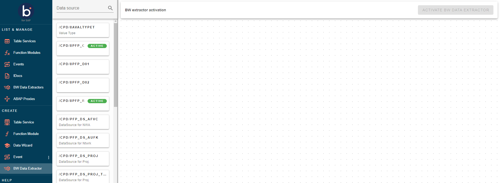
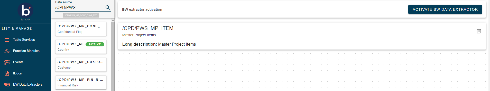
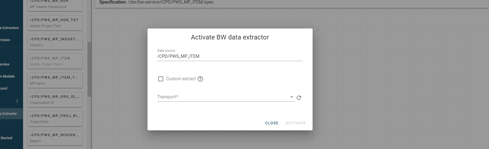
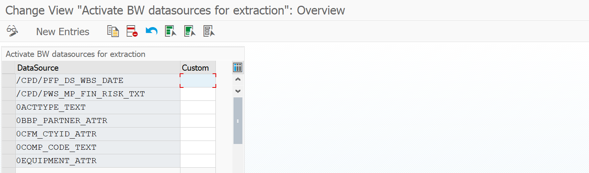
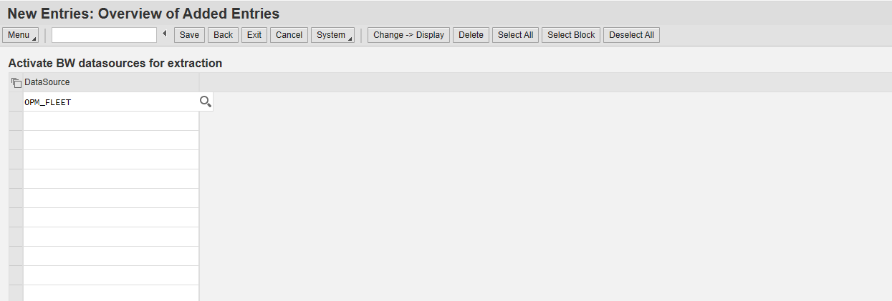

# Getting Started with BW Data Extractor 

<head>
  <meta name="guidename" content="Boomi for SAP"/>
  <meta name="context" content="GUID-de04dca9-d872-4e74-835f-c343003f8101"/>
</head>

The following sections will describe and visualize the BW Data Extractor.

## Prerequisites

Establishing a SAP RFC Connection to the Boomi Runtime (Atom, Molecule, or Cloud) and configuring a Boomi process to receive the data efficiently.

## BW Data Extractor in SAP
To activate the BW Data Extractor, you have two options available. You can either use the Boomi for SAP UI or log in directly to SAP. 

**1. Activate BW Extract in Boomi for SAP**

  - Navigate to the BW Data Extractor menu to locate the desired data source. Once found, drag it onto the canvas to access information about the extractor.

  

  - The canvas retrieves the relevant information, including a detailed description and specifications as shown in the image below.

  

  - To activate the extractor, click on the orange button in the top right corner. In the activation menu, select a transport. If you prefer to handle the extractor through a custom "BADI" implementation instead of the standard Boomi for SAP implementation, choose "Custom Extract."

  

**2. Activating BW Extractors in SAP GUI**

To activate BW extractors in SAP GUI, follow these steps:
  - Run transaction `/IXBX/ZBX006`: 'Send BW Data Extractor' and click on the **New Entries** button.

  

  - Select the desired data source and add 'X' to the Custom column if you want to handle the extraction through a custom BADI implementation, not the standard Boomi for SAP implementation.
  - The BW Extractor should be sent via RFC, which can be created for the previously used URL. After that, click on the 'Save' button.

  

  - Once you have saved the selected data source, the system will prompt you to associate this change with a transport request (For example, a customizing request). 
  - Select the appropriate customizing request and click on the 'green checkmark'.
  - The data extractor is now in the BW Data Extractor menu. You can send it via ZBX007.