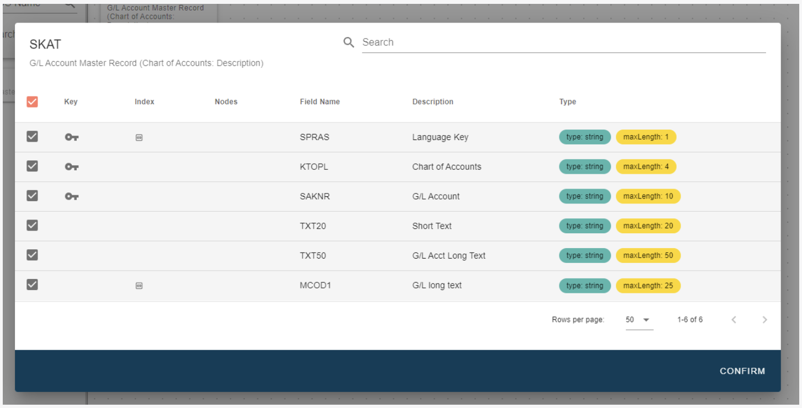

# Getting Started with Table Service 

<head>
  <meta name="guidename" content="Boomi for SAP"/>
  <meta name="context" content="GUID-de2292c0-892c-4177-b5d0-bb8ef94c48ac"/>
</head>

The landing page contains the Create menu on the left, where you choose **Table Service**. The table service functionality allows you to develop table services for external systems.

Use the Search Table or the Table Wizard to search for your desired table. For example, if you search for **SKAT**, all table names containing that word will appear.

You can also search for the description of your desired table. The asterisk symbol can be used as a wildcard, enabling you to search for specific text in the description.

For a more specific search, use the **Strict Search option**.

You also have the option to select the tables you want to use or join from the list menu and view the table's fields. To do so, ***drag and drop*** the desired table onto the canvas. Your chosen table will now show in the table menu in a light grey color, meaning it is now read-only. The tables that are still available will stay black and can still be dragged and dropped.

To view information on available fields for your table, hover over the index sign. To delete a table from the canvas click the **garbage can icon** in the upper right corner of an individual table.

If you want to remove any fields from the chosen tables, click on the **filter icon** to filter the fields. Boomi allows you to minimize the document size.

When you click the **filter icon**, you will be redirected to a page showing the details of the chosen table. You can then de-select all fields by clicking the **uppermost checkbox**. If you want to de-select just one or a few, you can click on the **check box** to the left of the individual fields.

When you have de-selected the fields you do not want to include in the table, press the **Confirm** button to return to the canvas.

If you de-selected any fields from the individual table, the number of fields included in the table will be shown in the upper right corner when you return to the canvas.

