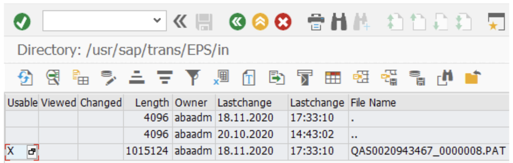

# Installation and Configuration

<head>
  <meta name="guidename" content="Boomi for SAP"/>
  <meta name="context" content="GUID-f133fa3d-7331-4aff-97ab-19455ba56a8d"/>
</head>

## Installation of Add-On

### Upload the installation file**

1. Login to your SAP system in client 000

2. The installation file(s) should be in the folder `*/EPS/in/`. You can find the path with *al11*.

3. First, upload the *PAT* file(s) into your SAP system using transaction ***CG3Z***.

4. Press *Upload*

  You can now see the file uploaded via *al11*

### Installating Add-On

1. Go to *SAINT*. On the **Installation Package** tab, select **Load packages** then **EPS files from the application server** to import the Add-On installation file(s). 

note:::
Installation of the Add-On must be done in each system in the system landscape via SAINT. The *SICF* configuration is performed in the Sandbox and/or Development environment, and transports the rest of the systems in the landscape.
:::

2. Press on **Start**

3. Select **IXBX** in the *Add-On list* and press **Continue**

4. In the pop-up, confirm adding modifications or adjustments to the transport queue:

  - Click **Yes** to continue
  - Click **No** to reject the additions.

  Now, the installation starts.

5. After completing the installation, press **Finish** to finish the process.

## Installation of Add-On, upgrade

If you already have a version of the product installed, follow the same steps above.

### Configuration

After finalizing the installation, you must set up *zbx* in *SICF* and the *BW Extractor* to utilize the *BW Extractor* functionality.

Additionally, We recommend creating roles in Boomi for SAP functionality and assigning them to the relevant users.

### SICF Setup

1. Run transaction *SICF*. Press **F8**  to execute the transaction. 

2. Click **Default Host**, then **Create Host/Service**.

3. Press **ENTER** to continue.

4. Enter **ZBX** as the service name. Choose Independent Service. Press **ENTER** to input the service name.

5. Enter ***Boomi for SAP*** as Description 1. Enter handler class ***/IXBX/CL_SICF*** in the Handler List tab.

6. Update data for service and login data if needed, depending on customer requirements. Press **CTRL+S** to save. Press **F3** to leave the main menu (package and transport according to customer requirements).

7. To activate the service, select it by clicking it and pressing **SHIFT+F11**

8. Click **Yes**

