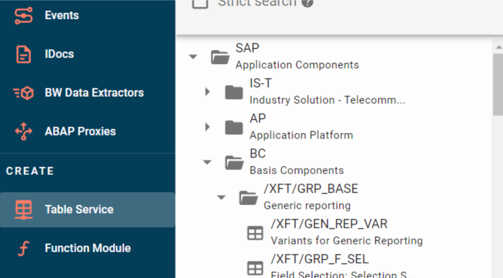
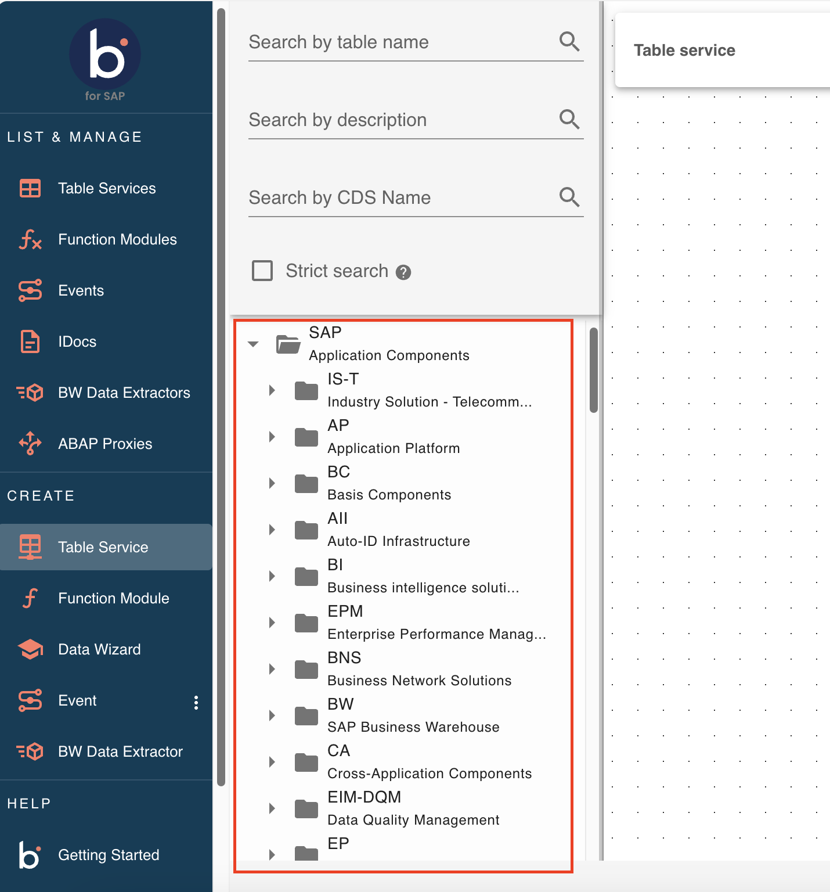
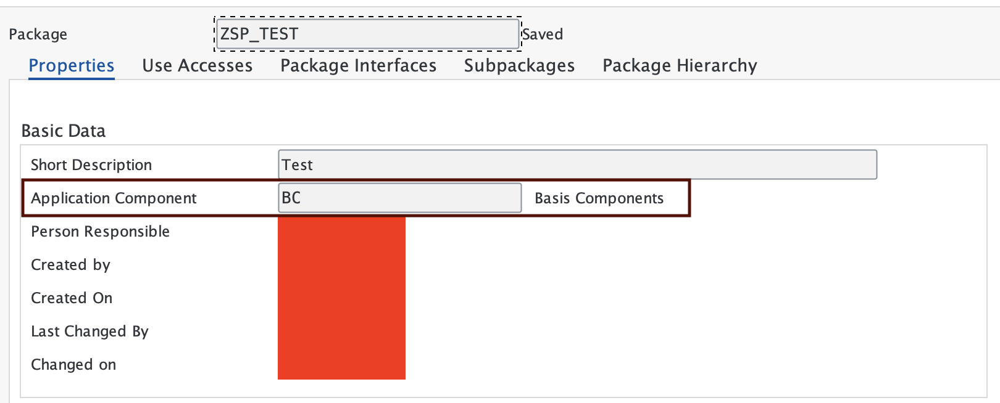
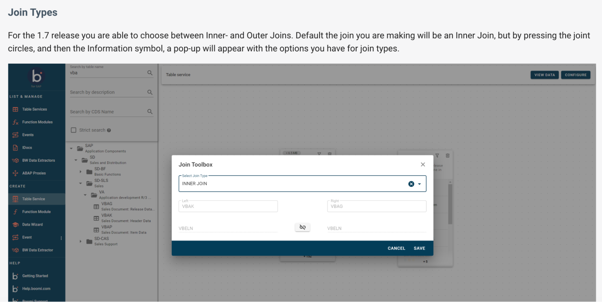
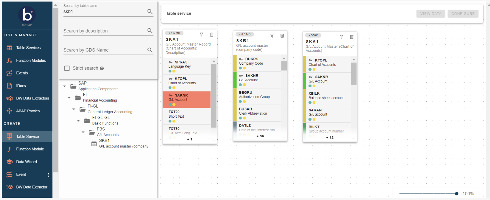
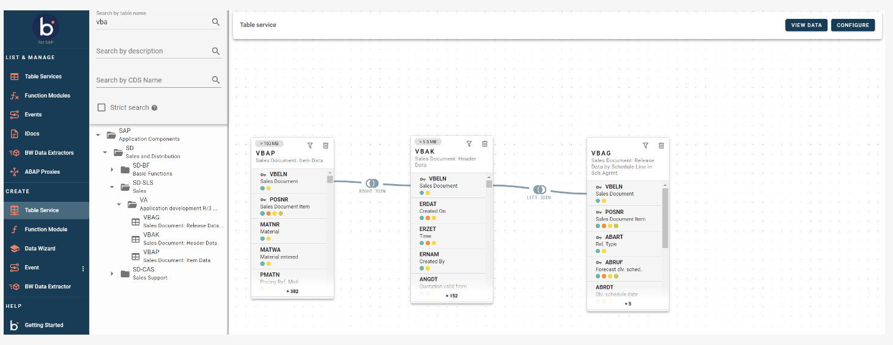
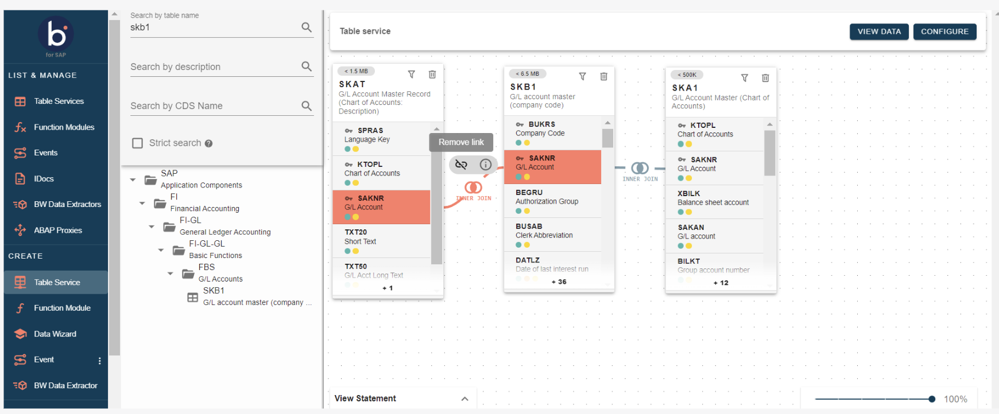
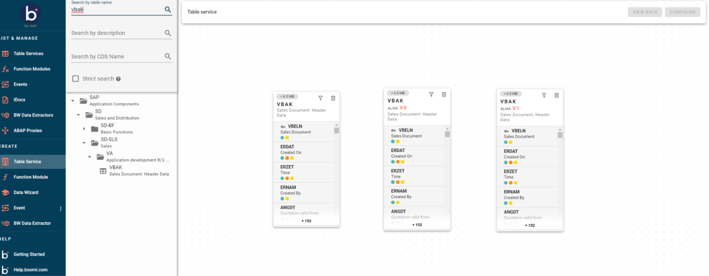

# Joining Tables

<head>
  <meta name="guidename" content="Boomi for SAP"/>
  <meta name="context" content="GUID-bdf07b9a-1d77-41d2-9360-92fdf90e8ec5"/>
</head>

:::note Important 

You need version 1.7 or higher of Boomi for SAP to use Join Types, Aliases, and find tables by unfolding the tree structure.

:::

## Table Services

All tables are now available in the standard SAP tree structure in **Table Services** under Component View: Database Tables. You can find the table you want by unfolding the tree structure.

You can search **Table Services** after loading the Application component hierarchy in the search panel as highlighted below.

:::note Important

If the tables are not visible in the search panel even after loading, ensure the package where the table was created is always assigned to any application component as highlighted below.

:::

- If the Application component of the package is missing, update the application component and schedule the program `RS_APPL_REFRESH` as background job.

## Join Types

You can choose between and Inner and Outer Joins. The default are Inner Joins. 

To see what join types you can use, select the joint circles, and then the Information symbol. A pop-up will appear with the options you have for join types.

When you choose Outer Join, the join will be made to the left or right based on the position of the main table in relation to the joint tables.

If you want to see the SQL statement Boomi for SAP creates, select **View Statement** at the bottom left corner of your screen.

## Joining tables

1. To join your desired tables, after they have been dragged and dropped to the canvas, start by clicking on the **field** you want to join. This will cause the fields on the other table(s) to turn green or yellow.

2. The **Color scale** indicates whether it is possible to join and how good the join is.

  - **Green** 🟢: Indicates a technical good match
  - **Yellow** 🟡: Indicates technical possible - but not a good match

:::note

The field you click on first will always turn red, so you should use the second field selected to determine if it is a good join.
:::

3. First, click on one field, then click on the field you wish to join to connect the desired fields with a grey line.

4. If you want to remove your join, hover your mouse over the join string and press the pop-up box.

## Aliases 

In versions 1.7 and above of Boomi for SAP, you can create alias tables when you join the same table multiple times. If you add the same table more than once, an alias of the table will be shown as depicted on the following picture. 

