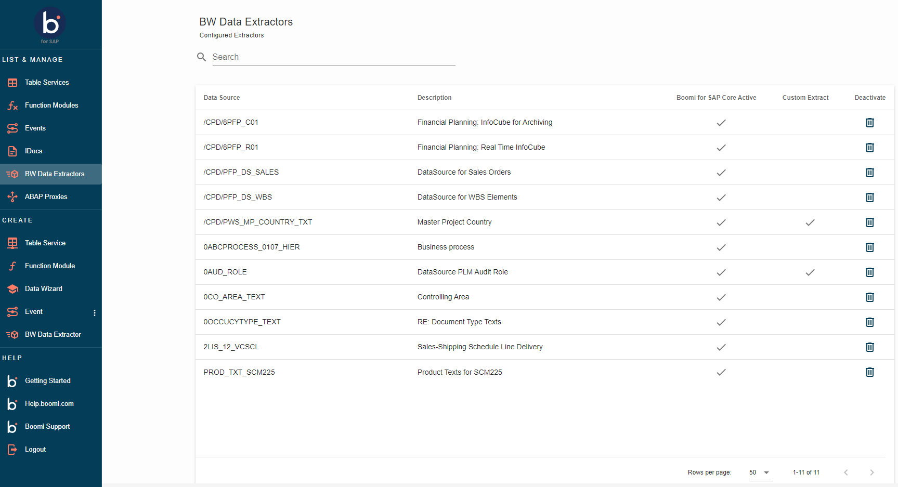
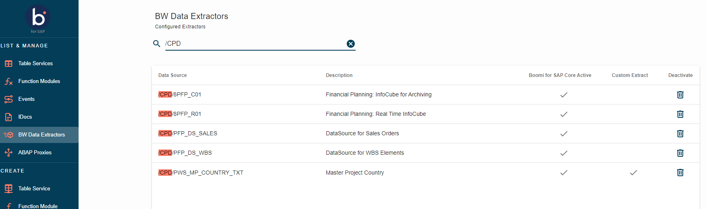

# List and Manage - BW Extractor

<head>
  <meta name="guidename" content="Boomi for SAP"/>
  <meta name="context" content="GUID-094e517c-5724-4dd3-b9b8-6aab8d2d130c"/>
</head>

- To view the activated BW Data extractors, go to the homepage and click **BW Data Extractors** under the LIST menu on the left side.

- This list provides an overview of the currently active data extractors in SAP, which can send data when executed. The list is organized as follows:

   - **Data Source:** Refers to the name of the data source in SAP.
   - **Description:** Provides a concise explanation of the data extractor in SAP.
   - **Boomi for SAP Active:** Indicates whether the BW Extractor has been activated for Boomi for SAP.
   - **Custom Extract:** Specify if the BW Extractor is prepared for custom extraction.
   - **Deactivation:** Allows the removal of the BW Extractor from the user interface.

- To search for specific extractors, use the search function in the page's upper right corner. For example, if you search for the name 'FLEET,' all extractors containing 'FLEET' will be displayed.

- If the desired data source is not listed, log on to SAP GUI and activate the data source by running `/IXBX/ZBX006`

