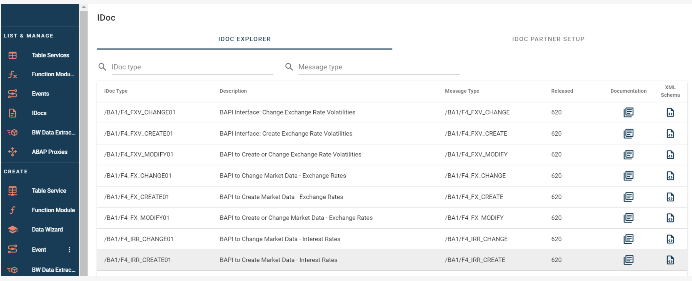
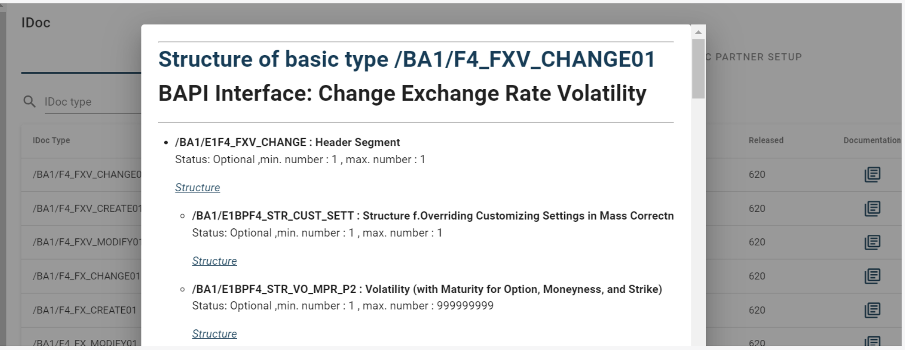
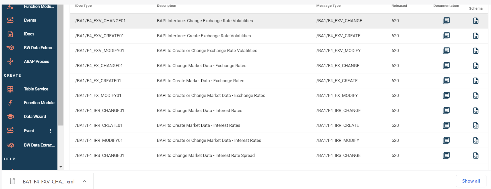
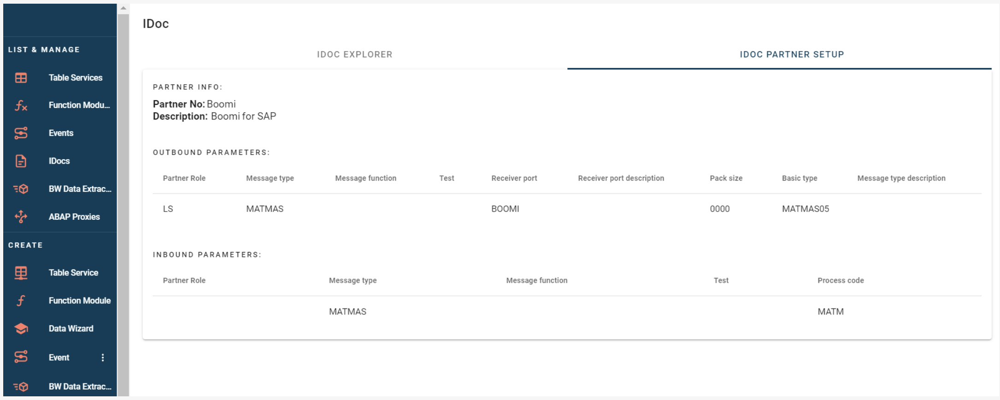

# List and Manage - IDocs

<head>
  <meta name="guidename" content="Boomi for SAP"/>
  <meta name="context" content="GUID-ff93d339-1757-46d9-90e4-a0827d9b1b02"/>
</head>

## IDoc Explorer

In the Idoc Explorer, you can view all the Idocs in SAP and search for either the IDOC type, message type, or both, as detailed below.

1. **Idoc type**: Idoc identification

2. **Description**: Document description

3. **Message type**: Type of message

4. **Released**: Release ID for IDoc

5. **Documentation**: SAP Documentation

6. **XML Schema**: Download icon to download the XML Schema

**Documentation** Documentation lets you see the SAP documentation of the IDoc. The creators of this IDOC designed it to be easy to understand.

**XML Schema** Downloading the XML Schema. This download option makes integration testing on other systems more accessible.

## IDoc Partner Setup

For IDoc Partner setup, you can see which partners are already configured and which parameters they are configured for. Outbound parameters indicate the services configured to send, while inbound parameters indicate the services configured to receive.

The following information shows a list of the Partner configuration options:

1. **Partner role**: Partner type(SAP standard)

2. **Message type**: Type of Message

3. **Message Function**: File Format

4. **Test**: Is it activated for test

5. **Receiver Port**: The connection port

6. **Receiver Port Description**: Description of Port

7. **Pack Size**: The size of

8. **Basic Type**: Type of service

9. **Message Type Description**: Description of Message type

10. **Process Code**: ID of the processing service

