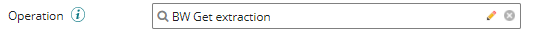
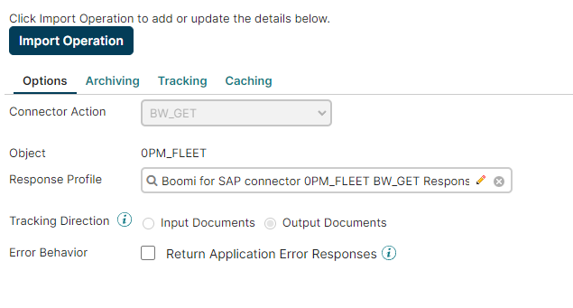
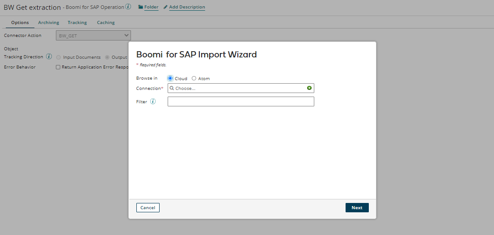
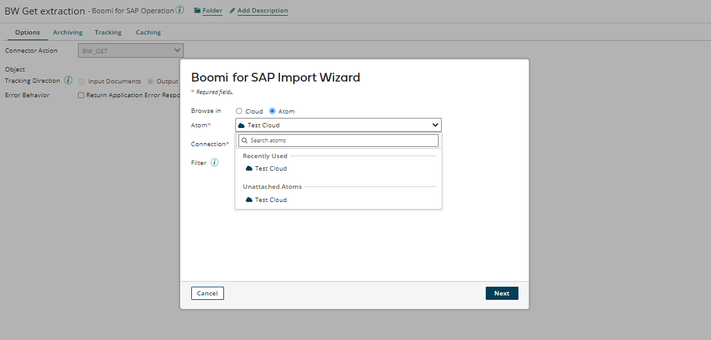
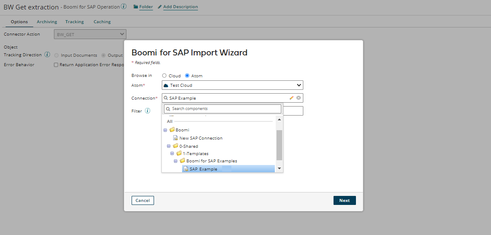
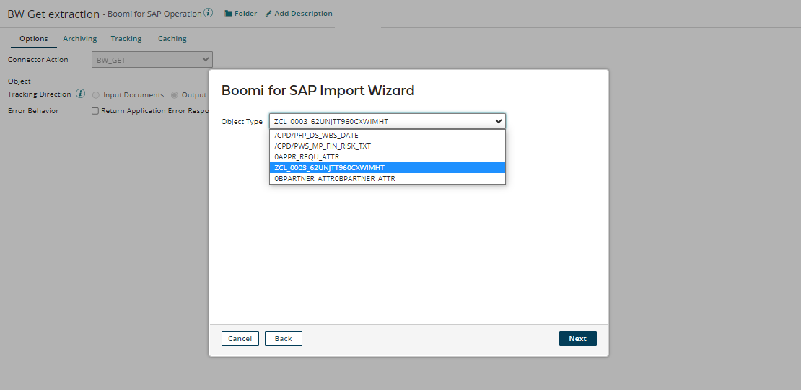
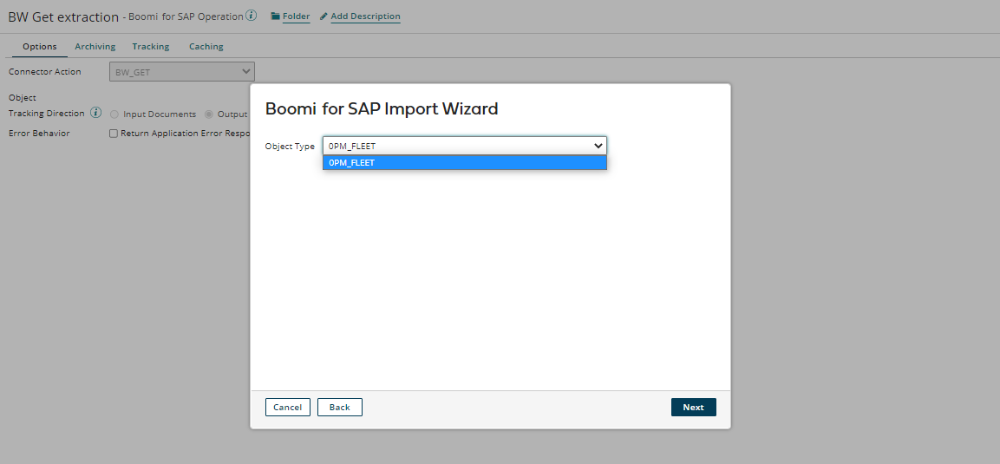
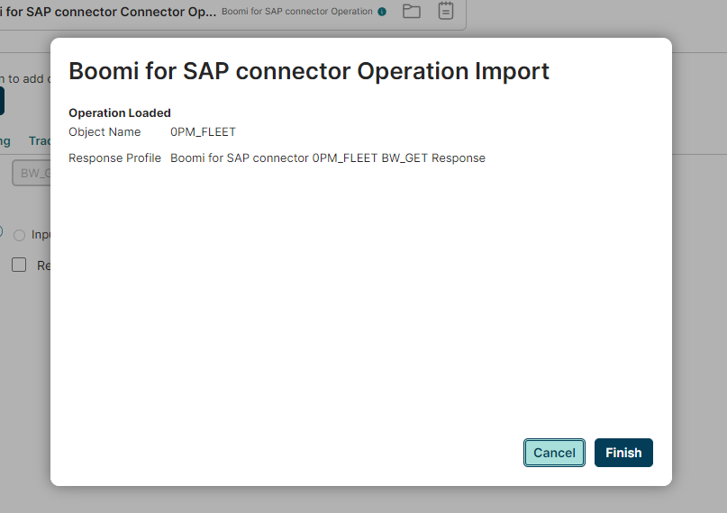
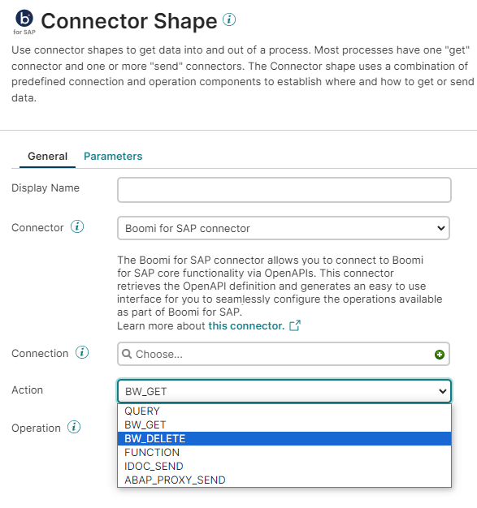

# Operation

<head>
  <meta name="guidename" content="Boomi for SAP"/>
  <meta name="context" content="GUID-6e65fbcf-2d44-445f-a456-7ab8011c54e5"/>
</head>

To configure the connector operator:
- Click the 'pencil icon' next to the BW Get extraction operation. This will redirect you to the configuration page.

- To easily locate the operation in the future, replace **BW Get extraction** with the name of the extractor you previously created. For example, we named the operation ***Get extraction for 0PM_FLEET*** because it imports the extractor named ***0PM_FLEET***.

- Next, click the **Import** button to query the objects. A pop-up window will appear.

- To return the operation choose an Atom from the drop-down menu.

- Select the connection you configured earlier. 

- Once you select the Atom and the connection, click the **Next** button to query the objects. The Atom will connect you to object types. Click the drop-down menu and select the desired ***Object Type***.

- Alternatively, you can use filters with wildcard characters by clicking the **Back** button. This will help reduce the number of returned objects. The filter lets you limit the objects (Services) by searching for a specific value in the service name.
- To search for any value, use the asterisk (*) symbol. For example, if you want to find tables ending in **FLEET** or any services containing that value, you should search for **FLEET**. 

- Once you select the desired filter, click the **Next** button. The object type shown will then contain the value you searched for. In this case, **FLEET**.
- After selecting the desired object type, click the 'Next' button. A new page will appear, showing the object type and the associated response profile. Click on the 'Finish' button to continue.

- You will now see that your operator imports the selected extractor with an associated response profile. Click the **Save and Close** button to return to the connector page.
- To complete the configuration, click **OK**.
- Follow the same procedure to create a **BW_DELETE** Connector Operation, by selecting the **BW_DELETE** action.

