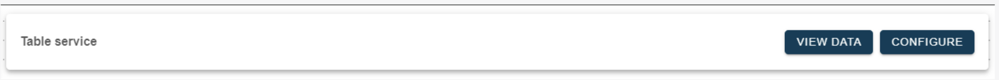

# Preview Data and Test options

<head>
  <meta name="guidename" content="Boomi for SAP"/>
  <meta name="context" content="GUID-8e95d3fe-1d5a-4b6e-9694-f26887195e5e"/>
</head>

You have several ways to preview table data and test options. At the top of the canvas:

1. **View Data:** This lets you preview the data on which you want to create a service. You can preview data from your local system and get shown data from other systems via an RFC connection.

2. **View Data Configuration:** When using this option, you can select data from remote systems via RFC connections and set them up, but they must be.

The following transactions show how to set up a connection to a remote SAP system:

- Create an ABAP Connection in SM59 to a remote system.

- `/n/ixbx/ZBX014` - Set up the data system to allow it to call.

- `/n/ixbx/ZBX015` - The calling system sets which RFC connection it can call.

3. **Test Service:** This lets you test your service before and after creation and determine whether the join you have made is possible.

4. **Configure Service:** Use this option to configure a service and create a single-table service.

