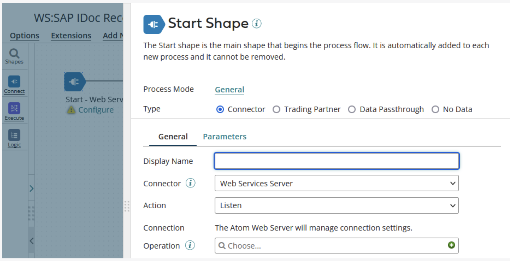
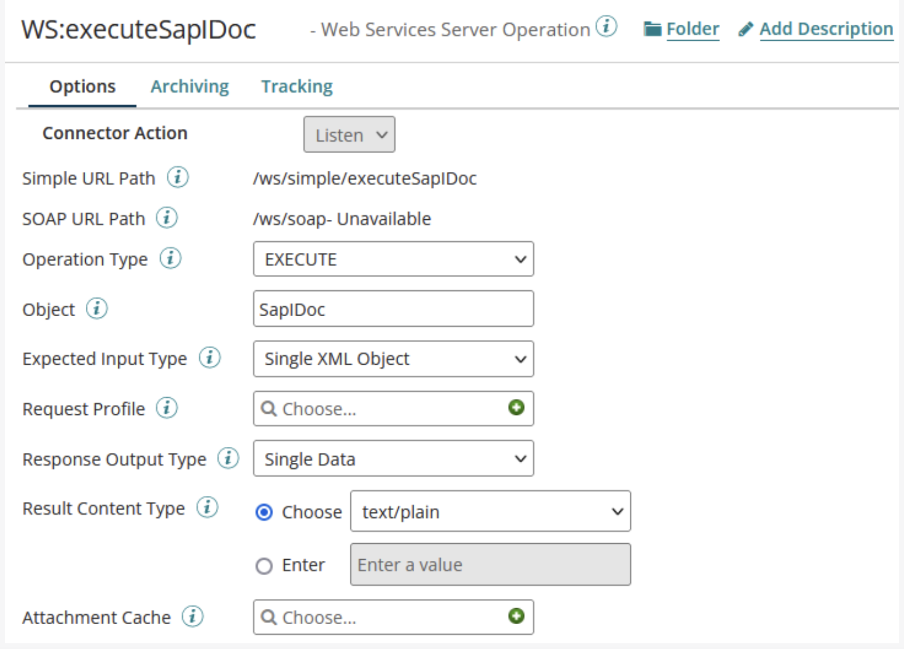
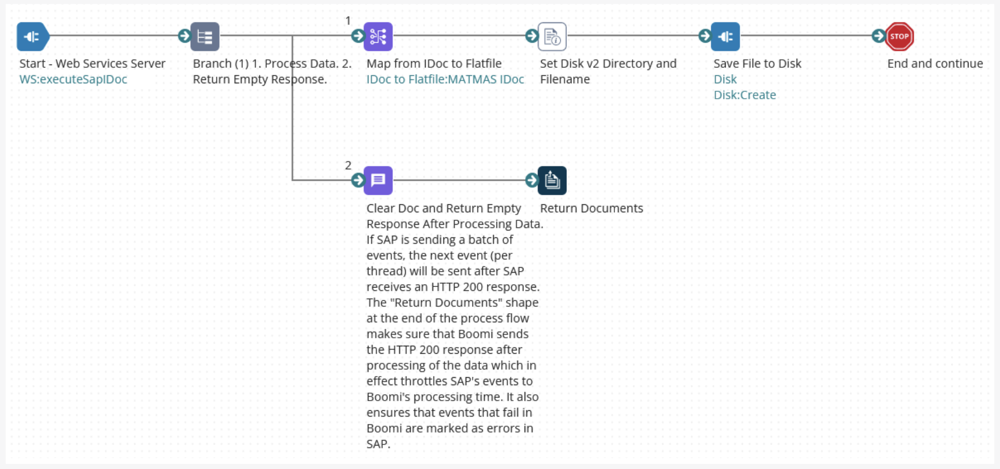

# Receive IDocs in Boomi from SAP

<head>
  <meta name="guidename" content="Boomi for SAP"/>
  <meta name="context" content="GUID-bc616d63-d6c0-4100-b833-c415538c626a"/>
</head>

- The IDocs will be sent from Boomi for SAP Core to a standard Boomi Web Service with a Shared Web Server using API Type 'Intermediate'.

## Building a Boomi Process

- The example process will demonstrate how to receive IDocs from SAP.
- Create a new process and configure the Start step type for the Web Services Server.

- Create and configure a Web Services Server Operation:
 - **Operation Type**: Choose an appropriate type
 - **Object**: Choose an appropriate name
 - **Expected Input Type**: Either 'Single XML Object' or 'Single JSON Object' depending on your setup in Boomi for SAP Core
 - **Response Output Type** Single Data

- Take note of the *Simple URL Path*. This path must match the path configured in SAP.

- Start step now receives IDocs from Boomi for SAP.

## Importing the IDoc Profile

- To import the IDoc Profile (XML or JSON):

 - Deploy the Web Service Process
 - Send an IDoc to the Web Service
 - Download the IDoc from the Boomi Process Log
 - Import the IDoc in Boomi

- Profile (the imported tool) can analyze the process.

## Completing the Process

The example process below is completed by mapping the IDoc Profile to a flat file and saving it to the disk.

