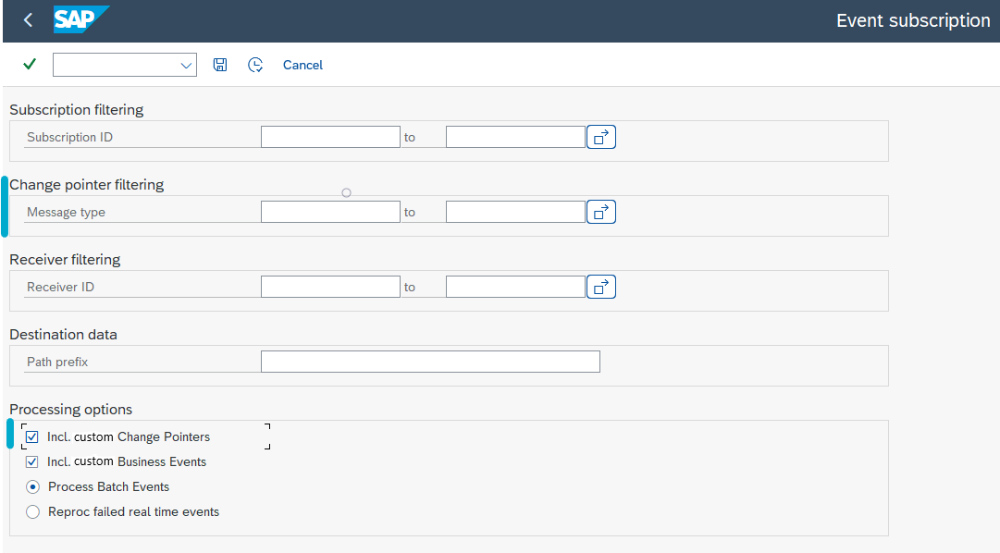
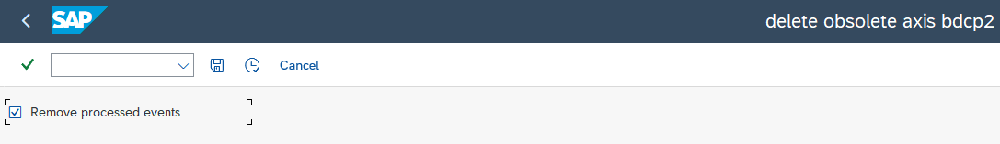
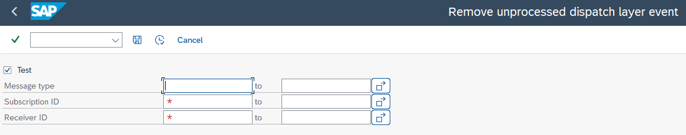

# SAP Event Processing

<head>
  <meta name="guidename" content="Boomi for SAP"/>
  <meta name="context" content="GUID-46934c64-08b7-4e41-9734-96caff897749"/>
</head>

## Process EDA subscriptions

**Transaction:** `/IXBX/ZBX011` or `/IXBX/EVENT_PROCESS`

**Subscription and Receiver filters:** These let you control which subscriptions and receivers are processed during execution. All that are relevant for the new events will be updated in the Boomi for SAP dispatch layer, irrespective of the filter applied.

**Destination data:** This serves as a prefix to the generated path for the topic. For example, if the topic path is `/TOPIC`, it already contains a leading `/`, so there is no need for a trailing `/` in this field.

## Processing options

The description of the **Processing Options** are as follows: 

- **Incl. custom Change Pointers:** This option allows the processing of Change Pointer subscriptions. When selected, a new select option becomes available.

- **Change Pointer filtering:** This feature enables the filtering of message types to be processed, based on those marked as relevant for Boomi for SAP.
Including new events, this option processes Change Pointer subscriptions for new events in SAP only.

- **Incl. custom Business Events:** This feature processes Boomi for SAP Business Events. These events are managed by handlers based on the `/IXBX/BI_EVENT_HANDLER_STATIC` interface. Only one real-time handler can be processed per *objecttype/eventtype* at a time.

- **Process batch events:** This feature enables the batch processing of events for batch subscriptions.

- **Reproc failed real-time events:** This option allows reprocessing real-time events that failed during the original processing. In this case, the topic prefix used for real-time ***`/TOPIC`*** is replaced with the provided Path prefix.

- **Max events:** This specifies the maximum number of events for processing.

- **Include external value fields:** This option extends the output data with external format values.

- **Max threads for parallel proc:** This specifies the maximum number of threads that can be allocated for parallel subscription processing.

- **Server group:** This specifies the server group for parallel subscription processing. You can choose from the provided list.

## Process Event Clean Up

**Transaction:** `/IXBX/ZBX012` or `/IXBX/EVENT_CLEAN_UP`

This transaction should be scheduled to run periodically as a clean-up process to remove events that have been successfully processed by all receivers. It can be compared to the clean-up process for SAP standard change pointer events. If the deletion of obsolete EDA event dispatch data is executed with *Delete older than (days) = 0*, the main event will be directly deleted instead of being marked for deletion in the next run.

### Process Dispatch Layer Clean Up

**Transaction:** `/IXBX/ZBX013` or `/IXBX/DISPATCH_CLEAN_UP`

This transaction lets the removal of data generate for the dispatch layer that should not be sent. This can occur due to the deletion of a subscriber or receiver or changing pointer message types for Boomi for SAP settings.

**Parameters**

- **Test:** This overviews the number of records found based on the filtering criteria. The table `/IXBX/BDCP2_LINK` can be analyzed using SAP standard transactions such as *SE16*.

- **Message Type:** This allows for filtering based on the message type for which the event is created. The message type for Boomi for SAP business events is `/IXBX/ZBX_EVENT`

- **Subscription ID:** This allows for filtering based on specific subscriptions.

- **Receiver ID:** This allows for filtering based on specific receivers.

