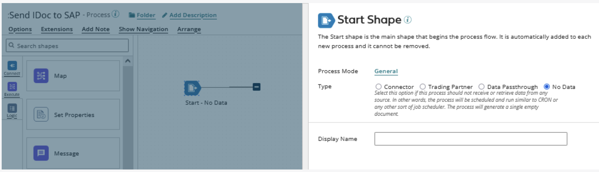
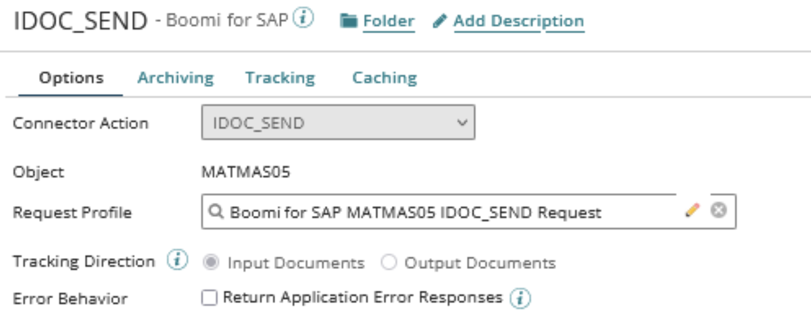
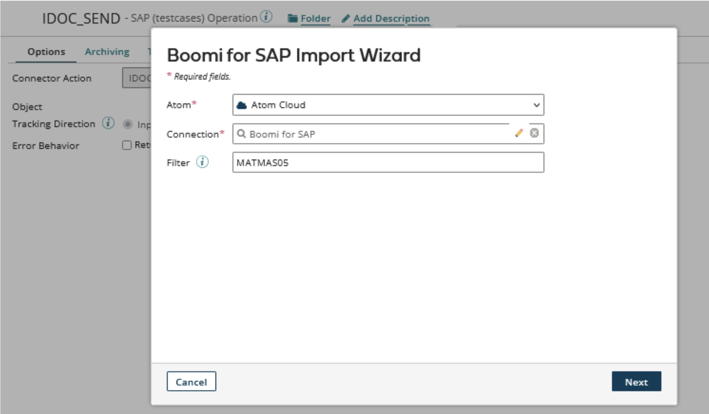
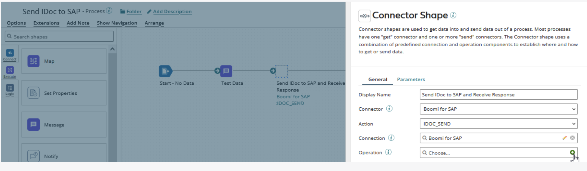
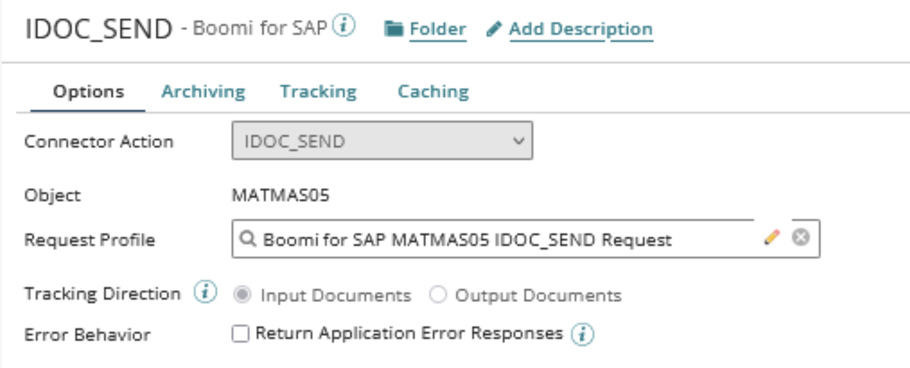
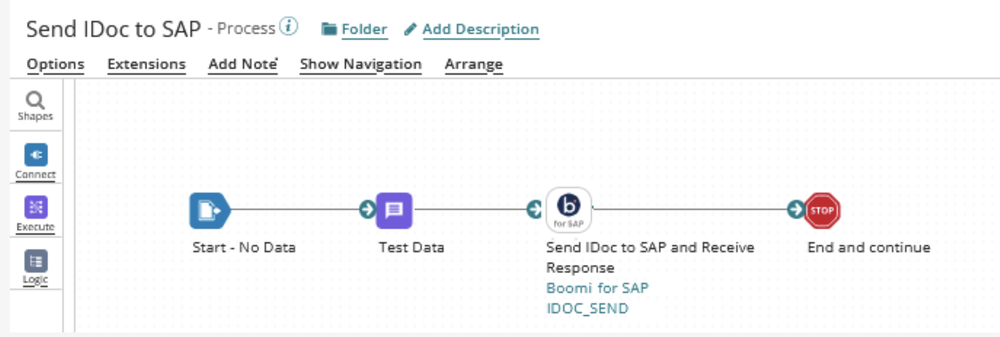

# Send IDocs to SAP from Boomi

<head>
  <meta name="guidename" content="Boomi for SAP"/>
  <meta name="context" content="GUID-c60ad162-0c66-4f53-bf62-da52aba18d2d"/>
</head>

This section describes how to use the IDoc Service created above.

The ***Boomi for SAP*** is no different from other Boomi connectors. It makes development easy by importing operations and profiles.

## Building a Boomi Process

- Create a new Process and configure the Start step type to ***No Data***.

- Add a **Message step** immediately after the Start step and connect the Start step to the Message step. In this example process, the Message step contains test data corresponding to the Request Profile created in the next step. When building your processes, map your data to the Request Profiles of the Operations.

## Operation for Boomi for SAP Connector

- Add a Connector step to the canvas. Add a *Display Name*. Select an existing Connector or create a new Connector.
- Choose the Action ***IDOC_SEND*** and create a new operation.

- In the new operation, click *Import* and follow the guide to import the operation and Profile.

- Choose an ***Atom*** to perform the Import. The Atom should have network access to the SAP and Boomi for SAP Core instance. Choose the appropriate Connector. The optional Filter option allows for wildcard filtering.

- Create a new Connector Operation; click on the small **green plus icon** in the Operation field. The system redirects you to the Connector Operation creation page.

- The operation has the Object and Request Profile already populated.

## Completing the Process

- Finalize the configuration by adding a ***Stop step*** and connecting it to the Connector step.

- Add test data to the ***Message step*** that conforms to the Request Profile format. To test the process, click **Test** in the upper right corner and choose Atom to run the test.

