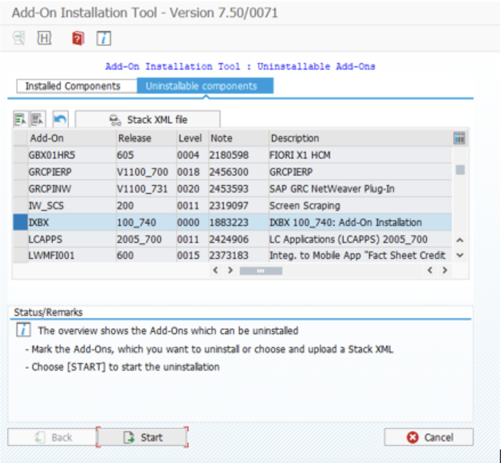
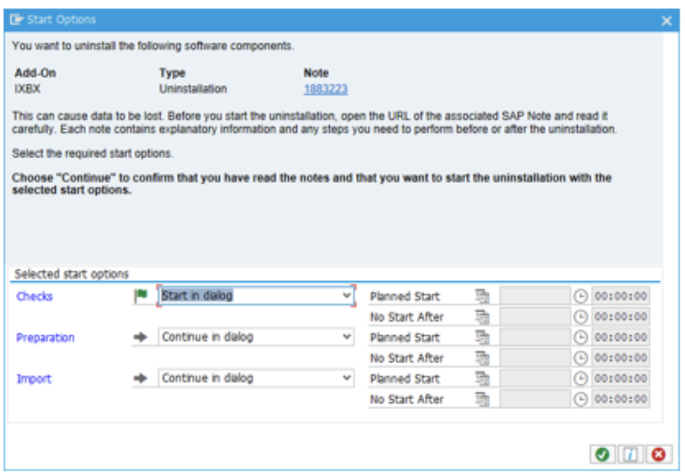

# Uninstallation and Clean-up

<head>
  <meta name="guidename" content="Boomi for SAP"/>
  <meta name="context" content="GUID-4f014d8e-b0ad-48f3-af81-6a822a262ae4"/>
</head>

## Uninstallation

To uninstall **Boomi for SAP** follow the below instructions:

- Before starting the Uninstallation, you must remove the **ZBX** from *SICF*.

## SICF and event clean-up

1. (TC: SICF) Delete *SICF* implementation for the Boomi for SAP component.

2. (TC: SWETYPV) Delete events that utilize components provided by Boomi for SAP.

3. (TC: BD52) Remove change document triggers for the Boomi for SAP message(s).

    We recommend removing roles created for Boomi for SAP and all Change Pointers with the Message Type */IXBX/ZBX_EVENT* must be deleted.

    All table services and the BW staging data will be removed during the uninstallation. If you need the data after reinstalling, please make a copy of these beforehand.

4. Login to your SAP system in client **000**

5. Go to ***SAINT***, choose **Uninstallable components** and press **Start**.

6. In the dialog box, select **Start in dialog** then, select **Continue**, and press **Finish** when the uninstallation is complete.

Uninstallation is now complete and all components related to the producct have been deleted from your system. 

