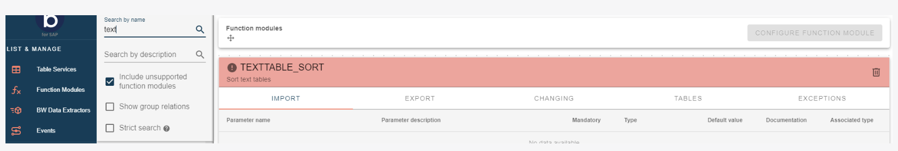
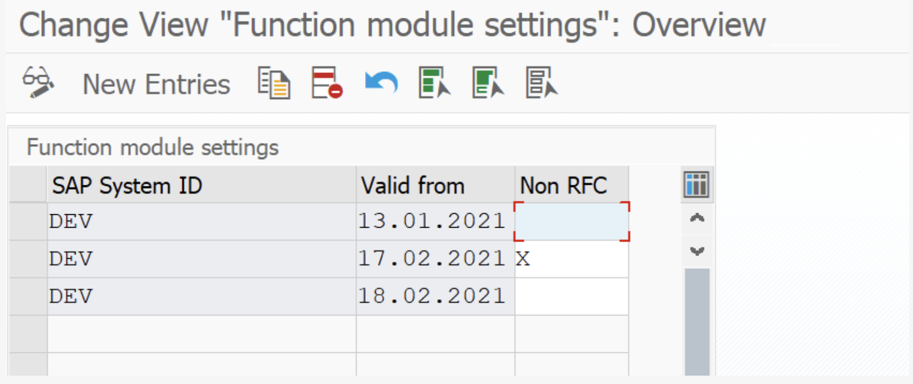
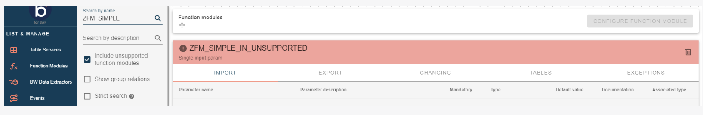

# Unsupported Function Modules

<head>
  <meta name="guidename" content="Boomi for SAP"/>
  <meta name="context" content="GUID-0f7cae09-9669-4203-bdd9-5de7763f9a01"/>
</head>

It is only possible to create a function module service (connecting to the service in Boomi) if a developer has exposed the particular function module in SAP. However, it's possible to include unsupported Function Modules in the search results, which the citizen integrators can use to get an overview of existing function modules in SAP.

Enable the **Include unsupported function modules** option below the search boxes to see unsupported function modules.

As shown in the picture above, the red panel shows unsupported function modules that cannot create be created as a service. To view lack of support details, hover your cursor over the exclamation mark.

If the unsupported Function Modules are not RFC-enabled, it is possible to make them available in Boomi for SAP. All Non-RFC-enabled Function Modules will appear as unsupported functions that cannot be called by default in SAP, as these are defined not to be called outside of SAP. To make the Non-RFC-enabled functions available in Boomi for SAP, go to `/IXBX/FM_SETTINGS` or `/IXBX/ZBX010` to enable the functions. Think carefully before exposing Non-RFC-enabled Function Modules, as the developer did not intend to expose them outside of SAP. Unsupported function modules contain an object type that our JSON translator still needs to support.

The system's records indicate whether Non-RFC-enabled Function Modules are allowed and determined by the SAP System ID and record validation date. If ' X ' is true, it means the Function Module is allowed; if it's false, it's not. When Boomi for SAP checks if RFC is permitted, it reads the record where the System ID matches the executing system, with the lowest date being more excellent or equal to the system date. 
The examples in the figure above, show this process updating the system with the latest permissions:

  - The system will only select records from the 'DEV' system.

  - The first record will be the *active* setting between 13.01.2021 and 16.02.2021 (both days included). Creating and exposing Function Module services for 'Non-RFC'- enabled Function Modules is prohibited.

  - The second record will be the *active* setting on 17.01.2021. Non-RFC Modules can create and expose Function Module services for Non-RFC-enabled Function Modules.

  - The third record will be the *active* setting after 18.02.2021. Creating and exposing Function Module services for Non-RFC-enabled Function Modules is prohibited.

A Function Module's lack of support may result from 'Non-RFC' being disabled or other factors. In these instances, Boomi for SAP may be unable to invoke specific parameters of the Function Module, possibly because a parameter expects an object instance. If you encounter such a situation, don't worry. Contact your SAP developers and ask if they can create a wrapper module or a version with simple parameters. This function will show up with a red panel and an exclamation mark, which shows why the Function Module is unsupported. We're here to help you handle these situations.

