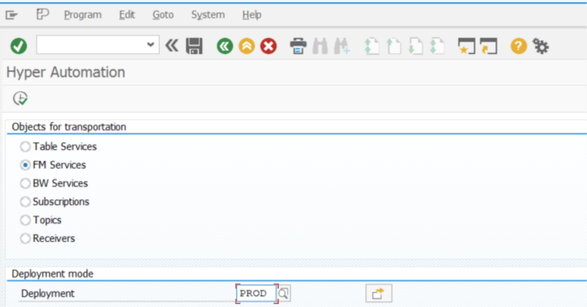

# Hyperautomation

**Hyperautomation makes it easy to transport objects through SAP clients.**

<head>
  <meta name="guidename" content="Boomi for SAP"/>
  <meta name="context" content="GUID-83dd10ca-d6f8-424f-8072-c54f09d72216"/>
</head>

Hyperautomation simplifies the creation of transports and facilitates the addition of objects. Utilizing the transaction **/IXBX/hyper_auto**, Hyperautomation empowers users to effortlessly leverage the following features:

- With Hyperautomation, all your services are conveniently gathered in one place, giving you a clear overview and control over your tasks. It provides easy accessibility to all activated objects in Boomi for SAP, and the possibility of adding them all to one transport.

- Hyperautomation ensures the automatic population of related objects to the transport. When choosing subscriptions, associated tables and topics are transferred automatically without the need for manual selection.

This guide will walk you through setting up a transport using Hyperautomation. We will start with accessing the main menu, adding services to transport, and managing the transport request.

## Adding services to a transport

To access the main menu and add services to a transport, use transaction **/IXBX/HYPER_AUTO or /IXBX/ZBX002**. Here, you can see all features available and choose one to add services to a transport. You can also select the deployment mode for the desired services. 

:::note
To prevent confusion between production and development/test systems, we advise creating separate transports for the LOCAL and PROD objects.
:::

Select the services you want to have transported. When ready, choose *Add to transport* and enter the transport request. You can **either create a new transport** or **choose an existing one.** To see all active transports and what they include, use transaction SE10.

A dialog box appears, where you can view the number of chose services and choose to proceed or not.

If *Subscriptions* was chosen in the main menu, the dialog box shows all the chosen subscriptions objects (table service, topic, receiver) that were automatically added to the transport.

Choosing *No* cancels the action you were about to take, redirecting you to the list of services without any changes.
Choosing *Yes* results in two possible outcomes. 
1. A successful message confirming the addition of services to the transport. 
2. An error message with detailed explanation of any issues, including services already added or a technical problem.

