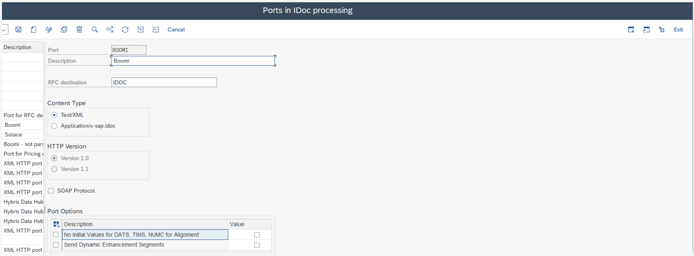
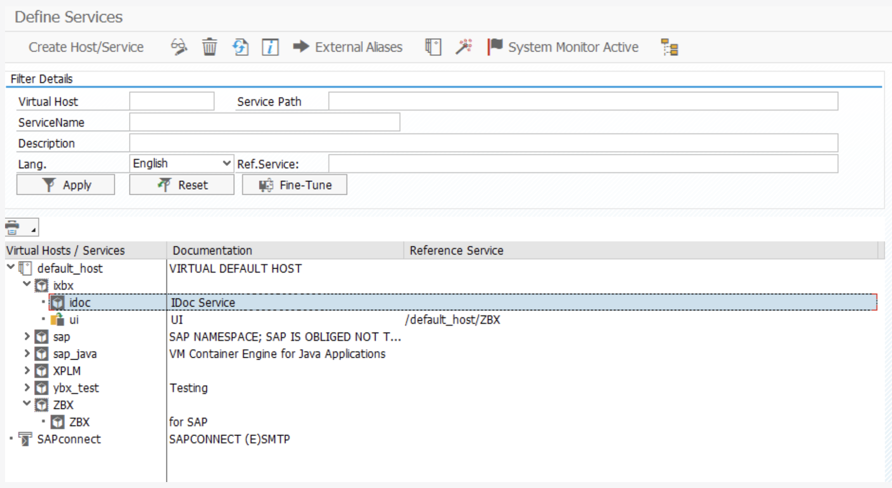
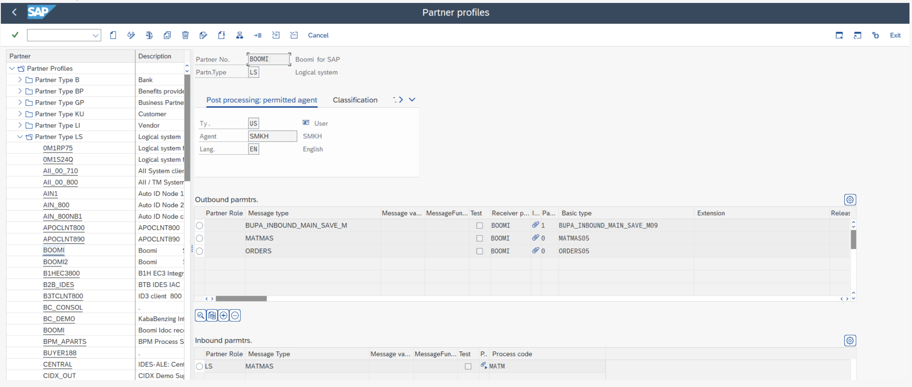
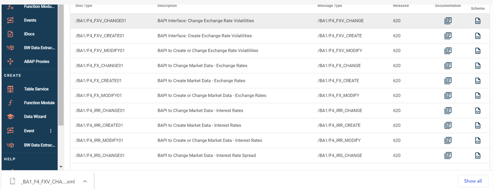
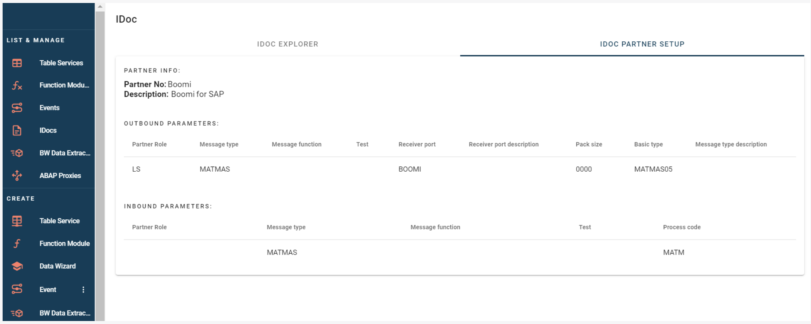
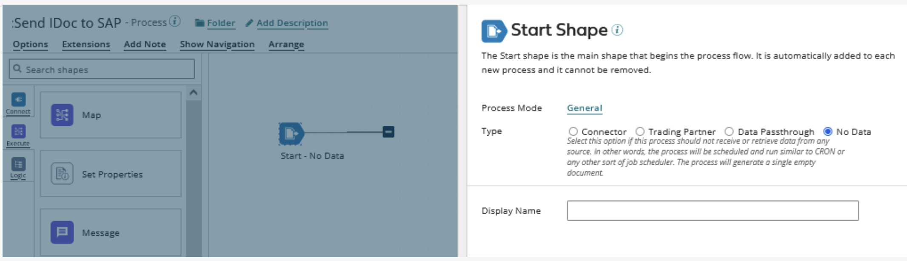
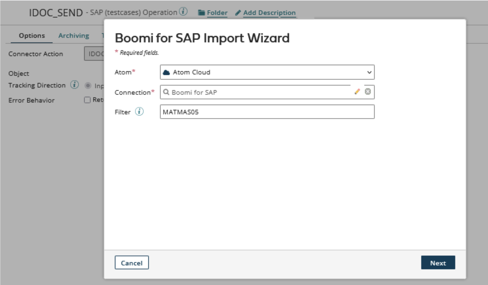
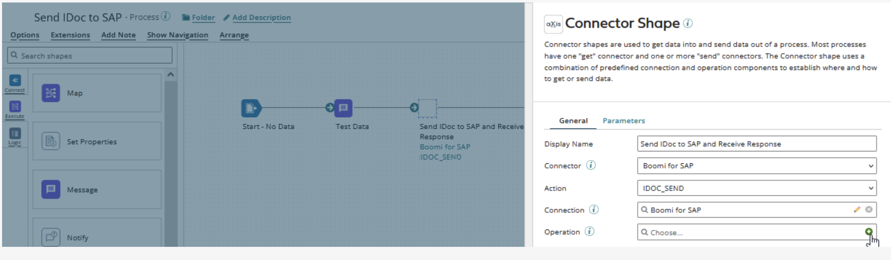
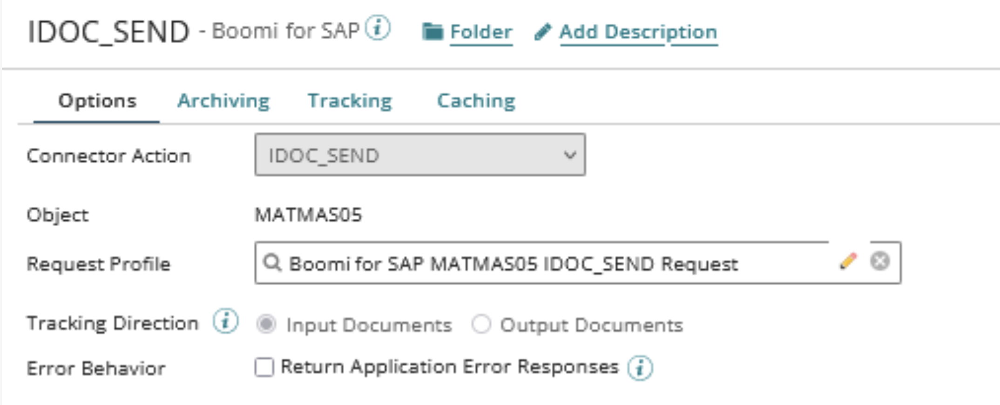
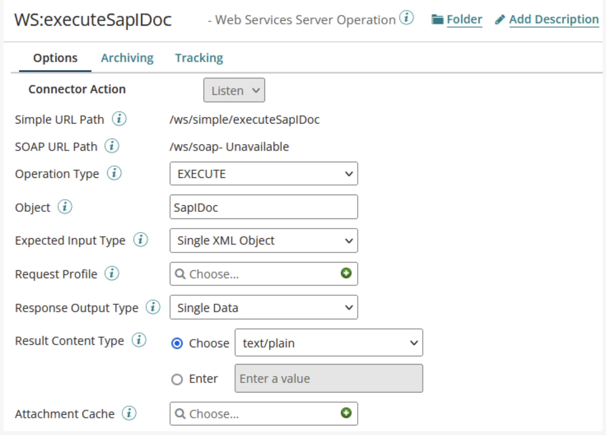

# IDocs

<head>
  <meta name="guidename" content="Boomi for SAP"/>
  <meta name="context" content="GUID-ff93d339-1757-46d9-90e4-a0827d9b1b02"/>
</head>

The IDoc feature exposes IDocs as REST services (in Boomi for SAP Core) and sends IDocs to REST services. Simplifying sending and receiving SAP IDocs processes.

The following are some use case examples:

- Receive updates to a data object

  - When a Business Partner is updated, send the update to Boomi and update other applications.

- Update a data object

  - Update a Material in SAP with master data from an external application.

- Query a (complex) data object

  - Retrieve a Business Partner object.

## SAP and Boomi for SAP Core Configuration

We must complete the following steps and transactions to use the IDoc feature in Boomi for SAP. Create a Boomi for SAP IDoc user (SU01) and add the role `/IXBX/IDoc`.

*It is necessary to add role `/IXBX/IDOC` to the user, as an authorization object, embedded in the role to access the Boomi for SAP functionality*.

- Set up a RFC destination for IDoc handling (SM59)
- Set up Ports for IDoc Processing (WE21)
- Create Logical System(s) in BD54 - suggestion Boomi
- Set up a Partner Profile(s) for Boomi for SAP (WE20)
- Set up an IDoc handler (SICF)
- Set up an RFC destination (SM59) for the receiving system
- Set up the relation between IDoc Ports and RFC destination

### Create a Boomi for SAP IDoc users

- User Type = SYSTEM
- Add Boomi for SAP role `/IXBX/IDOC` or add the created Authorization Object
- Suggested name: BOOMI_IDOC

### Set up an RFC destination for IDOC handling

Please complete the following steps:

- RFC Destination for IDoc handling: Suggested name - BOOMI_IDOC
- Type = G
- Target Host

### Set up Ports for IDOC Processing

- Select port type: XML HTTP
  - Port - Suggested name: Boomi (JSON, pashing through Boomi for SAP as in the example)  
  - Description - Suggested name: Boomi (XML, sending to Boomi, choose RFC Destination for Boomi)
- RFC Destination: Choose the RFC Destination just created in SM59 (BOOMI_DOC)

### Batch processing

Note that when you choose to use batching, sending more IDOCs (inbound) to SAP, via XML request, will require you to configure the business partner to "collect", when there's a separate processing SAP batch job running. Using this method ensures IDOCs are processed sequentially rather than in parallel. We will manage all the IDOCs correctly, and the response will include the correct IDOC numbers.

### Set up a Partner Profile for Boomi for SAP

1. Create several Partner Profiles depending on how many systems you want to send data to:

    - Partner Number: Suggested name - Boomi
    - Partner Type: "LS"

2. Set up Outbound parameters(example):

    - Message type: MATMAS
    - Receiver port: Boomi
    - Basic type: MATMAS05

3. Set up Inbound parameters(example):

    - Partner Role: LS
    - Message Type: MATMAS
    - Process code: MATM

### Set up an IDoc handler in SICF

- Set up the specific IDOC handler in SICF under `/IXBX`, as shown in the image below.

- Add a handler to the IDOC service:

:::note
**Version 1.4** This version does not support bundling outbound IDOC for JSON. To send in a batch, set the Pack size in the Partner Profile (WE20) in "Outbound Options".
:::

### Further information

- The logic system for Boomi for SAP is Established in `/n/ixbx/zbx016`, same as shown in the UI under Partner.
- Alternative setup: If Port and RFC Destination are not created with the same name, use `/n/ixbx/zbx017` to change it.

### List and Manage

#### IDoc Explorer

In the Idoc Explorer, you can view all the Idocs in SAP and search for either the IDOC type, message type, or both, as detailed below.

1. **Idoc type**: Idoc identification

2. **Description**: Document description

3. **Message type**: Type of message

4. **Released**: Release ID for IDoc

5. **Documentation**: SAP Documentation

6. **XML Schema**: Download icon to download the XML Schema

**Documentation** Documentation lets you see the SAP documentation of the IDoc. The creators of this IDOC designed it to be easy to understand.

**XML Schema** Downloading the XML Schema. This download option makes integration testing on other systems more accessible.

### Boomi for SAP IDoc Partner Setup

For IDoc Partner setup, you can see which partners are already configured and which parameters they are configured for. Outbound parameters indicate the services configured to send, while inbound parameters indicate the services configured to receive.

The following information shows a list of the Partner configuration options:

1. **Partner role**: Partner type(SAP standard)

2. **Message type**: Type of Message

3. **Message Function**: File Format

4. **Test**: Is it activated for test

5. **Receiver Port**: The connection port

6. **Receiver Port Description**: Description of Port

7. **Pack Size**: The size of

8. **Basic Type**: Type of service

9. **Message Type Description**: Description of Message type

10. **Process Code**: ID of the processing service

## Boomi AtomSphere Process

- Boomi for SAP Core and Boomi communicate in two different ways depending on which system initiates the communication.

- **Send IDocs from Boomi to SAP**
  - IDoc services created in Boomi for SAP Core are imported into Boomi using the branded Boomi for SAP Connector.

- **Receive IDocs in Boomi from SAP**
  - REST services are created in Boomi using the standard Boomi Web Services component. Boomi for SAP Core: Someone configured to transmit IDocs to the Boomi REST service.

## Send IDocs to SAP from Boomi

This section describes how to use the IDoc Service created above.

The ***Boomi for SAP*** is no different from other Boomi connectors. It makes development easy by importing operations and profiles.

### Building a Boomi Process

- Create a new Process and configure the Start Step type to ***No Data***.

- Add a **Message Step** immediately after the Start Step and connect the Start Step to the Message Step. In this example process, the Message Step contains test data corresponding to the Request Profile created in the next step. When building your processes, map your data to the Request Profiles of the Operations.

### Operation for Boomi for SAP Connector

- Add a Connector Step to the canvas. Add a *Display Name*. Select an existing Connector or create a new Connector.
- Choose the Action ***IDOC_SEND*** and create a new operation.

- In the new operation, click *Import* and follow the guide to import the operation and Profile.

- Choose an ***Atom*** to perform the Import. The Atom should have network access to the SAP and Boomi for SAP Core instance. Choose the appropriate Connector. The optional Filter option allows for wildcard filtering.

- Create a new Connector Operation; click on the small **green plus icon** in the Operation field. The system redirects you to the Connector Operation creation page.

- The operation has the Object and Request Profile already populated.

### Completing the Process

- Finalize the configuration by adding a ***Stop Step*** and connecting it to the Connector Step.

- Add test data to the ***Message Step*** that conforms to the Request Profile format. To test the process, click **Test** in the upper right corner and choose Atom to run the test.

## Receive IDocs in Boomi from SAP

- The IDocs will be sent from Boomi for SAP Core to a standard Boomi Web Service with a Shared Web Server using API Type 'Intermediate'.

### Building a Boomi Process

- The example process will demonstrate how to receive IDocs from SAP.
- Create a new process and configure the Start Step type for the Web Services Server.

- Create and configure a Web Services Server Operation:
 - **Operation Type**: Choose an appropriate type
 - **Object**: Choose an appropriate name
 - **Expected Input Type**: Either 'Single XML Object' or 'Single JSON Object' depending on your setup in Boomi for SAP Core
 - **Response Output Type** Single Data

- Take note of the *Simple URL Path*. This path must match the path configured in SAP.

- Start Step now receives IDocs from Boomi for SAP.

### Importing the IDoc Profile

- To import the IDoc Profile (XML or JSON):

 - Deploy the Web Service Process
 - Send an IDoc to the Web Service
 - Download the IDoc from the Boomi Process Log
 - Import the IDoc in Boomi

- Profile (the imported tool) can analyze the process.

### Completing the Process

The example process below is completed by mapping the IDoc Profile to a flat file and saving it to the disk.

